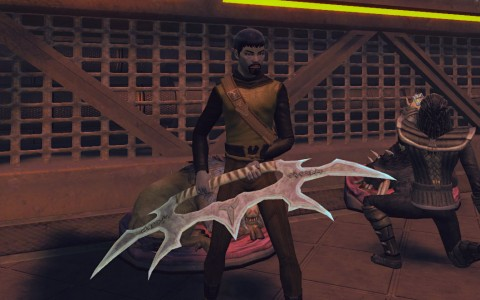
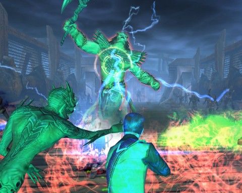
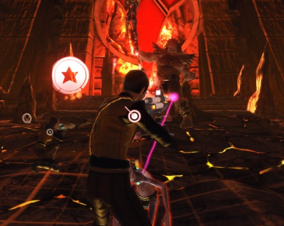

Back to: [West Karana](/posts/westkarana.md) > [2010](/posts/2010/westkarana.md) > [December](./westkarana.md)
# STO: From the Pits of Gre'thor, I Spit at Thee

*Posted by Tipa on 2010-12-01 01:20:18*

I, Krontar, wield the Sword of Kahless, in service to the Empire! I took it from the hands of the Emperor himself, Kahless. Together, Kahless and I braved the pits of Gre'thor and battled the Lords of the Dead. Klingons damned by their treachery, cowardice and dishonor to row ceaselessly the Barge of the Dead were redeemed and sent to Sto-Vo-Kor.

I, Krontar, did this. Yet because my forehead is smooth, my deeds will not be sung in the Great Hall. I write them here that my sons will know of the bravery of their House.

While on patrol against Breen attacks in the Orellius sector, we received an emergency call from Qu'noS. Fek'Ihri were streaming from mysterious portals in the nearby system of Norgh. Fek'Ihri! That is the name we give to the creatures who torment the dishonored dead in the Pits of Gre'thor. Kahless drove the evil Molor into Gre'thor by the power of the Sword of Kahless, and by that power sealed it forever.

If it were somehow opened... We closed those portals, and sent the Fek'Ihri guarding them back to the pits from which they sprang. Their ships... used conventional weapons.

More portals opened in the shipyards around one of Qo'noS' moons; we warped in and assisted the home defense fleet against the demon cruisers and frigates, but we were not quick enough. Fek'Ihri had invaded the Great Hall!

We beamed down and joined the other warriors in clearing the Great Hall, one bloody corridor after another. There was no need for blood wine with so much of the undiluted variety available. I stood shoulder to shoulder with the High Council and defeated the final assault.

The Council were as baffled by these attacks as I. Were they the Fek'Ihri come back to life, or an elaborate ruse by even more powerful species, like the long-thought-dead Hurq? Some on the Council demanded the Sword of Kahless be returned to Qo'noS to aid in the fight against the demons. For my bravery in battle, I was given the honor of seeking out the Emperor in seclusion and relaying the Council's request.

I found the Emperor's ship in orbit around a dark planet in the Sanek system -- under attack by the Breen! I had almost thought I would not get a chance to kill a coldblood this day, but I killed many as I and my crew battled through the Breen infesting the Empire's flagship.

Kahless did not have the sword, but he told me if I would meet him in the Boreth system, together we could find some answers to the question of the apparent Fek'Ihri invasion of Qo'noS. We proceeded there, and found that the planet was the home of the Shrine of Kahless, where monks keep the Sword of Kahless safe. The answers could be found in that shrine.

The shrine is built in the caldera of a slumbering volcano -- a volcano brought to life by an invasion of Fek'Ihri! They were after the sword -- but not if my crew and I could stop them. This we did, eventually meeting Kahless himself, who advised me to ignore the battle and meditate at the shrine.

I did so, and immediately felt... transported... into a strange place. Was I dead? Surely I would be worthy enough to enter Sto-vo-Kor, but I knew this place. This was the Barge of the Dead, which ferry dishonorable Klingon souls to eternal torment Gre'thor.

The place I needed to go.

After a short discussion with the Ferryman, he agreed to carry me across the river in his barge, but only if I could rally his oarsmen, dishonored Klingons all, to row me there. And before that, only if I could defeat Herron, the Lord of the Dead, who objected to one of the living entering his realm.

I defeater Herron. I rallied the dead. And with a cry, I led them against the gates of Gre'thor, battling our way through a legion of Fek'Ihri. We rousted out the gatekeeper and demanded he let us in.

Inside were waiting the Spirits of Cowardice, Dishonor and Treachery. We, who were possessed only of Bravery, Honor and Fidelity, had no trouble laying these foul spirits to rest. We descended deeper into Gre'thor and came across Molor himself. Molor, Kahless' betrayer, forced into Gre'thor an eon ago by the power of the Sword of Kahless itself! Even such a villain as Molor had no power over a true Klingon heart, and he was defeated.

One last foe remained -- the Lord Fek'Ihri himself. For this battle, Kahless himself joined me, and he wielded the Sword of Kahless. Together we fought wave after wave of Fek'Ihri, and finally their master. Many of my crew died, but in the end, we did triumph.

Kahless explained that the power of the Sword of Kahless lies not in the steel of the sword, but the steel of the Klingon heart that wields it. I, Krontar, said Kahless, have that steel. The Sword must remain in its resting place, but he had cause to be forged duplicates, to be wielded only by those who have done the Empire a great honor. Into my hands, he put one of these swords.

---

This was a very long mission arc, given at the cusp of promotion to Captain, something that happened midway through these missions. Another amazingly fun mission series, with a boatload -- or rather, a bargeload -- of high quality rewards.
## Comments!

**Longasc** writes: Though I often wondered why Breen, Fek'hlri and suddenly Kahless on board of the Breen ship end up in the afterlife fighting in Gre'thor (WTF?!) I must say this mission was really awesome. The Fek'lhri (I can't spell this...) were awesome ground opponents, much more interesting to fight than borg or random encounters.

I would rate this as the best mission arc so far.

---

