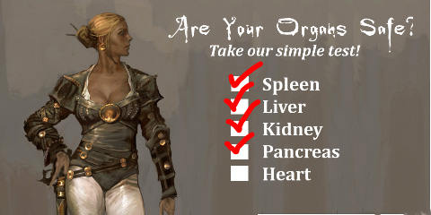

Back to: [West Karana](/posts/westkarana.md) > [2010](/posts/2010/westkarana.md) > [December](./westkarana.md)
# Daily Blogroll 12/2 -- Rift-tease Edition

*Posted by Tipa on 2010-12-02 06:00:15*

There's a Rift Beta event this weekend, and that's about all you'll ever hear of the beta from this site at least. To call their license agreement secretive would be an understatement. In Rift, you start out dead, and then are sent into the past to, I guess, prevent the events that led to your death from occurring, or something. Best let them explain it:

> Like a phoenix rising from the ashes, the survivors from the desolate future of Telara have resurrected champions and sent them into the past to prevent the dystopia caused by the Bloodstorm and the blindly faithful Guardians. Join the techno-magical Defiant in their fight to change the course of history!

Play to Win! Escape to Freemarch and you could be eligible to win an NVIDIA Geforce GTX 460 video card! Terms and conditions apply, click here for details. In-Game Prize Packs will be given away to ten (10) select players who complete the objective!

So, there you go. Log in, escape to Freemarch, and you could win a video card, or an in-game prize pack. You will never, unfortunately, be able to tell anyone in game WHERE you got that prize pack, because as far as future history is concerned, this beta never happened. The first rule is: You don't talk about Rift Beta. The second rule is: YOU DON'T TALK ABOUT RIFT BETA! ([Thanks to Amanda Rain](http://murren.wordpress.com/) for the Fight Club ref!)

Blogroll juiciness after the break!

Well, now that WoW's Cataclysm expansion is launched and the fever has died down and everything has been discovered and analyzed to death, it's time to start asking Blizzard where the next expansion is!

Wait, Cataclysm is still five days away? Ever ahead of the curve, Syp tries to figure out [where Warcraft can go from here](http://biobreak.wordpress.com/2010/12/01/where-can-world-of-warcraft-go-from-here/). 

Mr. Anderson at Juxtaposed Life is glad that the new easy leveling system finally makes WoW [exciting enough for normal people](http://www.xenopulse.com/blog/?p=968). Spinks agrees, saying that people who dislike the new faster, guided, low-danger leveling experience probably [weren't the intended audience anyway](http://spinksville.wordpress.com/2010/12/01/wow-the-new-levelling-experience/). Dragon Chaser P. Smith takes the opposite position -- that current WoW has drained all the things -- danger, discovery, surprises -- [that brought him to MMOs in the first place](http://dragonchasers.com/2010/12/01/in-defense-of-new-players/).

[Via Broken Toys](http://brokentoys.org/2010/12/01/blizzard-production-schedule-leaked-world-unsurprised-to-learn-of-12-more-expansion-packs-for-wow/?utm_source=feedburner&utm_medium=feed&utm_campaign=Feed:+BrokenToys+(Broken+Toys)), [a chart of Blizzard's upcoming releases](http://www.mmo-champion.com/content/2095-Blizzard-Product-Slate-Forum-Titles-Blizzcast-15-Blue-Posts), with a five quarter release schedule for WoW expansions, news on Diablo III and more. Sounds like [Team Spode](../../../index.php/tag/team-spode/) has just one more year of DDO.

The Friendly Necromancer has some more news on [the disappearing plants bug](http://thefriendlynecromancer.blogspot.com/2010/12/test-realm-disappearing-plants.html) in Wizard101 Gardening. I finally had to give up my [Test Realm garden](../../../index.php/tag/gardening/). Everything was dying or disappearing, but I'm still looking forward to gardening going live.

I'm always looking out for a MMO set in the Steampunk milieu. But there seems to be a lot of disagreement on just [what Steampunk IS](http://en.wikipedia.org/wiki/Steampunk). To me, it's the world of H. G. Wells and Jules Verne -- science fiction with perhaps a touch of fantasy set in the Victorian or Edwardian eras. It's REALLY SIMPLE. [Gatheryn](http://www.steampunktribune.com/2010/03/passing-of-gatheryn-steampunk-mmorpg.html) had [the aesthetic](../../../index.php/2009/09/26/checking-back-with-gatheryn/) nailed. Sherlock Holmes with ray guns.

[Atlus' Neo Steam](http://neosteam.atlusonline.com/) CLAIMS to be Steampunk, [but it is not](../../../index.php/2009/05/22/atlus-neosteam-first-impressions/). It's a F2P game set in a land divided, with one half using technology, and the other half using magic. I don't see what this has to do with HG Wells or Jules Verne. Nothing, right?

Throwing its hat into the ring is [Alaplaya's Argo](http://argo.en.alaplaya.net/), a F2P game set in a land divided, with one half using technology, and the other half using magic. So not only is it not Steampunk, it's a ripoff of Neo Steam.

It would be hard to measure my excitement.

Lastly, [Lucent Heart](http://www.lucentheart.com/teaser/default.aspx) claims to be something new to the MMO world -- a dating simulator (or as they call it, "an Zodiac-inspired Anime MMORPG"). Fall in love with another player, and together you rush out on adventures and use the power of your love (and your glowy swords) to kill things, just like real lovers do!

Check out the video below!

## Comments!

**Tanek** writes: While I'm not saying a license agreement exists for the Rift beta (or even that there is such a thing as the Rift beta), if one *did* exist it might be so secretive that one of the clauses would prevent you from disclosing the very existence of the license agreement that may not exist. Were that to be the case, you may or may not have broken the possibly non-existent agreement by just mentioning it.

>.>

I was never here.

---

**[Tipa](https://chasingdings.com)** writes: There is no spoon...

---

**[kaozz](http://www.ectmmo.com/)** writes: I was very excited about Rift beta but it's died down a bit. I guess I don't do well with hype these days :(

---

