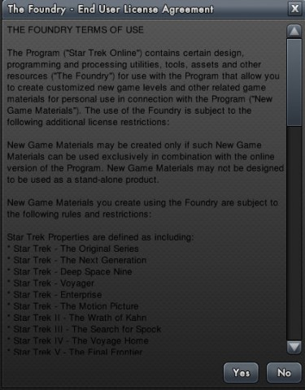
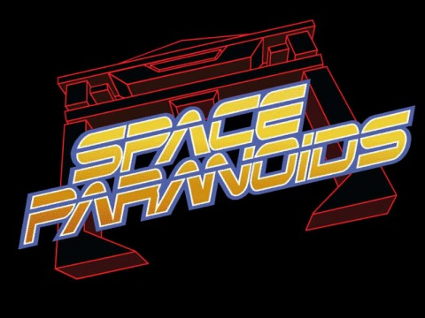

Back to: [West Karana](/posts/westkarana.md) > [2010](/posts/2010/westkarana.md) > [December](./westkarana.md)
# Gimme Some Space: Star Trek Online, Pirate Galaxy, Space Paranoids

*Posted by Tipa on 2010-12-04 16:36:23*

**Klingon meets Breen. Breen goes boom.**

Star Trek Online's launch missions were a little weak. If you stuck to the main storyline, you got some pretty exciting missions, but as you got to the higher levels, the missions tended to devolve into "go here, kill N groups of X." This is my main memory of the fight against the Borg that was the end game when STO launched. Accept mission, kill lots of Borg in space, kill lots of Borg on the ground. End result: boredom.

They were rushed, and it shows. The later Special Task Forces and Season 2's Undine arc revealed the sort of improvement we were hoping for all along, and the recent Feature Episodes just hit the ball out of the park -- they were easily the equal of many episodes of, say, Star Trek Voyager.

Each of those Feature Episode brought new daily missions, repeatable for loads of XP. I've been leveling my Klingon on those almost exclusively; the Klingon PvE missions come only every ten ranks or so and don't really help with the xp. Anyway. Do the dailies enough, and you find that they aren't quite as static as might be assumed.

The Deferi missions against the Breen, for instance, can work out a couple of different ways, apparently randomly. Sometimes you scan wrecks, sometimes you ward off attacks... and sometimes, you're surprised by something you didn't expect at all. A few nights ago, I encountered a Breen capital ship, the Desna, in one of my missions, just flying serenely around on patrol. I couldn't take it down and couldn't get anyone into my mission to help. I just kept flying at it and dying until I gave up.

[Longasc](http://twitter.com/#!/longasc) helped me train my bridge officers and acquire gear enough so that my ship could take on a capital ship. Then he took me into some exploration missions to teach me how to use it. From then on, I was on the hunt. Days of nothing went by, until, while helping the Deferi turn back the Breen threatening their homeworld, the "Snosk" warped in with two frigates. Finally. I cleared the other Breen squads, cloaked, and took a close look at the carrier.

I then lagged behind a bit until I was at the limit of my range. Decloaked, activated my damage buffs and fired a scatter volley that took out the two frigates and did a number on the Snosk's aft shields. Full impulse for a strafing run, cannons on rapid fire, hurled my ship at the carrier as it struggled to turn around and bring its forward beams to bear. It tried to tractor me, I polarized my hull and flew past, hitting my beam overload as my aft disruptors came into play. That finished off the shields; I turned and hit it broadside with cannons, and that was the end of the Snosk. Hardly took any damage at all.

That automatically started me on the path toward the "Capital Punishment" accolade. Now I just need to hunt down the Desna and her sister ship, the Istopp.

I'll write about the secret True Way daily another time.

Star Trek Online's user generated mission creator, "The Forge" is online. I'll have more about that later, but ... what's with the unreadable EULA? Did they run out of WHITE in the future? I know space is dark, but come ON!

**Pirate Galaxy**

Yes, it takes place in space, and yes, you get to be in a space ship, and yes, it is a MMO, but to call Pirate Galaxy a space MMO in the same way EVE or STO might be, would be stretching the definition more than a little. It's free and [it runs in your browser](http://pirategalaxy.com//) (and is available [via Facebook](http://www.facebook.com/pirategalaxy) as well). You have a laser and you can pewpew aliens.

But you could as well be in a toy race car, or, I dunno, playing ice hockey, because in Pirate Galaxy, there is no up or down. All the fighting I've seen so far takes place on a planet's surface, in your space ship that hovers a couple of feet above the ground, fighting aliens whose ships hover a couple of feet above the ground. When you do return to orbit or chart a course to distant planets, you are not fighting. Whenever a fight breaks out, you head down to the ground to settle the argument.

Once on the ground, and once you have mastered the rather slushy motion of your ship, you take on the standard variety of MMO quests. You do some escorts, you do quite a lot of killing, you kill stuff for collection quests, you loot gold and cryonite and blueprints from your defeated enemies, you take your party in a story thread that connects many of your missions...

I've been advised by other players to never attempt the third galaxy alone. And that if I play consistently for 2-3 years, I might just earn myself a really shiny ship! Yay!

**Space Paranoids**

If you're anything at all like me -- and, let's face it, if you're reading this, YOU ARE -- then you're probably counting the days until Tron returns to the big screen in Tron Legacy. Way, WAY back in the early 80s, the original film took those of us who were incredibly geeks on a journey into the world inside the computer, where video games came to life, and were, like, REALLY REAL!

The video games were so COOL that they were even more popular than the movie. There were LINES for [Discs of Tron](http://tips.retrogames.com/gamepage/dot.html) in my local arcade, even though it was a hideously expensive game to play -- two tokens.

One movie game that never did make it to arcades was the second one we saw in the movie -- Space Paranoids. Light Cycles was the first game we saw in the movie, but that game was just an evolution of a game that had been in arcades for awhile under various names.

Anyway, in Space Paranoids, you play a grid warrior in a light tank, fighting off other light tanks and evading "recognizers", immense flying arches that would relentlessly pursue you and then crush you.

As part of the promotion for Tron Legacy, the game has finally been released. You can [play Space Paranoids right now](http://www.spaceparanoidsonline.com/), in your browser. I'm not sure what happens if you get through every level; I conked out at level 9, and you can see my pathetic failure below. But you truly get paranoid! Love the game! If they'd had this game out back int he 80s, I may never have left the arcade. Serious.

## Comments!

**[kaozz](http://www.ectmmo.com/)** writes: I'm wanting to see Tron, also. It looks awesome!! If you like Tron type games you might like Armagetron, it's pretty neat, my son and brother use to play it quite a lot. http://www.armagetronad.net/

---

**[Lars](http://www.mymomentofzen.com)** writes: I haven't been playing many MMOs but I've been inching my way through the Deferi season 1 missions and I think they are way better (especially the later ones, with some story/dialog based ones with puzzles) than the original game content which mostly was formulaic and rather dull. And I hear it just gets better. So I'm rather happy with the direction the game is going.

---

**[Bronte](http://arewenewatthis.wordpress.com)** writes: Need more information on the Foundry when you get the chance!!

---

**[Yeebo](http://yfernbottom.blogspot.com/)** writes: Space paranoids looks like serious retro fun. I'm waiting for the client to get down to "practically free" or for my refound WoW addiction to cool off before I jump into STO.

---

