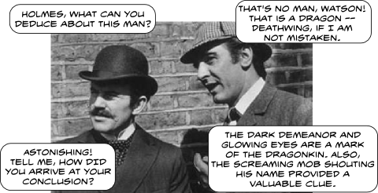

Back to: [West Karana](/posts/westkarana.md) > [2010](/posts/2010/westkarana.md) > [December](./westkarana.md)
# Daily Blogroll 12/7 -- Expansion edition

*Posted by Tipa on 2010-12-07 06:00:30*

The Imperial Japanese Navy attacked Pearl Harbor 69 years ago today. Now we're having a little payback at the expense of the whole world. I know a lot of people who plan to take days off to play their way through the entire expansion as quickly as they can. My cousin Tom even (jokingly, I hope), regretting that he had to work, thought he might let his son take the day off from school to play.

I'd like to be more excited about the WoW expansion. But -- I just don't think a game can make me feel like that anymore.

On with the blogroll -- it's been a long weekend. I was too busy playing a game which cannot be named to write much, so there's a lot to catch up.

**World of Warcraft: Cataclysm**

Arkenor feels a little left out of the Cataclysm hubbub, but maybe [Optimus Prime can help](http://www.arksark.org/blog/4301/in-which-i-agree-as-usual-with-optimus-prime/) him through it. The Green Armadillo doesn't think all the work Blizzard put into the old world revamp [can keep people busy](http://playervsdeveloper.blogspot.com/2010/12/from-shattering-to-cataclysm.html) more than a few weeks. Anjin from Bullet Points reminds us non-players that [it's not cool to rain on the WoW parade](http://bulletpointsblog.blogspot.com/2010/12/random-shots-you-are-not-required-to.html). And Ars Technica has a grand unboxing of [the WoW: Cataclysm Collector's Edition](http://arstechnica.com/gaming/news/2010/12/digital-real-world-rewards-unboxing-the-world-of-warcraft-cataclysm-ce.ars).

**Rift**

On a completely different note, Rift has announced [their next beta weekend](http://forums.riftgame.com/showthread.php?10475-Beta-Event-2-Guardians-of-the-Vigil). Where this last weekend's test focused on the technomagical Defiants, this next test will focus on their foes, the proud religion-motivated zealots, the Guardians. Rumor has it that a third beta test will pit them against the Defiants in a huge PvP battle. More when Trion Worlds releases more since nobody can talk about the game besides them.

**Jumpgate Evolution**

Via Massively, news that Jumpgate Evolution publishers [Codemasters has sued developers NetDevil](http://massively.joystiq.com/2010/12/06/codemasters-files-suit-over-jumpgate-evolution-delays/) for a return of the $1.4 million they paid them to ship the game, which is almost two years late. Commenters point out that NetDevil did manage to ship LEGO Universe in that time. If forced to repay Codemasters, it likely means JE won't see the light of day -- and financial difficulties may affect LU as well. Too bad, I was really looking forward to some new space combat MMOs to try. Well, any word on [Black Prophecy](http://www.blackprophecy.com/)?

**EverQuest II**

The Ancient Gaming Noob writes about [the new vampire race](http://tagn.wordpress.com/2010/12/04/team-edward-to-norrath/) that will soon be added to EverQuest II -- but only, apparently, to current subscribers. Given the easy availability of a trinket that can turn you more or less permanently into a vampire, I doubt anyone will really cry into their boots if they can't play as one from the start. Honestly, what would vampire players do, anyway? [Enroll in high school and spend centuries stalking teenagers](http://www.geekosystem.com/anne-rice-twilight-ridiculous/)?

Arkenor wonders [why vampires](http://www.arksark.org/blog/4264/new-eq2-race-is-vampires-seriously/), when there's lots of OTHER races players have been asking for since forever? But, while it's true players have been asking for gnolls to become a player race for over a decade now, EQ2 would STILL be accused of being copycat, what with WoW's Worgen race. Just can't win for losing down there in San Diego.

**DC Universe Online**

I'm not a big fan of game NDAs. I abide by the ones I sign (or click), but I sure don't like it. While I'm technically eligible to play in DCUO, since I pre-ordered it and have the receipt, I didn't get it copied and sent to SOE so I am not in the beta, and my friends who DID get in, can't tell me about it. Thus, I was pretty happy to read Ars Technica's [first look at the DCUO beta](http://arstechnica.com/gaming/news/2010/12/saving-heroes-from-themselves-ars-plays-the-dc-universe-online-beta.ars). Is it going to be the superhero game for the rest of us? Comments from the beta testers tended to point to the DC Comics IP as the only thing really setting it apart from Champions Online and City of Heroes.

I suppose this post could have been longer. Tomorrow it will be, but tonight -- I have some Sherlock Holmes to watch!

## Comments!

**Hudson** writes: I know a site that is following the DCUO beta. I can tell you that the only thing setting the game apart is the fact that it is a console port :) and no where near as in depth as MMO's as we know it.

---

**[pasmith](http://dragonchasers.com)** writes: NDA has been lifted on DCU so now I can talk freely.

DCU isn't an MMORPG, it's an MMO Action Game. Whether people are willing to shell out $15/month to play an action game remains to be seen, but I've been having fun with it.

Expect tremendous amounts of hate from MMORPG gamers who think this is like Champions Online or City of Heroes just because it has comic book characters. It isn't, at all. 

Put it this way, there's are combos required to fire off skills. Y'know, X, X, X, Square = flying backhand karate chop

It absolutely plays better with a gamepad, too. So that's another vote against it to MMORPG gamers who only have a hammer and so think everything must be a nail.

---

