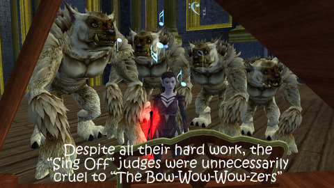

Back to: [West Karana](/posts/westkarana.md) > [2010](/posts/2010/westkarana.md) > [December](./westkarana.md)
# Daily Blogroll 12/10 -- Bite from your wallet edition

*Posted by Tipa on 2010-12-10 06:00:26*

I was thinking about some of the things we know about Star Wars: The Old Republic. [It's going to be a subscription game](http://darthhater.com/2010/12/07/ea-at-ubs-media-and-communications-conference). It cost a hell of a lot to produce -- perhaps [more than $100 million](http://www.eurogamer.net/articles/swtor-is-eas-largest-ever-project). And yet they think they're gonna have no trouble making their money back [even if they have less than a million subscribers](http://www.escapistmagazine.com/news/view/105946-EA-Old-Republic-Doesnt-Need-a-Million-Subscribers).

It's no secret. I can do the math. They're gonna be bleeding their subscribers absolutely friggin' *dry* in the Bioware cash shop. But that's okay! That would have really bothered me a couple years ago, but now -- I'm buying space ships in STO and pets in Wizard101 and heck, EQ2 is even taking the bloodsucking thing to a whole new level by adding a new Vampire race to their cash shop.

So yeah. Totally there. Wave of the future, folks. Onto the blogroll.

**EverQuest II**

Sure, WoW may have their playable undead and their playable werewolves and all that, but EverQuest II has rats, cats and frogs... and trolls, ogres, barbarians, dark elves, high elves, wood elves, half elves, gnomes, dwarfs, halflings, probably some I've forgotten. To that long list come the Vampire race, EQ2 Live's first cash shop race. I have to be really specific, because EQ2X, the "F2P" version of EverQuest II, has been selling races since it opened in packs of three -- one popular race and two less popular races per pack. (And I need to point out that current subscribers will get the Vampire race for nothing when they pick up their copy of Velious in February).

Arkenor goes deeper into the Vampire lore and tells us the story about [how Courtney Love managed to become the model for all vampires in Norrath](http://www.arksark.org/blog/4344/eq2-new-information-of-the-freeblood-vampire-race/)!

**Star Trek Online**

Star Trek Online's Season 3: Genesis [hit the live servers today](http://www.startrekonline.com/season_three), *sans* the player-created content tool, the Foundry. But there's a lot of new stuff -- new sector space display that makes it look more like space, the ability to replay old missions, more stuff for Klingons to do in the Pi Canis sector block, and the promise of more stuff to buy in the cash shop.

Werit's been hanging out in STO recently, and he's come to appreciate [the willingness of the developers to interact with the community](http://www.weritsblog.com/2010/12/developer-communication.html) -- not just on the message boards, but online, too. (The special sekrit channel, TTS for Tribble Test Server, usually has a dev or two hanging out in it).

Commander Scott at Pumping Irony [has a fairly comprehensive look](http://pumpingirony.net/2010/12/09/sto-season-3-and-beyond/) at all the other new things that have come with Season 3. Crafting! You like crafting, right? Everyone likes crafting!

**DC Universe Online**

DC Universe Online has gotten mixed reviews from its PC beta testers. Some love its action-oriented, arcade-like gameplay, while others wonder if it has enough MMO flavor to make any headway against fellow genre games City of Heroes and Champions Online.

That shouldn't be an issue when DCUO makes its debut as the first MMO on Sony's PlayStation 3. To get maximum exposure, every subscriber to Sony's PlayStation Plus service [gets in the beta](http://www.1up.com/news/dc-universe-online-beta-coming-ps-plus-subscribers). YOU get in the beta. And YOU get in the beta. EVERYONE GETS IN THE BETA! If they're PS Plus subscribers, anyway.

**Planetside Next**

Planetside made a big splash when it went live a few years back -- first person shooter MMO with three warrior factions! A lot of the RPG-ish elements that later made it into Call of Duty and other modern FPSs, got their start in Planetside. People have been asking for a sequel to the game for years, and [it looks like they're gonna get one](http://www.escapistmagazine.com/news/view/105953-Sony-Online-Strongly-Hints-Planetside-Sequel-Coming-This-Spring). 

Fairly easy to predict this is going to hit the PS3... where it's gonna have to go up against the games it inspired.

**Wizard101**

Team Spode's own Gleek is taking a trip through the Spiral NAKED! Yup, 100% full frontal ALL NUDE ALL THE TIME WIZARDRY. Why? Don't care. [It don't matter none](http://thefriendlynecromancer.blogspot.com/2010/12/level-10-angus-dont-care-none.html).

**WoW of CraftWorld**

Everyone is still loving WoW! Go Cataclysm! Cataclysm rocks!

Have a good FRIDAY!

## Comments!

**[Fuan](http://Yourwebsite)** writes: The news about Planetside is huge!!! I'm so excited now, especially since it's only a few months away (if it's true). Hopefully if it's also being developed for the PS 3 it won't lead to a subpar PC experience.

---

**[Tipa](https://chasingdings.com)** writes: I'd be shocked if it weren't being developed for the PS3. Once SOE was absorbed into SCEA, the hardware arm of Sony, every new game seemed to be developed with the PS3 in mind.

---

