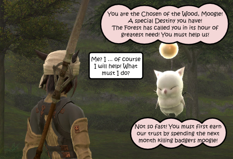

Back to: [West Karana](/posts/westkarana.md) > [2010](/posts/2010/westkarana.md) > [December](./westkarana.md)
# Daily Blogroll 12/14 -- Take my game, PLEASE! edition

*Posted by Tipa on 2010-12-14 06:00:17*

FFXIV opens with a fantastic character generator, shows you a wonderful cinematic that soon includes you and segues smoothly into the tutorial. You soon are dropped into a crowded inn with quest givers that you will come to know very well. They give out your "guildleves" -- kill quests, and your "local leves" -- crafting quests, and finally your "field leves" -- harvesting quests. Your remaining days in FFXIV will consist of filling up on leves, going to the place they tell you to go, killing trash mobs, making items you won't be able to keep, and whacking away at harvest nodes.

Once in a very, very long while, you will get to continue the story for a short time -- and then it's back to the leves, hoping for the next bit of the story. Or perhaps to rise high enough in level to see anything but the forest. In a game that almost begs for exploration, it keeps such things as the ferry to other cities, riding chocobos and even travel deep into the forest outside Gridania locked away.

FFXI had its issues -- a lot of them -- but for the most part, I had fun. Nothing stopped me from exploring (and dodging high level monsters). FFXIV, on the other hand, constantly teases with the fun stuff just over the next horizon. Except over the next horizon are more badgers, bees, animate fungus and so on to slaughter, mindlessly.

If a MMO player had to choose between FFXIV and WoW, I can't think of anything that would compel them to choose FFXIV. They'd miss questing, an explorable world, any goals, dungeons, etc. They would gain a limited ability to mix and match class abilities to form a custom class of their own choosing, but then, with Rift coming out which goes crazy with customizability (and includes leveling by quests or rift chasing or PvP), it's not easy by any means to build the case for the game.

Now they're [tossing the game's director and producer](http://multiplayerblog.mtv.com/2010/12/10/final-fantasy-xiv-ps3-delay/), taking the game back to the workshop for a complete overhaul, and not charging for a subscription until sometime next spring. That puts it just after Rift's launch, and just before SWTOR's expected launch in April. I have no idea what they could possibly do to fix the game. It is SO BEAUTIFUL! I guess my only suggestion would be to put some of the fun stuff closer to the start of the game.

On to the blogroll.

**Rift**

A lot of people are calling Rift "TGWCBN" -- The Game Which Cannot Be Named -- because of the bizarrely over-restrictive NDA which prevents anyone from writing anything good about the game. (People who want to trash the game probably don't care much about keeping the NDA, you see). Yet, there is some small amount of publicly available, developer approved information out there, and the Green Armadillo has gleaned enuf sekrits from the podcast, et al, to ask [some insightful questions about Rift's future](http://playervsdeveloper.blogspot.com/2010/12/leaning-towers-of-telara.html), once the shine has left the apple. Could Rift be headed to a Warhammer-like sudden subscriber drop once the playerbase has spread out too much to easily take on the eponymous rifts?

**War of Worldcraft**

WoW: Cataclysm roared out of the gate to top the charts as the most popular PC game ever sold. Chris Smith of Levelcapped was forced to wonder if perhaps WoW: Cataclysm shouldn't really be considered an expansion, [not an entirely new game](http://levelcapped.com/2010/12/your-opinion-counts-expansion-or-game/)? 

**Elder Scrolls V: Skyrim**

Looks like Bethesda's follow-up to its single player, sandbox RPG Oblivion won't be an MMO, after all. [Skyrim, a direct sequel to Oblivion](http://elderscrolls.wikia.com/wiki/Skyrim), is the setting for the return of dragons to the world. Okay, so it's a single player game -- will it still repeat Oblivion's mistakes and punish you for leveling? The Mind Bending Puzzler [looks back at the myriad questionable design decisions](http://mindbendingpuzzles.blogspot.com/2010/12/are-single-player-gamers-more-forgiving.html) made by the Oblivion team, and wonders what's in store with Skyrim.

**DC Universe Online**

Syp [takes a look at the DCUO character creation and tutorial](http://biobreak.wordpress.com/2010/12/11/dcuo-tutorial-impressions/). I'm excited and nonplussed at the game in turns. Of course I'll play it, BUT... will this be another one month fling?

**FFXIV**

Tobold has [his usual insightful take](http://tobolds.blogspot.com/2010/12/chronicle-of-death-foretold.html) on the FFXIV brouhaha.

**Mythos, the Second Coming**

Massively reports that Flagship's ex-MMO Mythos is finally [making noises of imminent return](http://massively.joystiq.com/2010/12/10/mythos-inches-closer-to-closed-beta/) under its new publisher. So, sign up for the beta and all that. Mythos had some absolutely killer combos.

**4Story**

And lastly, Korean F2P PvP MMO "4Story" is having [a "Naked" Tournament](http://www.gamerslifeline.com/news-4story-launches-naked-tournament/) -- everyone gets into a pit and gets naked. First one out with their dignity intact wins the tourney!

I wonder how much it costs to hire a native English speaker to translate your Korean press releases? I just have the feeling $20 would get a Korean-American college kid to offer better translations than "Also check out more than 2 GMs are waiting for you to guide out and push you to go out to kill something live" or "And this manipulated war zone, you can even kill eminent high level users."

Although, the thought of two GMs just waiting for you to pop up so they can push you into the arena to kill something live is pretty intriguing.

Long intro embedded below. Of course, [it's no Luna Online](http://www.youtube.com/watch?v=CJr-CKII4T8), but what is?

## Comments!

**[mbp](http://mindbendingpuzzles@kevnol.net)** writes: Thanks for the linky Tipa. 

I have been thinking about bit more about Oblivion's much reviled level scaled mobs feature. I think the intention was to allow a completely open world where a character could go anywhere at any stage of the game and always meet level appropriate mobs. 

In fairness to Bethseda the open world concept did work and every player's progress through the game was different. In fact many people agree that the real value of Oblivion lies in the fabulous side quests that you stumble across on your journey through the land. 

Unfortunately though when you create a world where a level 1 character can go anywhere then you create a world where no where is particularly special. I am sure a better compromise could have been reached and indeed many modders have already implemented mods which fix this.

---

