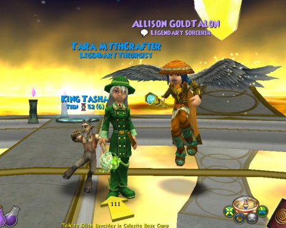

Back to: [West Karana](/posts/westkarana.md) > [2010](/posts/2010/westkarana.md) > [December](./westkarana.md)
# W101: Celestia finished!

*Posted by Tipa on 2010-12-19 14:55:47*

I SHOULD be playing the BTCNBM... oh what the heck, I should be playing in this weekend's Rift beta event. And I have, but ... past few days, I've been getting closer and closer to finishing Celestia. The turning point was getting Ra and the Forest Lord. With a one-two AE punch that could clear through trash in a couple rounds, the remaining quests went MUCH faster.

Having opened up the Stars and Moon portals, only the Solarium remained. Many Pisceans died in the Solarium, incidentally completing some quests from way back in the Stellarium. Every bit of XP helped.

**Calypso** -- Figurehead of the boat she commands. Well, the boat is kinda sunk. It's like in DDO, pirate ships never seem to GO anywhere. I have to imagine Calypso commanded her zombie crew to tramp in circles outside the grotto in which the ship is sunk, and never stop. Can you really be pirates without a ship? Mixed in with the pirates in Blue Bart, a creature of some sort. He was annoying largely because being a life monster, he was more or less immune to Tara's spells. I once saw three Blue Barts tramping around in circles with the zombie pirates.

**Queen Morganthe** -- she and her minions guarded the last portal piece in the Solarium. She took off, leaving a rather weak boss to fight us. By that time a level 50 friend had ported in and was helping -- he stayed for the rest of Celestia, but since he only has text chat, it was hard to discuss strategy.

**Trial of the Spheres** -- Having done this instance so often on the Test Realm, and a couple of times after Celestia went live, I knew generally what to do at each stage. I got my friend to wait and let me take the lead on things, and after that, things went okay. Slowly, but okay. Neither of my characters got any decent loot from the Trial, but ... I bought everything at the Bazaar anyway.

After that, it was back to Ravenwood to inform the Storm Professor about Celestia, and -- I have lots of quests left to do in Celestia, but a) am now at max level, b) have all the loot I need, and c) can't get any more training points, so I'm calling it finished. I'm going to take a break, just continue working on gardening, and then bring Marissa, my Myth wizard, through. With Ra helping, it should go a little more quickly.

Looking back, it took about as long to go through Celestia as any of the other worlds. It's nice to see that we have a new villain, Morganthe. Now, the Laws of Plotting demand that Malistaire either join her or battle her at some point. I'm hoping they join up. A Malistaire-Morganthe teamup would be EPIC.

## Comments!

**[Arlen Dawneyes](http://twoheadedwizard.blogspot.com)** writes: Nice job! Living with Text Chat for a while (me) is tough but I manage nice and know what to do in any place. Whats next for the duo? :)

---

