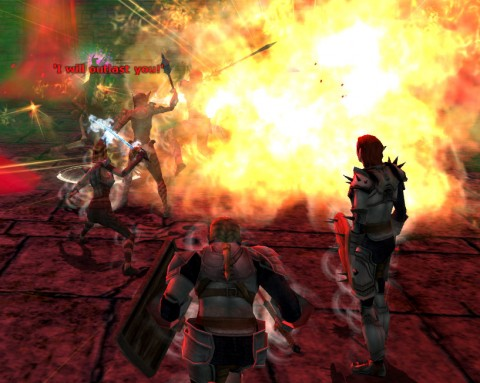

Back to: [West Karana](/posts/westkarana.md) > [2010](/posts/2010/westkarana.md) > [December](./westkarana.md)
# DDO: The Wight at the End of the Tunnel

*Posted by Tipa on 2010-12-21 12:20:15*

Delera's Tomb has some sort of unhealthy obsession with dead girls. You have the "Dead Girl's Notebook" one-off. Then you have the whole Delera questline proper, where you free the spirit of the dead girl and then hunt down the evil necromancer what did it to her.

It's as if Turbine's quest scripters had come off a weekend binge that included a half dozen Japanese horror movies, stumbled into work on a Monday with their brain cells still crackling, and wrote what they saw when they closed their eyes.

There's an undercurrent of despair to most of DDO's quests. Having children means living your life worrying that something bad will happen to them. In Stormreach, something bad ALWAYS happens to them. But then again, pretty much everyone in the DDO universe is living on borrowed time. No matter who you are or how much good you've done, somewhere someone has just given a bunch of wisecracking adventurers the quest to kill you.

Last week, we freed Delera's shade from its eternal torment, but even released, she could find no peace. There could never be a rest for her while her tormentor still lived his unlife. Sunday, then, we took on the evil power of the graveyard, Dreadlord Giddeon.

We first had to have a chat with Dead Delera, who was kindly waiting for us in a one-room dungeon of her own. She'd moved, apparently, from being the queen of her own lair, to being trapped alone in a room. That's what we call progress, folks. Just a single file of adventurers each coming in for a moment to assure her that this time, the Dread Lord would REALLY be defeated. And each time, Delera was wishing to be a wraith again, so she could at least kill ONE of them. Just for old time's sake.

Out again for a chat with an NPC, and then to the Necromancer's Lair. Built right next to Delera's Tomb, but with no connecting passages. The Dreadlord gave Delera her space.

For this run, I'd spent a few days playing the auction house, looking for gear that was both affordable and would hit my nemeses, the Ghostly Skeletons. Which are neither ghosts (cannot be touched by "ghost touch" weapons) nor skeletons (have no weakness for blunt weapons). They're the pineapples (neither pine nor apples) of the undead bestiary.

I'd been outbid on two very nice rapiers, but managed to snag a Rapier of Pure Good +1 for my main hand. For the off hand, though, I was forced to resort to the Holy Club that we'd all been handed at the start of the quest series. It worked well enough; I switched between that combo and my trusty Quarterstaff of Backstabbing for the true skeletons and some of the wights for most fights. I just like the whole concept of a blunt staff that can backstab.

Gleek had gotten sufficient experience to reach level 8, but was holding off on the promotion so that he wouldn't outlevel Shy when we make our triumphant return to Delera's Tomb on hard mode next year. I pointed out we still had our Team Spode 1.0 characters available for a little retro action to help Shy along -- she's been stuck at level 4 for weeks, hating the solo leveling grind. Who can blame her? Even pseudo-MMOs like DDO are best played with other people.

Anyway. Spode playing the human trap detector, check. Long room full of sarcophagi that popped out at us as we passed, check. Pressure switches, check. Me dying because I was taking screenshots, check :) About the only thing we missed this time around was a water-filled tunnel we could drown Spode in.

The Dreadlord was all bluff and bluster, but remarkably short on killing power. All he killed was me (see: screenshots). Once raised, I unlocked the two locked chests for teh ekstra lewt. See, I KNEW there was a reason they keep me around!

We all chose the Voice of the Master, the 5% experience trinket, for our final reward. Speaking of which, the Master's voice -- Gary Gygax's narration -- was little in evidence on this final mission. Someone (Spode? Gleek?) provided replacement narration in a dead-on copy of Gygax's stentorian tones.

Afterward, it was still early; we decided to do Dead Predators, which was advertised to me as "quick" and "easy" and "we shouldn't need a cleric for this" and "we'll do it on elite!" and "don't worry, Ulan can handle the healing!"

When we got back from the wipe, we brought a cleric hireling and didn't have many troubles after that :) Stormreach can feel safer, now that the undead threat is over.

Until next time.

Next week is an off week due to the holidays. When we come back, we'll either be playing our 1.0 characters with Shy, or restarting Delera's Tomb, but this time on hard mode.

## Comments!

**[Capn John](http://capnjohnsblog.blogspot.com/)** writes: I think Backstabbing with a Staff falls into the "Pineapple" category. Sort of. Actually, you can make a thrusting or stabbing-type attack with a staff, and a successful staff thrust/strike to pretty much any region of the spine would result in critical damage, so...Backstabbing with a Staff? Not as far fetched as one might think.

---

**Gleek** writes: Glad I could provide some narration for the adventure. ;)

---

**[/AFK: Boxing Day Edition &laquo; Bio Break](http://biobreak.wordpress.com/2010/12/26/afk-boxing-day-edition/)** writes: [...] West Karana — DDO: The Wight at the End of the Tunnel “It’s as if Turbine’s quest scripters had come off a weekend binge that included a half dozen Japanese horror movies, stumbled into work on a Monday with their brain cells still crackling, and wrote what they saw when they closed their eyes.” [...]

---

