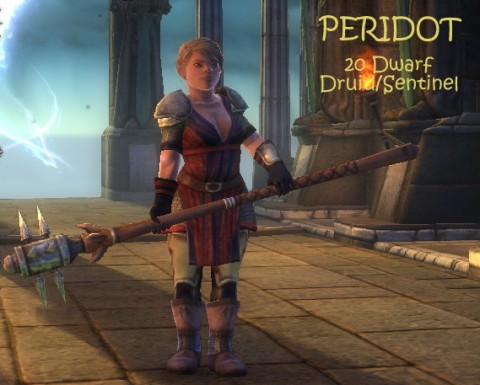
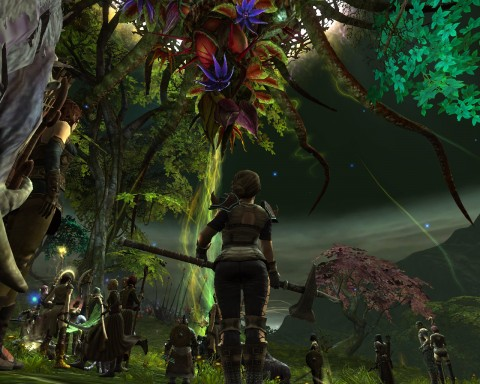
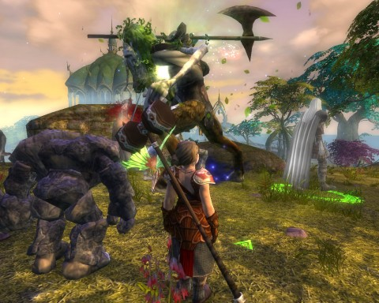
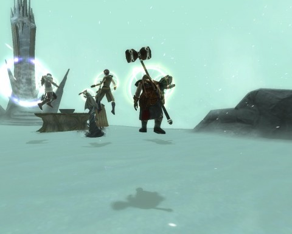
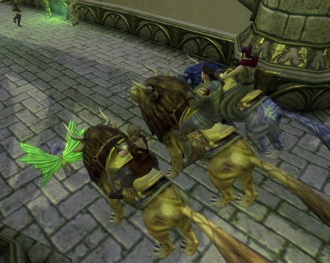

Back to: [West Karana](/posts/westkarana.md) > [2010](/posts/2010/westkarana.md) > [December](./westkarana.md)
# Rift: The Realm of the Faerie

*Posted by Tipa on 2010-12-22 13:36:11*

The Rift beta NDA has just been lifted, and there's so much I want to write about. I want to tell why this makes me feel like I felt when playing EverQuest, even though it really is nothing like EQ. And in fact, EQ did certain things better. So maybe I'll work something about that into this article, more in others. For now, this is just going to be a stream of consciousness ramble through the second Beta event, the fantasy-based Guardians.

Two sides -- the technomagical Defiants and the fantastical Guardians. They come from the opposite ends of time to defeat the otherworldy threat of Rifts spawned by extradimensional dragons. And if they can give each other a few knocks, so be it.

Likely starting most clearly with WoW and even more so in the latest crop of F2P games out of Asia, battle lines in fantasy MMOs seem more often based on the forces of technology facing off against the magical forces of nature. That's roughly the division here. At the end of the world, right before the final destruction of the patchwork world of Telara, the Defiants resurrect heroes from the past, ensoul them with the souls of their enemies, and send them into the past to defeat the evil before it has had a chance to shatter the world. You'll have a chance to remove a second soul from another fallen enemy before your trip backward in time, though. The Defiants are the "evil" side, the side that puts results above means, and living creatures are just more machinery. You, the resurrected hero from the past, are an "Ascended", a literal god from the machine.

The opposite faction, the Guardians, consider the Defiants the worst abominations against the gods that could possibly be imagined, and the Defiant "Ascendeds" parodies of the real things. The Guardian Ascendeds are resurrected heroes from a battle in their more recent past, against a vile fire dragon. They have the souls they had before -- their calling -- but can acquire new ones through magical means.

Your calling is your general class -- cleric, warrior, mage or rogue. No surprises there. Your souls are your subclasses, all within your calling. You can have eight souls at the ready, but you can only form your current capabilities from a maximum of three souls at a time. It's easy to explain in World of Warcraft terms: Think of the "souls" as specific talent trees within a class, and you have the idea. Points are divided the same way as WoW talent trees. The only real difference is you have up to eight to choose from (three at a time), and that no soul can really stand alone. With the latest WoW patches, every tree can more or less perform any of its traditional roles in a group. In Rift, you can build a cleric that cannot heal at all, rogues that can tank, healer mages...

Okay, header picture is my Guardian Dwarf cleric, Peridot. She carries a comically huge meat tenderizer and jumps, screams and leaps into battle. Her original soul, an Inquisitor, had no heals -- the focus there was on dots and nukes, basically a priest-mage. I mixed in Druid for her second soul, which gave her melee abilities and a pet that could nuke and heal. I liked that so much that I made a second spec that was just Druid, and stuck with that until level 18, when I could do the quest for my third soul. Since I thought I might like to heal, I mixed in some Sentinel, a pure healer. For the Realm of the Faerie instance run, I was pure Sentinel, with a little Druid mixed in so I could keep my pet.

If I did it again, I'd start out with Justicar, a straight-up battle cleric, mix in Druid for my second soul, and go for Sentinel once again at 18 to get ready for instance runs. That's if I was leveling via quests, which is more or less solo, at least before the mid teens. If I decided to level via Rifts, well, I'd want to get a group together and be a healer and go around the world seeking out and closing Major Rifts.

There's a bunch of different kinds of planar incursions. The smallest is a Minor Rift -- these can be opened and cleared by a single person. Next comes a Minor Invasion. When a Minor Rift is allowed to proceed, it shoots out invasion forces -- traveling rifts -- which tend to beeline to quest hubs. The rift then spawns a foothold, a static spawn of mobs. Major rifts have the same behavior, but are filled with epic mobs that will waste any soloer to slow to move out of the way.

And then you have the occasional full on invasion, where planar battles erupt around the major cities of the land.

Rifts are in no way rare things; you'll see them ALL THE TIME. Even the most dedicated soloer is going to be forced to take part in Rift sealings. You will jostle around in the open world with your community.

Trion is constantly tuning things so that Rifts don't open that are too powerful for the people in the zone.

Next slide, please.

Oh yes. Does this look like any game you know? Yeah, it doesn't stray far from WoW's UI. If this had been the first thing I'd seen of Rift, I'd likely have instantly lost interest. The UI isn't the only thing that will have you thinking about the world's most popular MMORPG. The graveyard/spirit healer death mechanic will be instantly familiar. Though there is no item decay (yet), each death drains 10% of your "soul vitality". I'm not sure what happens when that reaches zero. You can pay a "Healer" NPC to restore your vitality, for cash. I believe vitality affects your magic and health regeneration.

The picture is from the Autumn section of the Realm of the Faerie, which I'll get to in a bit.

Stepping back a bit, I snapped this picture -- it's an in-game cut scene (they call it a "vision"). This one explains some past happenings. I believe the betrayal or betraying of the King of the Aelfwards. Not bad enough we have to contend with Rifts, dragons and the other faction, but the NPCs have their own little wars. The Guardians have the Aelfs, the Defiants have the Iron Tomb dwarfs. Both connect up at their respective level 18 instances, the Realm of the Faerie and the Iron Tomb, respectively.

The Guardian zone of Silverwood has two fairly separate story questlines -- the first is an invasion by the minions of a fire dragon, and the second is an ongoing war between the good elfs of the Guardians, and the evil Fae led by Lord Forgot His Name. Nasty dude, though.

Your private battles vs the Fae end at the lip of a deep, magical well. At the bottom, you encounter the Realm of the Faerie, a living temple to Nature in all its glory. The shrines of spring, summer, autumn and winter are within, and you must bless each one to reign in the evil that rages outside. Each shrine is in an area themed with its season. You start out in the spring and move to summer, taking on the Fae that work their dark magics there. You have a brief rest in autumn, but soon interrupt an argument between two lords of the Fae. A blinding blizzard heralds winter, and you will fight trash mobs you can barely see until you've defeated enough of them that the storm lets up. You'll then fight four bosses in a row, with only seconds to rest between them.

(Unlike WoW, you can "drink" and "eat" during combat).

In the end, we killed the bosses but missed the big prize, as Lord H. came by and easily defeated us (per the script), while letting us live to carry news of his victory to our Sanctum Lords.

I was the only cleric in the group, with my Sentinel/Druid spec, and I mostly kept everyone healed by mixing fast heals, slow but more efficient heals and group heals, same as any cleric in any game, really. I believe one of the mages had a Chloromancer soul active, but I'm not sure how much healing he contributed. Similarly, I just had my pet stick to the nuking because her heals weren't really doing that much. We wiped only once, in Summer -- the tank pulled two groups, my heals drew aggro, and that was that. We all had Soul Walk up, though -- once an hour, you can choose to respawn where you are, given a 15 second head start to find a safe place to rez.

Picture of me, Longasc and Kentravyon on the mounts we bought at level 20. They look almost exactly like the WoW Horde druid travel form, but bigger. The Defiant ones are steampunk... oh, I wasn't going to start mixing in the Defiant stuff, but here's Longasc's character on his mecha-steed with my Bladedancer/Riftstalker rogue, Tipa, standing in front.

So, summary:

Rift IS like WoW in a LOT OF WAYS. Not only the interface; you won't be able to go five minutes without seeing something that reminds you of a corresponding element in WoW. The crafting is all WoW -- I think they even reused a lot of the same recipes. Crafted items are, oddly, generally better than equivalent level quest rewards, and can be further enhanced with items (typically found in rifts) which grant stat bonuses.

Take away the Rifts, and this is a WoW-clone. Even the "souls" mechanic is just, as I mentioned before, a variant of WoW's talent trees. You may be able to make a wide variety of specs, but you'll likely end up with your solo spec and your group spec -- just like in WoW. You can buy several specs, though. The quests are par with the latest quests in Cataclysm, the one dungeon I've been in reminds me of any number of WoW instances. Realm of Faerie strongly reminds me of ~~that one dungeon in Stonetalon Mountains, with the god in it~~ Zul'Gurub in Stranglethorn Vale.

But you get to go at level 18 in Rift.

BUT! The Rifts change EVERYTHING! They tend to eventually concentrate people in the zone, make them come together. If you're smart enough to start or join a Rift group, you can pretty much skip a lot of the questing and level very quickly by closing major rifts. The rewards are pretty good, too -- if you're one of the top contributors, you get a nice piece of gear for your class. Other random loot drops, as well as the motes everyone gets, which can be traded in for planar gear. The meat tenderizer in the top picture is a planar reward; my character also has a couple of non-visible rewards. Almost all her armor is level 19 stuff I crafted myself; most of the crafted armor was better than the stuff I got via quests, especially once I added planar drops into the crafting process.

There's a whole "A" team, "B" team thing in game development. The "A" team develops the game according to a shared vision of something new, then the "B" team takes over and removes all the cool stuff in favor of ever-increasing mediocrity. Both EQ and EQ2 have been "B" teamed to death. But I am loving what the "A" team has done with Trion's Rift.

There's only room for one WoW-like in my life. Rift is the one.

## Comments!

**[spinks](http://www.spinksville.com)** writes: Sounds like you had a great time ;)

---

**[Tipa](https://chasingdings.com)** writes: I did! I think part of the reason is that I am so far behind in WoW that I can never catch up, but this here is a game I can be out in front for -- like STO and W101.

---

**Yeebo** writes: The two sides you are describing sound similar to Allods Online. In Allods, I found the steampunk eastern European themed "evil" side to be really entertaining. However, the magical nature themed side was so generic that I couldn't get into it (despite the ability to play as three little teddy bears that can summon a pink attack squirrel...which I admit did appeal...).

---

**[Tipa](https://chasingdings.com)** writes: Yeah, a lot of newer MMOs are going for tech vs magic instead of good vs evil. I guess fighting against evil just got boring.

---

**[Randomessa](http://casualdoes.wordpress.com/)** writes: For someone like me who never got into WoW, in large part because the graphics just did not appeal, I don't see things in Rift and see the connection to WoW - I just like what I see. There is also the appeal of being able to get in on the ground floor, as you mentioned. A lot of fun was had at Chez Randomessa these beta weekends. Thanks for sharing some of the post-level 16 experience, since we never managed to get past that point!

---

**[Lock, Stock, and Barrel: Rift Edition | Vagary.TV](http://vagary.tv/archives/5438)** writes: [...] TenTonHammer, Massively, MMORPG, KillTenRats, West Karana, MMO Reporter, Biobreak, Spouse Aggro AKPC\_IDS += "5438,";Popularity: unranked [?] Share [...]

---

**[Rift Take Me Away &laquo; Casual Is As Casual Does](http://casualdoes.wordpress.com/2010/12/22/rift-take-me-away/)** writes: [...] seems everybody has something to say about Rift, so I’m not sure I have much to add. Since I don’t play WoW, many of the similarities [...]

---

**[Tipa](https://chasingdings.com)** writes: I totally had fun in the beta, and when it stopped I missed it. EQ and EQ2 were amazing at launch. I just love the new MMO smell.

---

**Telke** writes: There's no instance dungeon in Stonetalon Mountains, so I'm not sure which one you're thinking of....

great write-up though, many thanks.

---

**[Daily Blogroll 12/23 &#8212; Christmas Eve Eve edition - West Karana](https://chasingdings.com/index.php/2010/12/23/daily-blogroll-1223-christmas-eve-eve-edition/)** writes: [...] wrote my rather rambling thoughts about Rift earlier today. I really enjoyed it, but not everyone had such warm feelings about the [...]

---

**[Tipa](https://chasingdings.com)** writes: @Telke gah, been so long. I meant the one in Stranglethorn Vale, Zul'Gurub. I should have looked it up before I wrote.

---

**[Jomu](http://www.justonemoreunlock.blogspot.com)** writes: i was actually thinking of playing the guardians, until i saw the steampunk horse.... guh.. how can't you not play that side now??? ;)

---

**[I’m happy I didn’t get in the Rift beta | Multiplaying](http://www.multiplaying.net/2010/12/23/i%e2%80%99m-happy-i-didn%e2%80%99t-get-in-the-rift-beta/)** writes: [...] to go in with eyes unclouded by a previous experience with it. What I do know is that bloggers like these have me sold and somewhat excited about trying [...]

---

**[Tipa](https://chasingdings.com)** writes: The whole steampunk thing is pretty persuasive :)

---

**[RIFT: To beta and beyond &laquo; Welcome to Spinksville!](http://spinksville.wordpress.com/2010/12/24/rift-to-beta-and-beyond/)** writes: [...] Tipa at West Karana loves what she has seen so far and can’t wait to play. (I think it’s a shame that other bloggers have been jumping on her for being enthusiastic about the games she tries. What we need is more enthusiasm, not less.) [...]

---

**[Scott Hartsman](http://www.riftgame.com)** writes: Hey, Tipa! Really glad you had fun. :) 

That's some high praise right there at the end -- We'll keep trying to live up to it.

---

**[My MMO Outlook for 2011 &laquo; The Ancient Gaming Noob](http://tagn.wordpress.com/2010/12/29/my-mmo-outlook-for-2011/)** writes: [...] who have proven they can do good things.  Reports about the game, now that the beta NDA has been dropped, tell a tale of a polished and really good looking game, with some special twists to help it stand [...]

---

**[Peering into Rift | MMO-Symposium an MMO blog](http://www.mmo-symposium.com/2006/rift-beta-experience/)** writes: [...] seen so far and what my initial thoughts are on the game, Tipa over at West Karana has written a great post about her experiences with Rift having played right through to the upper reaches of what the beta [...]

---

**Zygwen** writes: Rift reminds me a lot of WAR. Rifts are Rift's public quest just implemented better.

I don't think you should be surprised that it has a EQ/EQ2 feel. I think the game is very much like EQ Planes of Power. Scott Hartsman has also worked previously on EQ and EQ2 including the Planes of Power expansion.

---

**[Tipa](https://chasingdings.com)** writes: Yeah, I knew Scott was an old EQer. It's his involvement that got me to look at the game -- prior to that, I kept confusing it with TERA for no real reason. 

But I find I really don't know WHY, EXACTLY, Rift reminds me of EQ. I've been playing EQ a little when Rift is down. EQ still feels the same to me, except much lonelier. Rift plays far more like WoW -- I never tried Warhammer. I suppose I should.

---

**Zygwen** writes: Well I played WAR and never played WoW which is probably why I associate it more with WAR than WoW.

---

**Zygwen** writes: Based on your last post about Velious, I think I might know one reason why you might feel that Rift feels like EQ. You talked about how EQ gives you that total immersion feeling. Well thinking back on beta, I got that feeling out of Rift. I'd be killing 10 rats and a rift would open and for the next hour or so I'd be swept away by need to defend the land from various incursions. It was difficult not to get sidetracked by rifts in order to complete quest and harvesting to finish off crafting levels.

Another component that reminds me of EQ is the lack of quick transportation between various zone locations and the fact that mobs where actually dangerous. It took me a while to get used to the fact that I could no longer just train through a bunch of mobs to get where I was going without dying. Upon second reflection, this is only true in Silverwood. In Freemarch I was mostly able to circumvent clumps of dangerous mobs.

But that goes back to the question of immersion. The Guardian and Defiant starting zones have noticeably different feels. One feels relatively linear in progression while the other zigzags across the zone in a badly organized wheel and spoke design. They are not carbon copies of each other which would break immersion. I think the fact that Guardians face Life and Fire rifts versus Defiants facing Death and Water Rifts also helps to contribute to the different feel.

I remember clearly standing on the fields of Freemarch looking at that black sky wondering when I'll ever see the blue sky again. Others where wondering the same thing in general chat and in the blink of an eye, the sky was clear once more as the major rift incursion finally ended.

In the depth of Silverwood, one never sees the sky so one wouldn't notice these things but when the ground starts to turn black with red cracks as a Fire Rift opens or a rolling carpet of planar influence starts heading your way Rift incursion in toe you know you are about to get trained unless you get out of the way.

---

**[MMORPG Info &raquo; Rifts of Telara](http://www.mmorpg-info.org/rift/rifts-of-telara/)** writes: [...] Rift: The Realm of the Faerie – West Karana The Rifts change EVERYTHING! They tend to eventually concentrate people in the zone, make them come together. If you’re smart enough to start or join a Rift group, you can pretty much skip a lot of the questing and level very quickly by closing major rifts. The rewards are pretty good, too – if you’re one of the top contributors, you get a nice piece of gear for your class. Other random loot drops, as well as the motes everyone gets, which can be traded in for planar gear. The meat tenderizer in the top picture is a planar reward; my character also has a couple of non-visible rewards. Almost all her armor is level 19 stuff I crafted myself; most of the crafted armor was better than the stuff I got via quests, especially once I added planar drops into the crafting process. [...]

---

**[Alphas, and Betas, and Demos, Oh My! | Kill Ten Rats](http://www.killtenrats.com/2011/02/08/alphas-and-betas-and-demos-oh-my/)** writes: [...] deal! I was having fun in the lower zones. Even without experiencing a dungeon, I had heard they were pretty fun. Ardwulf is worried about the end game, but I am not sure what he expects. Like a good conventional [...]

---

