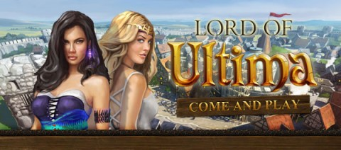

Back to: [West Karana](/posts/westkarana.md) > [2010](/posts/2010/westkarana.md) > [December](./westkarana.md)
# Lord of Ultima Evony

*Posted by Tipa on 2010-12-22 22:09:34*

Shady browser strategy game Evony [has been long criticized for its deceptive ads](http://www.lazygamer.net/a-history-of-evony-ads-the-insanity-continues/) featuring scantily clad women advertising a game where you build houses and sawmills and really, have very little sex at all. And no women.

Must have crushed them when gaming megagiant Electronic Arts ~~stole~~ was inspired by their clever marketing and came out with an example of their own:

Lord of Ultima also features building stuff and sending out armies and no sex or women.

In retaliation, Evony has had to up the ante. Now its porntacular, stolen ad art features [blinking, glowing breasts](http://divagoth.com/2010/01/25/evony-steals-artwork-from-soe-adds-blinky-tits-to-the-mix/), as if to emphasize with no confusion allowed that these are the very things you can expect not to see if you play Evony.

Blogstar Krystalle spotted the first picture as the old EverQuest II mascot, and the second as a particularly uncanny valley-ish avatar from Second Life.

To be honest, you probably CAN find flashing boobs in Second Life.
## Comments!

**[wilhelm2451](http://tagn.wordpress.com/)** writes: I have been playing Lord of Ultima for the last 7 months and I have yet to see a female breast, bare or otherwise, in game.

---

**[mbp](http://mindbendingpuzzles.blogspot.com)** writes: Evony's website claims they have 18 million players not that I believe a word they say but the fact that they continue to spend a tonne of money on advertising surely means it works for them. Proof if it were ever needed that there is no such thing as bad publicity.

---

**[Krystalle](http://divagoth.com)** writes: I admit, I'm confused at the sudden linkbacks to a post from January. Has someone seen the Antonia Bayle/Harper Beresford advertisements in the wild again for Evony? I'd be curious to know where if so.

---

**[Tipa](https://chasingdings.com)** writes: Ah, I was only directed there from Tateru's site... but now I have your blog in my reader, so I should get things more timely. But that Lord of Ultima ad, I just got in my mailbox a couple days ago.

---

**[Harper Beresford](http://slfashionpassion.wordpress.com)** writes: Being the owner of the aforementioned avatar, I will say that my boobs do NOT flash. Nor does my avatar generally look like that particular image. The blog from which it was taken was specifically about being a sort of fantasy that some people find appealing. I think I am more offended that my image was used to appeal to the lowest common denominator by making the boobs flash even more that my work was appropriated.

---

**[Tipa](https://chasingdings.com)** writes: I'd be horrified if my work were used in this way.

---

