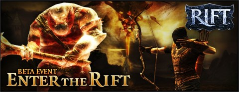

Back to: [West Karana](/posts/westkarana.md) > [2010](/posts/2010/westkarana.md) > [December](./westkarana.md)
# Rift: 3rd beta event, "Sealing the Rift"

*Posted by Tipa on 2010-12-24 08:14:56*

Trion has announced the third beta event for their Rift MMO. It's been described as an evolutionary rather than a revolutionary game, and that seems about right. Like fantasy novels, I guess, where very few ever try anything new, and yet people still buy, read and enjoy them.

It's a decent genre entry, and as I don't currently play any games in the fantasy MMO genre, I'm very much looking forward to it. (Wizard101 is so entirely different that it cannot be compared to the WoW-likes in any way. That's what I love about it!)

In this third event, beta testers will be able to play both Defiant and Guardian characters. While the test description doesn't specifically mention PvP, in the beta world, the newbie areas for both factions meet -- and I expect to see some action there.

The official goal for the current test is simply to help seal a rift. That won't take long, so players will have plenty of chances to try the things they haven't gotten to in the previous tests. We've been promised more training points to play with.

~~It's important to note that the NDA is back in effect for this third test.~~ This was an error on the part of the Rift team, there is no NDA for this or any other beta test (see comments).

> **Enter the Rift** 
Adventure in the world of Telara as a noble Guardian or technomagical Defiant. Enter a dynamic fantasy where eight primal forces battle for control of an ever-changing landscape. The planar invasions grow more numerous and the Ascended must rise to the challenge!

**Play to Win!**
Participate in sealing a rift and receive planar loot and you could be eligible to win an NVIDIA GeForce GTX 460 video card! Terms and conditions apply, click here for details. In-Game Prize Packs will be given away to ten (10) select players who complete the objective!

## Comments!

**Longasc** writes: More training points - sounds like more levels. But I heard nothing of new zones or PvP. Hmm.

The NDA is back for the 3rd event? That's strange...

I read the NDA for the 3rd event, and even though it has a slightly different URL than for Beta 1 and 2, the content is 100% the same, word for word. WTF?!

---

**[Tipa](https://chasingdings.com)** writes: I doubt there's new levels or zones, just more points to play with. from what Scott Hartsman has said.

---

**[pasmith](http://dragonchasers.com)** writes: Actually in the forums one of the Official Spokescreatures said that the NDA was left in by mistake; the NDA remains down. Beta testing their EULA, I guess. :)

Link (which goes to the beta forums, which are still up):
http://forums.riftgame.com/showthread.php?15160-Eula-nda&p=324504&viewfull=1#post324504

Post says:

We understand that you were asked to sign the NDA in the email you were sent. We did recently announce that we were, in fact, dropping the NDA for these events. Please ignore the NDA clause, as it no longer applies and you are free to discuss the Beta as much as you desire.

Admiral.

And "Admiral" has a "Rift Team" tag on his account.

---

**[Tipa](https://chasingdings.com)** writes: Ah, cool :) Thanks!

---

