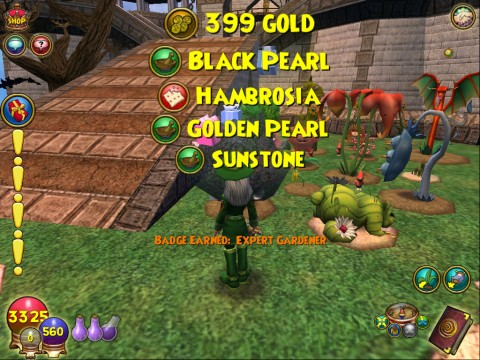

Back to: [West Karana](/posts/westkarana.md) > [2010](/posts/2010/westkarana.md) > [December](./westkarana.md)
# Wizard101: The last gift of the Giving Tree

*Posted by Tipa on 2010-12-24 08:55:14*

I'd hoped that the Giving Tree would give, as its final gift, the seed for another Giving Tree, but -- no such luck. A bunch of rare Celestia harvests, a handful of gold and Rank 7 -- Expert Gardener -- will have to do in its place, I guess.

I'd been saving a Rank 7 seed just for this occasion, the Maelstrom Snap Dragon, which was intended to fill the Giving Tree's empty plot. The Large Enchanted Soil required for the plant couldn't fit in the spot where the Giving Tree had been planted, so I had to plant it across the path, which is going to be inconvenient. I planted more Baby Carrots where the tree had been, instead.

I usually snap a picture of my garden each day and tweet it -- you can [follow along on my TwitPic page](http://twitpic.com/photos/tipadaknife), if you like.

## Comments!

**[Jomu](http://www.justonemoreunlock.blogspot.com)** writes: Have a Merry Christmas! =)

---

