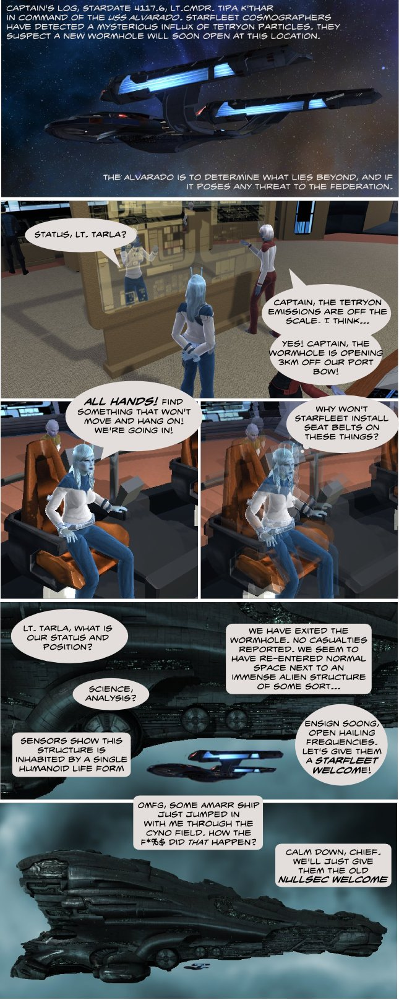

Back to: [West Karana](/posts/westkarana.md) > [2010](/posts/2010/westkarana.md) > [February](./westkarana.md)
# Star Trek Online vs EVE Online, part 1

*Posted by Tipa on 2010-02-10 01:13:15*

Thanks to Longasc for the use of his Sovereign class heavy cruiser for the exterior shots of the USS Alvarado.

## Comments!

**[Toldain](http://toldaintalks.blogspot.com)** writes: Ok, my daughter just asked me what I was laughing about. Well done!

---

**[West Karana » Star Trek Online vs EVE Online, part 1 | Combat Spaces](http://www.combatspaces.com/west-karana-%c2%bb-star-trek-online-vs-eve-online-part-1)** writes: [...] this link: West Karana » Star Trek Online vs EVE Online, part 1 Read [...]

---

**[Magson](http://phoenq-magson.blogspot.com)** writes: Cute comic!

Though I don't think the STO ships looks very Amarrian. . . . .

---

**Longasc** writes: I wonder if a "Blob" will follow... and if STO players will believe this ship to be something like a new Crystalline Entity and start a Fleet Action, with some people ramming the Titan at full impulse speed. ;)

For the Trekkies, this is not a 1:1 Sovereign class. Cryptic allows for variations when it comes to Saucer/Hull/Narcelles etc.. I found the Sovereign design to be too much of a flounder.

I think they should start out with "Project Ambulation" by adding a bridge and possible some more areas of the ship interior. Cryptic could also expand the bridge, e.g. add at least an option to zone to the "engine room" instance through the turbolift or something like that. Though being able to walk through the whole ship would be for sure even more awesome. :)

---

**[Tipa](https://chasingdings.com)** writes: @Magson -- they look more Amarr than anything else :P The sleek, rounded hulls are very Amarrian, even though the two-hull Starfleet concept is more or less unknown in New Eden.

@Longasc -- it's Sovereign enough for this comic :) Even though we can only see our bridge in STO, it is amazing how much that adds to the experience. In EVE, your ship is all you ever see. You are only ever a player sitting at the computer moving an internet spaceship around. Since you have an actual character in STO, it's more immersive somehow.

---

**[Tesh](http://tishtoshtesh.wordpress.com)** writes: The doctrine of "separation of avatar and ship" really does help with the notion of putting yourself in a game. I enjoyed the Descent games, but Privateer seemed much more interesting ("immersive"?) to me, largely because I had a character to hang the story on. Now, if my *ship* had personality, like Moya or Gomtuu, well, that would be another thing entirely.

Tangentially, the mute cipher as a protagonist is a curious design habit in many RPGs, ostensibly meant to let the player pour themselves into the empty vessel... but all too often, it's just boring. Neverwinter Nights was pretty good, but I'll take a well crafted Final Fantasy over it, purely because the characters are more interesting. I don't mind not being able to project myself into a game, so long as what *is* offered in the game is interesting.

---

**Thac0** writes: Tipa your really making me want to come play STO with you. Your blogs are making is sound way better than i thought it was in Open Beta. Hows the community and player interaction, its is fun or is it a solo mmo?

Also grats on getting your nemesis; Syp! I'm routing for you!

---

**[Tipa](https://chasingdings.com)** writes: It's a lot of fun. Encounters scale to the number of people in your group, so it's solo or group, your choice. Fleet battles and War zones are like public quests, and the best way to meet folks outside of the newbie levels.

I like it, but EVE is in the end the better game. Doesn't mean I won't play STO, though.

---

**Telke** writes: I'd say the STO ships look a bit like some variants of the tech 3 ships, more so than anything else - but those are so annoying to get good pictures of :/

---

**[wilhelm2451](http://tagn.wordpress.com/)** writes: At the risk of making the enemies list, isn't that a Gallente Erebus? The Amarr titan looks like a mushroom, while that ship looks.. Gallente.

If Gallente meet Gallente coming through the rye...

---

**[wilhelm2451](http://tagn.wordpress.com/)** writes: Of course, as soon as I hit submit, I realized that I missed the joke entirely. Never mind.

---

**[Star Trek Online (MMORPG) - Seite 47 - SciFi-Forum](http://www.scifi-forum.de/science-fiction/star-trek-allgemein/star-trek-online/25373-star-trek-online-mmorpg-47.html#post2313789)** writes: [...] wenn es ein wenig Off-Topic ist, ich verlinke es hier mal: Comic Seite 1 Weitere Seiten sind dort verlinkt, ich hab mich weggeschmissen vor lachen \_\_\_\_\_\_\_\_\_\_\_\_\_\_\_\_\_\_ [...]

---

