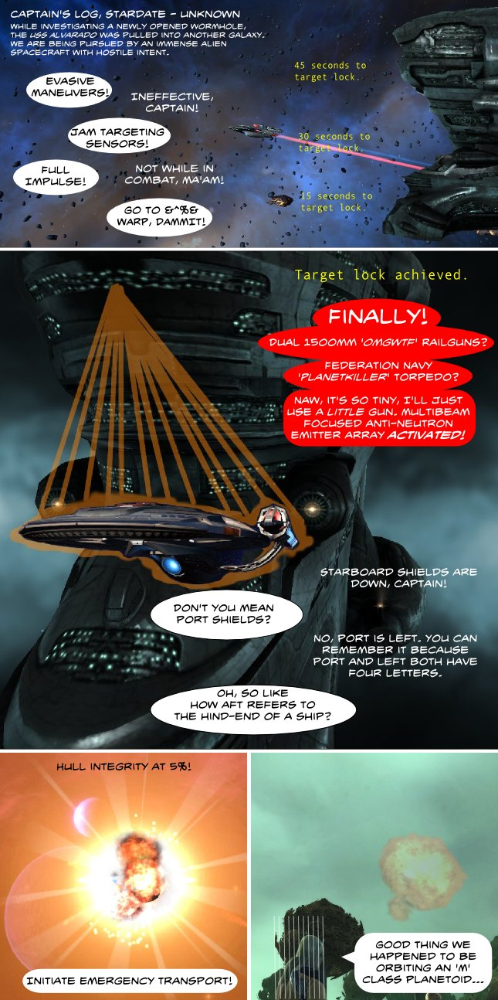

Back to: [West Karana](/posts/westkarana.md) > [2010](/posts/2010/westkarana.md) > [February](./westkarana.md)
# Star Trek Online vs EVE Online, Part 2

*Posted by Tipa on 2010-02-14 12:35:32*

In Part 1, the largely Andorian crew of the USS Alvarado, while exploring a newly-opened wormhole, found themselves trapped in the lawless domain of EVE Online's nullsec, within targeting range of a Gallente Erebus, a Titan-class ship.

Thanks once again to Longasc for the use of his semi-Sovereign class heavy cruiser. The Erebus shots were made with the Show Info tool within EVE Online. Explosions done in Star Trek Online, because it costs too much to explode a ship in EVE. Screenshots taken with FRAPS, collected in Picasa, cropped and composited in GIMP, text and certain other effects added and the whole thing published with Inkscape. Free tools are the way to go.
## Comments!

**Longasc** writes: It looks like the Enterprise got kicked by a gigantic boot - yup, the Titan looks like a shoe somehow. :)

---

**Culmen** writes: You should see the Dominix class battleship.
Also while an erebus class titan doesn't exactly fit anything particularly good against a ship that size, with the exception of drones.
Unless of course you count it's Doomsday Device, which would kill a single small ship, but that would be like using a MOAB to swat a fly.

---

