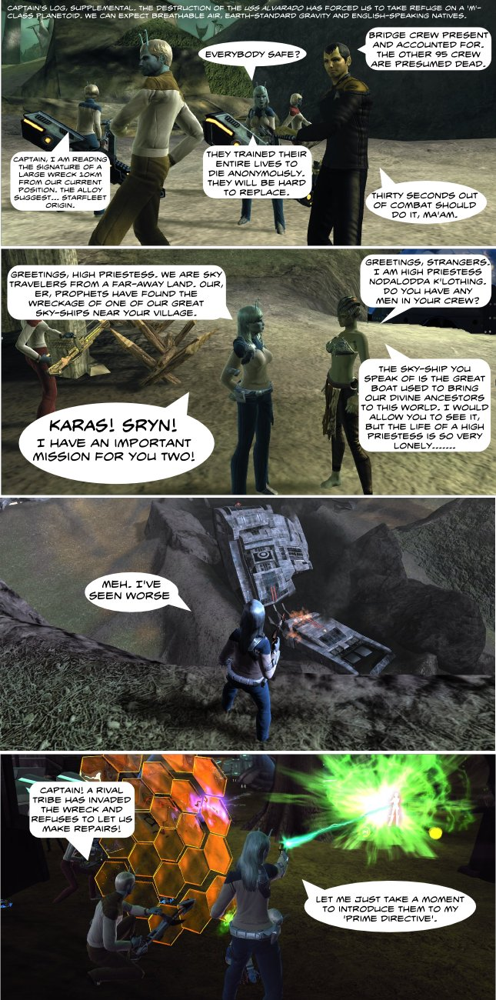

Back to: [West Karana](/posts/westkarana.md) > [2010](/posts/2010/westkarana.md) > [February](./westkarana.md)
# Star Trek Online vs EVE Online: Part 3

*Posted by Tipa on 2010-02-14 14:25:50*

When last we met the crew of the USS Alvarado, their excursion through a mysterious wormhole had ended in tragedy when an immense ship of unknown origin destroyed their starship, leaving them stranded on an alien world.

It's terrible how "romance scantily-clad, willing, beautiful green-skinned alien girl" is not a dialog option in ground missions in Star Trek Online.
## Comments!

**[The Federation News Service: Kirk or Picard? &laquo; Combat Archaeology](http://combat-archaeology.net/2010/07/26/the-federation-news-service-kirk-or-picard/)** writes: [...] I think the evidence speaks for itself: [...]

---

