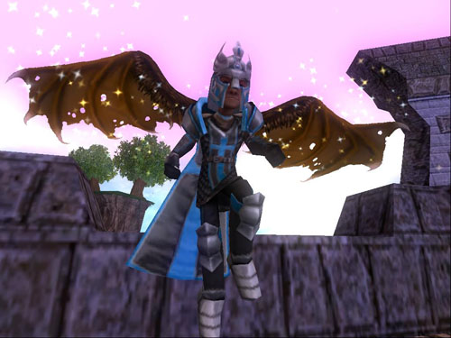

Back to: [West Karana](/posts/westkarana.md) > [2010](/posts/2010/westkarana.md) > [February](./westkarana.md)
# Wizard101: Now THIS is cool! Wings that work!

*Posted by Tipa on 2010-02-18 07:07:48*

KingsIsle is introducing a new mount type today -- Wings! They attack to your back and give you the same faster movement speed as any regular mount!

They are also adding back more insanely powerful Crowns gear that they had originally, for a price. The old uber gear only went up to level 35, but for this new stuff you'll have to be level 45 or better.

They also have some new wands and stuff. Check out the full press release below, after the pictures.

[gallery link="file"]

**New! New! New!**
Starting in the early hours of February 18th, the SHOP will carry some new items! 

**New Mounts!**
One of the most requested Mount additions has been a pair of wings, and we've got TWO for you to choose from: Seraph Wings and Bat Wings. Both types of wings can be purchased for either gender! These Mounts are only available to purchase from the Crowns Shop for Crowns, but they can also be found on high level bosses of the Spiral! 

**New Weapons**
Sometimes a wand just doesn't make quite the statement you were going for, so here are three Epic Weapons: The Ascendant Staff, the Phosphorescent Maul and the Cerulean Edge! Like the new Mounts, these weapons are only available to purchase from the Crowns Shop for Crowns, but they can also be found on high level bosses of the Spiral!

**New Outfits**
Those of you who remember the old retired Crowns gear will rejoice, these two new Epic outfits are made up from very powerful items with crazy powerful stats and cards! These items DO have a level restriction on them, but any level Wizard can buy them! If you see a small lock icon on these items in the SHOP that only indicates you cannot WEAR the item now, but you can purchase it, and store it for later. Again, these items are only available to purchase from the Crowns Shop for Crowns, but they can also be found on high level bosses of the Spiral (the bosses drop the individual items, not the entire sets).

These high level additions are just the beginning of new items that will be introduced to the Crowns Shop, because a young Wizard must be prepared for things to come.... 
## Comments!

**[Capn John](http://capnjohnsblog.blogspot.com/)** writes: Those wings look pretty cool. Maybe it's time to shop for a Batman outfit. Get a masquerade-style mask, long flowing cape, etc. Dye it midnight blue or just plain black. That could work ;)

---

**[kaozz](http://www.ectmmo.com)** writes: Oh I like those wings! They look really sweet, this game always seems to come out with some really cool cosmetic ideas :D

---

**[Wizard 101: New items are cool &laquo; Exploring War Like Worlds.](http://exploringwar.wordpress.com/2010/02/19/wizard-101-new-items-are-cool/)** writes: [...] Comment! West karana has lots of pictures of the new items including wings. [...]

---

**[/AFK &#8211; Sync in Progress &laquo; Bio Break](http://biobreak.wordpress.com/2010/02/21/afk-sync-in-progress/)** writes: [...] Tipa is thrilled for wings that work in Wizard 101 [...]

---

