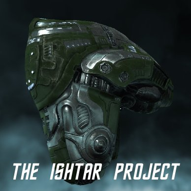

Back to: [West Karana](/posts/westkarana.md) > [2010](/posts/2010/westkarana.md) > [February](./westkarana.md)
# EVE, W101, WoW, STO... Sheesh!

*Posted by Tipa on 2010-02-19 08:20:10*

I am playing too many MMOs, it's true... but there's some good gaming out there.

In EVE Online, the Ishtar Project saw a minor victory as I sold my two run Ishtar blueprint for 30 million ISK after only a couple of days on the market. That worked out incredibly well. In another stroke of luck, I put another Vexor blueprint in for invention and produced ANOTHER two run Ishtar blueprint. This one I will likely keep to make the Heavy Assault Cruiser of my dreams.

But just in case, tomorrow my research agents will have produced enough datacores to try another run. How long can this streak of two-run Ishtar BPs continue?

In three days time, I will finish training to fly the Ishtar. At that time I will make the build/no build decision. If I can find an Ishtar cheaper than 145 million ISK, I will buy it. Otherwise, I have these blueprints... which we now know to have a value of 15 million ISK per run. Since it costs me 130 million ISK to build an Ishtar, and I could sell the BP for 15 million ISK, that means the expected cost to me would be 145 million.

I imagine I will be buying my Ishtar, but the Ishtar blueprint trade has turned out to be very profitable, so I still come out ahead.

With all the new stuff in the Wizard101 Crowns store just waiting for me, I really had to go in there and check it out. It's been awhile since I have bought Crowns cards, and only one of my characters had enough Crowns to purchase anything. I got the angel wings for Allison Goldtalon; she has a bird thing going on from all the Grizzleheim gear, anyway.

It's kinda tragic that none of the new items can be bought with gold. Many Crowns items also have a gold value which is usually in the neighborhood of ten times the Crowns price. With a little work, you can get items just by saving up money in-game. Not these, though. KingsIsle has said that some of these items may be found on high level bosses... which likely means some time with the second chance chests, and they also take Crowns to use.

KingsIsle has been focusing since Grizzleheim on its cash shop -- and they have done some marvelous things with it. We're all waiting to see their Grizzleheim follow-up -- and we're not just talking about the Grizzleheim-themed housing.

While on, I continued up through the Grand Chasm in Dragonspyre, which included another of those endless, soul-numbing towers. Eight floors of fighting. At least it was worth some decent experience. Allison is close to level 47, and Marissa is just inches from 45.

Longasc invited me to visit his Klingon's battleship last night. 1500 crew! That's just simply amazing. He's outleveled me on two characters already >< That's not so amazing, given how many games I'm playing.

I sat down to put the IKS P'wn through its paces. I hadn't noticed the Targ pits conveniently located beneath the captain's chair. So I killed them. His bridge crew attacked in retaliation. I killed them, too.

If my memories of Star Trek are right, I THINK this makes me Longasc's first officer. I might have had quite a career in detached service to the Klingon Empire if Longasc hadn't raged out and challenged me to a battle to the death. A battle I lost.

I'm a SCIENCE officer! We go boop-beep-doop with tricorders!

I ended the night exhausted, but 3/4 of the way through Commander 6. The Captain's rank is only a couple weeks away at this rate, but there's definitely no reason to rush through the game until there is some reason to do so.

[caption id="attachment\_4733" align="aligncenter" width="480" caption="Click to enlarge"][/caption]

I haven't been playing as much WoW as I had been before STO started sucking my free time away. I've switched Tipa back to Combat spec. Assassination may be a really great spec for level 80 rogues, but I was just failing with it. Combat is much better for leveling and for the kind of AE-intensive groups I get through the Dungeon Finder.

I'm taking a break from the whole pickup-group scene. When I started with the LFD tool, most of the people were just fooling around on alts. As I leveled through the 40s and 50s, most of my groupmates were still on alts, but they approached dungeons more seriously, but still not so serious that they were intolerant of anything less than total efficiency. 

As I near 70 (level 67 now), half the people seem to be demonstrably psychotic regarding dungeon runs. They aren't in them for fun. At our low level, you don't get tokens or badges or emblems or anything like that for completing a run. I'm sure they can twink themselves with way better loot than they are likely to get in the dungeon. I just don't see the reason for the intensity.

I've mentioned before that I intend to stop leveling at 70 and just work on the daily quests and such that people did before WotLK. It isn't that I don't want to see all the wonders of Northrend and all, it's just that I don't think I want to have to play with people who aren't playing to have fun and to meet people.

## Comments!

**Longasc** writes: As a male gamer I wonder more and more if the stereotype that men can't multitask or focus on more than a few things is right. My LOTRO sub is still running, but I am waiting for the next content patch. I should log in and pay the fees for my house before I forget it.

This ship needs a lot of crew because officers of the Federation kill around 20-30 each time they come along. ;)

Give MMO players a way to optimize the fun out of the game in favor of faster gain of whatever, they will do it. Happened in Guild Wars, people found efficient and super-boring and near (and often not only "near") exploitive ways to "farm" certain areas till kingdom come. Soul crushing unfun. If most of your buddies are "working" on achievements or "farming", you know it is time to move on. This is why I rarely play GW nowadays, the whole game turned into an achievement driven farm-mania. At least for the very very long time veterans - for new players, it is still amazing.

---

**Azy** writes: Tipa--don't cut yourself off from questing in Northrend. Some of the best quests in the game are to be found in Dragonblight, around level 73-74. Blizzard got a lot more creative in WotLK--even killing 10 foozles often has a new twist to it, and I would hate to see you miss some of their best quest work. If you just stay out of the LFD queue and take your time, with no leveling goal, I think you might really enjoy what Northrend has to offer.

---

**[Sierra Starsong](http://www.modernautomagic.com)** writes: There have been reports on Wizard 101 Central that the Jade Oni drops the wings and the new wands, so farming for them is at least a possibility. I'm with you though, I hope they add a gold alternative once the newness wears off.

---

**Jaladan** writes: Re: The Ishtar Project: Don't forget to factor in the ME of that blueprint. If you've used the 'Decryptor' to give you a two run blueprint it should also have reduced the components required. I can't find the precise details online, and I haven't yet done any invention myself, but I seem to remember this should be a reduction of about 1/7.

---

**Hugmenot** writes: "I’ve mentioned before that I intend to stop leveling at 70 and just work on the daily quests and such that people did before WotLK. It isn’t that I don’t want to see all the wonders of Northrend and all, it’s just that I don’t think I want to have to play with people who aren’t playing to have fun and to meet people."

My advice is for you to find a large leveling guild. Nice players are the majority but unfortunately, they rarely join the same guild and they typically stop using the LFG tool after a few experiences similar to yours. A partial guild run, say 2 or 3 players from the same guild, tends to influence other players into better behavior.

Please take my suggestion with a grain of salt because frankly, I am not a fan of the LFG tool and prefer to organize my own group, even when tanking or healing.

---

**[Suzanne](http://outlandbound.wordpress.com)** writes: > *I’ve mentioned before that I intend to stop leveling at 70 and just work on the daily quests and such that people did before WotLK. It isn’t that I don’t want to see all the wonders of Northrend and all, it’s just that I don’t think I want to have to play with people who aren’t playing to have fun and to meet people.*

I agree with Azy. I'd hit those dailies once or twice, but I wouldn't linger. Northrend is gorgeous and you'll still potentially meet some cool people while questing. The Dungeon Finder is more for the asocial crowd though, I agree. The groups aren't always bad, but they're rarely in it for the adventure.

---

**[Stabs](http://stabbedup.blogspot.com/)** writes: Regarding WoW one of the nicest parts of WotLK was soloing quests. Howling Fjord has a beautiful Nordic quest line full of interesting lore and the epic quest chain in Dragonblight builds up to one of the best quest finales in the game.

The Borean Tundra has fun quests too including a bunch for nutty eco-warrior druids who go hostile if you show up with animal blood on you!

As for Eve have you considered a daring dash with a 2 Ishtar bpc into a dangerous zone? Put them up in NPC Syndicate or Providence for double the Jita price or something? (If you can dash there in a blockade runner full of components just after downtime with a scout).

 I've just moved to 0,0 and noticed the following:

- the market is really empty

- prices are really high. Talking 500K for a Small Neut I

- people make isk really fast. There are more rats than all the ratting guides suggest so I think they either got increased with Dominion or possibly system upgrades are kicking in. Even in a Drake you can earn 145m pretty fast in a good spot or 290m come to that. 30m per hour just shooting stuff while watching films.

- manufacturing slots have short wait times.

Don't blame me if you get blown up though!

---

**[Tipa](https://chasingdings.com)** writes: Now there's an idea. I DO have a blockade runner, actually. My corp is not in any alliance so 0.0 is dangerous for me wherever I go, but I would definitely like to make them part with some of their ISK. Ill-gotten ISK, if all you say is true :)

---

**werewood** writes: I thought so too about WoW but getting to 80 and heroic, made me understand that now this is the nice people place where the ugly tense guys are in 10 and 25 peeps raids.
So I encourage u to get to 80 and see that I am right. At least 3 out of 5 heroic runs are really fun.

---

