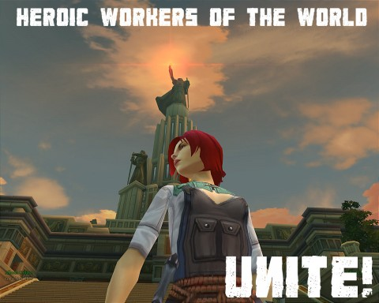

Back to: [West Karana](/posts/westkarana.md) > [2010](/posts/2010/westkarana.md) > [February](./westkarana.md)
# Allods Online: Workers of the World!

*Posted by Tipa on 2010-02-21 01:25:58*

[caption id="attachment\_4736" align="aligncenter" width="480" caption="Click to Enlarge"][/caption]

Allods Online is fun enough, and I guess it's cool that everyone's characters speak and read Russian because, hey, it's an overseas game not afraid to show its roots. Or too cheap to localize the voice and art assets, one or the other.

Yet I still feel a little uneasiness toward the game. Not because I can't handle a little Cyrillic here and there. Not because it doesn't depart far enough from its influences to really stand apart from the crowd. But because....

Maybe it's still the remnants of growing up in the Cold War. Growing up knowing that at any moment, the Soviet Union could decide to kill us all. As a child, all I knew of Russia was that they wouldn't be happy until every American was dead.

I cannot shake the feeling that this game is another, subtler attack on the Western world. This whole kerfuffle with gPotato deciding it is just good business sense to utterly gouge players with the cash shop when most of the US is struggling under the worst unemployment in decades is just lunacy.

Somewhere, there's a cabal of grim-suited business people chomping cigars and downing vodka, more pleased than they have any right to be that millions of computers across the world are running Russian software that can take control of those computers at any time.

Call me paranoid, I guess I am.

## Comments!

**Longasc** writes: I would like to highlight that the trouble is caused to 99% by gPotato. The russian devs from Astrum Nival (since when is Nival Entertainment suddenly Astrum Nival, hu???) are really making good games in general. That some players whine about some nerfs in the latest patch is the usual fine nerf whine (IMO),

but to 99% the fuss is all about the prices of certain items in the item shop.

Now I would say: Extra bag space - purely optional luxury item. Can cost quite some cash, IMO. Allods was not that short on bagspace as many other MMOs.
Death Penalty Perfumes: Now I wonder - as I said provocatively "LULZ you gonna pay if you die", people told me there are ingame ways to remove the DP without having to resort to the cash shop.

Let me quote Keen and Graev, which were quite enthusiast about Allods so far:

"Being resurrected by other players now gives you Fear of Death (the death debuff). In Heroic instances, which you can not leave, this essentially means you must have perfume to remove the debuff. Clearly promises are broken here. Given that the NA version must pay $13.50 for a stack of 20 perfume, the math was done and we’re looking at over $50 / month in order to participate in end-game PvE. Top it all off? Fear of Death now lasts 2 hours at level 40."

That's quite harsh.

But my main gripe is that I cannot understand that players are so madly in love with WoW's aging game system that it inherited from EQ. I mean, most are veterans by now, should they not know better? The basic "level up and progress" system is proven to be addictive fun, but it has a tendency to be all about combat and emphasizing nothing else, making the beautiful background graphics just that, a world where the only thing you interact with are the character models of players, mobs and other NPCs.

I hate to use the word "innovation" again, but the genre does not go ahead if all it does is producing clones of a system whose flaws become very apparent once players hit the max level.

---

**[Brian Inman](http://wasdstomp.com)** writes: The scary thing about the cash shop pricing is they don't seem to be concerned about the pricing. With all the rage going on they make an announcement that they understand, and will be adding more to the shop. It just seemed rather odd for their response. 

I think there response should of been more on the lines this is OB, and we are testing different pricing strategies before officially launching.

---

**Bhagpuss** writes: I really, really don't think "The Russians" are any kind of force you need to be worrying about now, Tipa! A couple of rather more likely candidates out there for your concern, I'd have thought. I find it more than a little surprising, though, that you would ever have thought "they wouldn’t be happy until every American was dead", even as a child. Did Americans really believe that?

If so, it's a terrible indictment of democracy and free speech. Russian children certainly did grow up with an utterly distorted view of America and the West, because their media was state-controlled and they had little or no access to any other information. Americans, on the other hand, could draw information from any media source and travel at will. If those democratic freedoms left you no wiser or better informed than children in a totalitarian state, then where does that leave the supposed inherent moral superiority of the democratic system?

It's an instructive example, though, because even with a vastly more available and unrestricted global media, large portions of the world now have as distorted a view of American foreign policy and the intent of the American people as you say you had (have?) of the Russians.

Apparently knowing better doesn't necessarily help us to know better.

---

**[mythokia](http://perpetuallybored.com)** writes: Secretly, through installations of Allods Online, all your computers are taken over by a Soviet variant of Skynet. Soon, they'll have enough computing power to break the nuclear codes which govern US ballistic missiles, and wipe you fellows out.

Somewhere, deep down in a Siberian mine shaft, Stalin would be laughing.

---

**[Kasul](http://shatteredblog.wordpress.com)** writes: It is an instructive example, but not necessarily an indictment of democracy. You have to remember that the US government isn't a democracy, as the current Republican party is prone to point out... it's a constitutional republic. The distinction is that the power doesn't lie with the people as everyone wants to believe, it's balanced using laws that protect minority interests from the power a pure democracy gives to the majority thinking.

The downside to this is that in order for legislation to happen a majority of public opinion isn't enough. You have to unify both majority and minority thinking behind a common idea, and unfortunately the easiest way they've found is by using a common enemy... true or imagined.

The Cold War was just that, a concerted propaganda campaign on both sides to sway public opinion in favor of the war by demonizing the other side. Tipa can tell you how it went in the US, from the highest level of news media and newspapers down to the lowest of schoolchildren being taught "duck and cover" and the mass installation of air raid sirens. And the beneficiaries of the propaganda were the arms manufacturers, the military and the conservative political party who all were able to consolidate their power through it.

---

**[Stabs](http://stabbedup.blogspot.com/)** writes: Does this mean Bill Roper is a Communist then? He likes price-gouging too.

And I naively thought it was all about fast cars and expensive women.

---

**[Blog Rage vs. The Army of Allods &laquo; Bio Break](http://biobreak.wordpress.com/2010/02/21/blog-rage-vs-the-army-of-allods/)** writes: [...] Petter! MMO Misanthrope! Mind Bending Puzzle! Tipa! Kaozz! [...]

---

**[Saylah](http://notadiary.typepad.com/mysticworlds)** writes: The only other F2P game I've played is ROM and you easily have 4x more bag space than you have in Allods and about 2x more bank space. I never rented pack space in ROM it just wasn't necessary. In Allods however, I have 18 spaces I think and 1/3 is routinely filled with quest required items. Sure ROM has daily quest items taking up space but you can opt out of doing those. Allods doesn't really support grinding, doesn't have a volume of daily quests, it's the regular-ole-run-of-the-mill quests eating up the little space you have. There are no mounts and vendors are WAY back at the NPC quest hubs. In adequate bag spaces means....think it over... walking back to vendor trash more frequently. Or destroying trash loot which you need for the in game money that is required to purchase your talent spec rubies. It's not just ZOMG we need more bags to to have more bag space. There's in impact to playing, when someone decides that 6 more spaces in your bags is worth $20 US.

Until that is lowered quite a bit, I don't even care what else is in the cash shop as I'll never see it. I am seriously questioning who thinks they're going to make enough money with this on-going rage over the prices outside of Russia. I'll keep playing until I'm tired of walking back to vendor stuff. But whereas ROM got $70 from me in two weeks for long term and useful items, Allods which is actually a better game, gets ZERO dollars. I won't be robbed to play Allods.

---

**Yarr** writes: No, Bill Roper & Cryptic are used car dealers, selling shiny sports cars that fall apart as soon as you get them home. They offered them with a lifetime* warranty (can only be purchased before a full test drive), but for some reason most buyers still don't seem too happy with how they do business.

*Lifetime Warranty void if car leaves dealers' lot

Seriously, it seems the Allods people, Cryptic and NCSoft (including ArenaNet), are trying to see how many people they can drive away from their games. Maybe there is some kind of company contest we don't know about, with categories like:

Greediest Cash Shop (looks like a win for Allods at the moment)

Worst CM and Support (toss up between Cryptic and NCSoft, but NCSoft is determined to win this one)

Shallowest Content (Cryptic, clear win with Champions)

Ban and/or Threaten the Most Legit Customers (NCSoft, no contest)

I only played the first Allods closed beta and while the first tutorial section looked really good (if a bit buggy), I was instantly turned off by the "kill 10 of this, kill 10 of that" everywhere, and really boring combat. I kept it on my machine thinking I might try it later but had a feeling the cash shop would turn out exactly like this.

---

**Thac0** writes: Kasul is correct. The USSR may have been a competitor but the hostility we were taught to hae was a tool used to drive our own politicians agendas. 

Regardless Enjoy Allods, there not conspiracy.

---

**Yakov** writes: In Soviet Russia, cash shop quits YOU!!

---

**[Tipa](https://chasingdings.com)** writes: I was waiting for someone to say that ;)

---

**[Brian Inman](http://wasdstomp.com)** writes: I have to agree with you that the timing for this overpriced cash shop is very bad. Maybe two years ago it would of flew since everyone had jobs, and money to spend like crazy. Most Americans have clamped down on their spending, and living within a budget.

People are getting thriftier. They are buying store brands instead of name brands, buying a Kia instead of a Honda, and etc.

---

**[Allods: Don&#8217;t Ruin Our Game! | Ravven&#39;s Glass](http://www.ravven.com/blog/2010/02/allods-dont-ruin-our-game/)** writes: [...] West Karana: Allods Online: Workers of the World [...]

---

**[Tesh](http://tishtoshtesh.wordpress.com)** writes: Y'know, I grew up in the Cold War, too, but never got it too badly, since we didn't live on a coast. Attacks weren't anticipated inland nearly as... vigorously.

That said, I have done more than my share of history research, and I have rather sizable problems with the Soviet leadership of days past. I do like the Russian people, though. In Allods Online, I see those people taking their heritage and using it for entertainment. Really, if we were to take the social policies of the Orcs or Trolls and apply them to Real Life, we'd be just as appalled with them as we rightfully are with Communism or Fascist Socilist states, though perhaps for different reasons. How many of us see Native American issues in the Tauren, and accuse Blizzard of political aspirations?

Maybe this strikes a bit closer to reality, which is always a danger, but at the same time, how objective are, really, about any of our entertainment? How violent was the original vision of Star Trek, for example, compared to STO?

I see Russian people at work in Allods Online, and while I disagree vehemently with state policies and leaders of their past, I'm heartened by the notion that modern citizens can make something interesting that has a distinct Russian flavor without being propaganda for terrible regimes of their past. If anything, considering Communism, Socialism, Fascism and other assorted insanity, I'm far more concerned by current U.S. politics than a game that the Russians have produced.

---

**[Callan S.](http://philosophergamer.blogspot.com/)** writes: What is this 'gouge with the cash shop' meme I'm seeing around the net?

I mean, they literally wield it like a knife and run at you?

Makes me think of a user getting cut at their dealer for hiking up the prices. You know your hooked, that's why you get so upset and vehement about something you could just not buy - because your hooked.

---

**[Tipa](https://chasingdings.com)** writes: I think it's more, they are going to charge a substantial amount for items that are required to play the game. Most cash shops are optional things, but gPotato has taken the cash shop to the next level.

---

**[Callan S.](http://philosophergamer.blogspot.com/)** writes: I think it threatens one specific type of play - it doesn't stop all types of play in the game.

I mean in terms of the death perfumes - you don't need them if you don't die. Granted, it does remove 'death/losing without consequence' play.

I used to play wow and hardly did any dungeons because it was well before the LFD tool. BUT there was still play there for me, even though I was locked out of some other play types of the game.

---

**[Trust Is Such A Fickle Thing](http://blog.dontfearthemutant.com/?p=1642)** writes: [...] answered the storm that the players of Allods Online stirred up on the official forums and blogs across the Internet. Darren Allarde, associate producer for the game at gPotato, even went on Massively [...]

---

