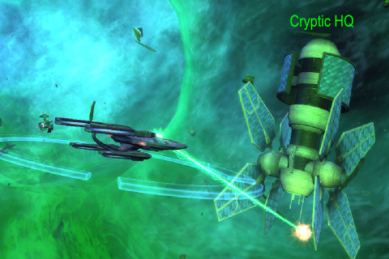

Back to: [West Karana](/posts/westkarana.md) > [2010](/posts/2010/westkarana.md) > [February](./westkarana.md)
# Star Trek Online: Cryptic fires back

*Posted by Tipa on 2010-02-26 08:03:20*

Cryptic responded to player concerns about the state and the direction of the game in a [huge, long, detailed producers letter](http://www.startrekonline.com/node/1182) that outlines their thoughts on the game as it nears the end of its first month.

Will this keep people subscribed while they wait for new content to come online?

Just picking a few details from the letter...

> Some of the few things on the way: 

 * Respec
 * Death Penalty
 * Difficulty Slider
 * More open auto-fire
 * Replayable missions
 * Improving Memory Alpha
 * Fixing those Commodity missions

Respec is nice. Cryptic took some heat over respecs in Champions Online when they added the respec ability to the cash shop. They also allowed you to buy respecs with in-game currency; I never really felt the sting. Here, though, I can't imagine someone not wanting to respec more than once as they level through the content, acquire new skills and weapons and so on. 

Death penalty is something that, according to this, players have been begging for. I *imagine* this will be the sort of equipment wear we get in World of Warcraft and similar games, and not a deep experience penalty or something bizarre like having to go back to a starbase to get a new ship. The EVE death penalty (lose everything) would just be inappropriate for a more casual game like this.

Difficulty slider? I imagine a slider to make the game MORE difficult. I don't see very many people being stuck in progression because of difficulty.

Improving Memory Alpha. Memory Alpha could be improved by nuking it from orbit. Seriously. We need REAL CRAFTING, not some sort of lame turn-in progression.

Fixing those commodity missions? I have one from Deep Space Nine. Apparently I have to find 160 resources and turn them in for 10 different resources to turn in for this quest. How could I GET more heroic?

More open autofire? I dunno, I just keep hitting ALT-SPACE. I think it would be cool to be able to target more than one ship at a time.

> Special Task Force: Infected
We're in the final stages of testing the first STF (the five-man raids we internally referred to as "Raidisodes"). STF: Infected is just about ready to release. 

I'm really looking forward to this. By the time they release it, I and four friends should be admirals. But, is there any point to repeating it? Will they let us repeat it?

> After Infected, we'll roll out more STFs. "The Cure", "The Khitomer Accord" and "Into the Hive" are all coming along nicely. We look forward to regularly releasing these and seeing what everyone thinks. 

I hope they plan on releasing all of these in a fairly short time frame. They NEED a high end game.

> Beyond Update 1?

Right now, we're planning it. We haven't set the future of STO's content into stone because so much of it will be determined by you, but we're laying out what we'd like to focus on for the next 6 to 12 months.

 * Who are the Undine and what drives them?
 * How can we better exploit the Genesis System to create even more compelling content?
 * Where can we boldly go next? Where shall we take exploratory missions, as there's so much potential there?
 * Which faction should be playable next? Romulan? Cardassian? Pakled? Dominion? Horta? Okay, not so much the Pakleds.

And that’s not even the start of it! Ship interiors, more bridges, crew quarters, First Officers, Fleet advancement... You have subscribed to a service that delivers a universe unending, and we shall see that universe populated with compelling content or, by the Prophets, we will die trying. 

Yes, I want to play a Horta :) 

All this stuff sounds great, but it's easy to write Producer's Letters, harder to push out actual updates. I'm subbed for a year, so I'm not going anywhere. I have been looking forward to this game since the first hints of its existence were floated by its previous developer, Perpetual Entertainment. I am still having a LOT of fun with the game, but I am interleaving it with EVE Online. I find they mesh well.

I'd REALLY like it if STO started stealing some of EVE Online's ideas, actually. I STILL want a reason to keep my old ships -- aside from looks. I'd like to see the players have some influence over the course of the war and the galaxy. If we're at war with everyone, let us win, or lose, or SOMETHING.

## Comments!

**[Pete S](http://dragonchasers.com)** writes: We've been talking about the producer's letter a bit on Buzz. Petter, Spinks, Longasc, Scopique & Arkenor have shared their thoughts. Or on other words, Don't Feat the Mutant, Welcome to Spinksville, @longasc, CedarStreet.net and ArksArk. :)

http://www.google.com/buzz/pasmith/AjLfR93665q/OK-so-Cryptic-has-an-STO-State-of-the-Game-up-and

---

**Bob** writes: Sweet, thanks to the community we get death penalties. 

That was sarcasm if you couldn't see it. Make the game worse community, you can do it!

I play games for fun, not punishment.

---

**Thac0** writes: I'm with Bob, I don't own STO however. I'm still torn on it and waiting especially after seeing it get 2 stars over at gamespy.

---

**[Tesh](http://tishtoshtesh.wordpress.com)** writes: Aye, Bob, it's baffling to me that anyone would beg for death penalties. Masochists.

Tipa, I wholly agree on tactical reasons to keep and use smaller ships. That would not only benefit players with whole fleets to choose from, but also make it easier for players of different levels to play together.

---

**[Amber](http://ambernight.org)** writes: I'm quite a bit more behind the STO curve than you are at this point, still learning the game, still figuring out controls, etc, but it does strike me as a somewhat...if not sparsely populated universe, then certainly a cold universe. Perhaps it'll start growing on me as I play, but I don't have the sense of wondering what's around every little corner that I did with LOTRO or EQ2. I am happy with the decision to be more story driven than pvp driven, which at first glance might be a "duh!" given the property, but then again you just never know.

Allowing you to keep your old ships...from a gamer point of view (I've played Eve also), it would definitely be cool. From a "realism" point of view...starships are expensive, and Federation tax payers would hardly consider it a wise investment to allow Captains to pocket ships they've previously commanded as just a privilege of command. But maybe there could be some kind of logic to make this possible, like calling HQ and requesting to be temporarily assigned to your old ship? Kirk did it in TMP. :)

---

**Alexa** writes: I really hope STF: Infected comes out soon. It was meant to be released yesterday but they found a "show-stopping" bug and had to postpone its debut. I can't wait to party-up with some people and tackle it! Yes, Tipa...In my tiny ship with a big name. ;)

That commodity mission is a pain. I remember going to Earth Space Dock and buying those 160 Provisions one by one. My finger almost fell-off from all the clicking!

Looking forward to their new additions.

---

**PeterD** writes: I hope they're referring to the explorer trade missions when they refer to commodities. They're just terrible. You can easily spend thousands of energy credits getting all the stupid commodities, and your reward is a handful of merits and skillpoints. Whenever I see those I just skip them and keep scanning anomolies until I get something else.

A death penalty is helpful because it forces people to actually play sensibly. With no death penalty there's no reason not to suicide zerg enemy fleets in missions. If you die, so what? You just respawn and charge back in. Rinse and repeat until you win. It also means groupmates in open groups have little reason to play responsibly or look out for teammates. If someone dies, so what? Your ship just blew up, there should be some sort of penalty for that.

As far as auto-fire, if I could set "fire all phasers" to auto-fire I'd be happy. I like managing my torpedoes and mines because timing is important. Phasers there's no reason NOT to fire every time their cooldown is up, so I'd prefer for them to just keep firing until I tell them to stop. It's not as if Captain Kirk had to sit in his chair and press a button every time he wanted his phasers fired. /kirk "My . . . spacebar . . . stuck . . can't fire . . phasers! Spock . . give me . . your keyboard!" /unkirk

---

**[Tesh](http://tishtoshtesh.wordpress.com/)** writes: Oh, and I'd totally play as a Horta. Or maybe one of Commander Hwiiii's people; the above-human-IQ cetaceans...

---

**[Rohan](http://blessingofkings.blogspot.com)** writes: PeterD, right-click the phaser icons. That turns on auto-fire. They'll have a green border show up. You have to press Spacebar once to start them firing, but after that they will auto-fire until your target dies.

---

**Alexa** writes: The auto-fire right now can only be used for one forward weapon and one at the aft section. You still have to manually fire the rest.

---

**[Saylah](http://notadiary.typepad.com/mysticworlds)** writes: Yep the auto-fire issue is one weapon forward and one aft. After that bang your keyboard for all it's worth. :-) One of the reasons I was for a death penalty is that I saw few players carrying out specific ship roles in group combat. Let's all just RUUUUUUUUUSH in to die. No one wanted for tanking ships to get the aggro or group with science ships for support. It was like all ships were equal, so the classification, I found pointless. I felt that if there was a DP, people would be a bit more conscious and let ships do more of what they had been outfitted to do. That was my take on it anyway.

---

**[Tipa](https://chasingdings.com)** writes: Perhaps if you had a team who knew each other, knew what they were doing etc. What you have in STO are missions that can be completed solo or in a group. If I can complete this by myself, and then some yahoo in a cruiser autojoins me, I suddenly should hang back and hope he knows his role? Nobody speaks to each other in STO, and the roles are not that well defined, anyway. Much of your ability hangs on what abilities your bridge officers have and in what positions they are stationed. There is no way for me to tell if you have the abilities that I would consider important for your role.

Even though the ships fall roughly into the Trinity, nothing is absolute.

---

