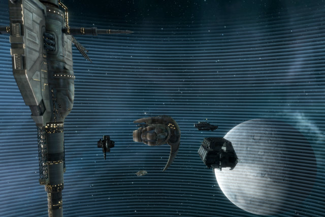
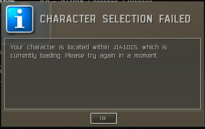

Back to: [West Karana](/posts/westkarana.md) > [2010](/posts/2010/westkarana.md) > [January](./westkarana.md)
# EVE Online: Into the Wormhole

*Posted by Tipa on 2010-01-04 07:13:49*

> Into the whirlpool, where matter vanishes
Degenerate star, arm of Orion
An iron sun, the forbidden circle
It's a mountain, it's a black horizon....
      Blue Oyster Cult, Heavy Metal (Black and Silver)

If there's one activity which defines my EVE corp, it would have to be manufacturing. We do missions -- a lot of them -- but they don't define the corp in the same way. We rarely ever do PvP. But we're always making things. The corp makes its money in researching blueprints and selling high quality blueprint copies, as well as the occasional production run. My own experiments with invention and production have been wildly successful; 90% success rate on Hammerhead II blueprint invention, and I sell all the drones I can make at amazing profit margins.

OtakuDyne highly values exploration, too. Our director, Red, was for several months considering setting shop down in Providence space, which led to a lot of nullsec adventures. Without being part of an alliance and not really being a PvP-heavy corp, it was tough. There are not a lot of opportunities for un-allied corps in nullsec. You're everyone's favorite target, because what are the repercussions if they kill you? None. It's free loot and killmails.

Wormholes became our answer. If someone found a class 1 or 2 wormhole with a gravimetric site on the scanner, the corp channel would go quiet. If it turned out to be an asteroid belt with the rare, valuable minerals like Arkonor or Bistot, we'd all jump into our miners and haulers and, after checking for the presence of hostile players, start ferrying ore from the wormholes to our waiting refineries.

This would be a lot easier if we could just find a good wormhole without any residents and process things in our own station. We'd been toying with the idea for awhile; everyone was looking for good candidates during their daily exploration. Red was placing buy orders for the necessary mods with which to construct a station.

I thought I'd found a good class 2 wormhole Saturday. I didn't see anyone from the entrance, anyway. The corp started to gather. Red brought a Badger stocked full with everything we would need to construct a station and fuel it for a week. I hadn't looked closely enough, though. The wormhole already had a station in it, and there were a LOT of people in it.

I wasn't having much like finding other candidate wormholes, and I left after awhile to play the Star Trek: Online beta.

When I returned, a good wormhole had been found, and we were in the process of anchoring the station and its modules. I jumped into my probe ship and headed in.

It's a really great feeling to approach a player station with its shields up and to sail right through. It's only been a few days since we anchored the station, and it already feels like home. A home whose doors keep opening to different cities.

I smuggled my Dominix and my alt's Prophecy into the wormhole, intent on clearing out some of the Sleeper complexes for the salvage. Last time I came, I paired the Prophecy with my Myrmidon battlecruiser, and did fairly well. Against the sleepers this time, though, my Dominix could barely touch them. I spent thousands of Antimatter L rounds clearing the place, and lots about ten drones. The Prophecy took all the aggro every time it got in range. It wasn't good fun.

If I was going to solo the sleepers, I'd either need to go back to the Myrmidon/Prophecy pairing (which did work fine), or make a new ship. Well, I can STILL do the battlecruiser duo, but I almost never turn away an opportunity to try out a new ship design.

Red gave me a good quality Megathron blueprint. Megathrons are sold on the market at 70-72 million ISK; I could make one for 61.5 million ISK, having to buy most of the materials. That's still a substantial savings. It took me hours Sunday to gather the materials and construct the ship. In that time I could have perhaps run two level 4 missions and made up that ten million ISK difference on bounties alone, along with grabbing lots of very lucrative salvage. That may have been a bad move on my part, but nonetheless, I ended up, when all the fitting was done, with a very capable gunboat, able to strike out to 45km and reaching optimal range at 26km. It was just getting started where my Dominix would be at the extreme end of its range.

Since I was still having problems with the Megathon's power drain, the maiden voyage of the *Madame Somnambulist* was on a level 3 mission. A mission vs drones, the most difficult kind of opponent for a battleship of any sort to hit. The missiles hit well; the guns, less so, and in the end, I took down the enemy drones with drones of my own. Precisely the sort of tactics that won't work against Sleepers in the wormhole.

If we can find a friendly exit to our wormhole today, I'll bring the Mega in and see how it works against the real thing. I'm considering making a support ship for my alt, one with target painters, tracking links and remote repair units. In missions, such a ship would be a real boost, but in wormholes I just kinda think that the Sleepers would try to destroy the support ship first.

Corp-mate Kzaara plans on going into the wormhole with just that in mind. He plans on running dual remote-repair Dominixes. With two ships constantly repairing each other, TAUNTING the Sleepers with their repair abilities, the theory is that they will hardly even notice that they are being killed by drones.

Still, our search for an asteroid belt in our own wormhole continues....

## Comments!

**Longasc** writes: My random thoughts: Hammerhead I/II were my usual drones of choice. IIRC I liked their Thermal Damage and overall stats, but this was years ago. Things might have changed a lot.

My reason to play Amarr was that I am a Scrooge: No matter how cheap ammo and missiles are, I like Tech 1 lasers because they don't cost extra money, just capacitator juice - which Amarr ships have aplenty. :)

I used large pulse lasers or sniped with megabeams (I used an Apoc for mission running), I can't help but I think you either go Dominix and Drones as Gallente or just give in and join the glorious Amarr Empire, or at least train their ships, as their ships make awesome mission runners. Just like the Caldari missile boats, but they are not golden. ;)

---

