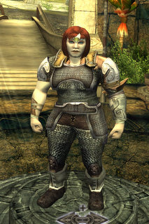

Back to: [West Karana](/posts/westkarana.md) > [2010](/posts/2010/westkarana.md) > [January](./westkarana.md)
# Dungeons & Dragons Online: A Hobbesian Cleric

*Posted by Tipa on 2010-01-08 02:11:51*

 What's a Hobbesian cleric? One who is [nasty, brutish and SHORT](http://www.phrases.org.uk/meanings/254050.html). 

That's Derra. Seriously, she looked better in the character creator. But when she got washed up on that shore just to be taunted by some halfling rogue (and not even a cute one), well, I guess that's when she lost it. When she met up minutes later with a cleric, an ELF, I think, who was so stuck up and SUPERIOR that she had a buff that could stop you from dying. I mean, where's the skill in that? "Oh, hi, here's a buff where you can't die. I'm the best cleric in the world! Lalalala! You go do whatever it is you DO do, dear!"

Yeah. That's when Derra lost it. That was a hatred she carried until she met that damn cleric again, at the dragon.

I'm in this wonderful static group. We were sailing our way through Neverwinter Nights 2 until the server decided to lose one of our characters, which kinda put a crimp on things. NWN2 wasn't the greatest game in the world. It took forever to load (at least for me), the controls were awful and the camera was impossible. While the game was mostly okay if played solo, it was just a nightmare in a group. The whole action would stop whenever anyone accidentally clicked on an NPC, I had no idea if my songs (I was a bard) were doing anything at all, and, similar to most fantasy games, by the time I got in melee range of a mob, a mage had usually killed it and the one standing next to it.

The missing character combined with the loss of a high speed internet connection for one of the crew killed NWN2 for us, and we've been gameless since.

When DDO went F2P, we kinda thought that would be our next game. We downloaded it, played it a little on our own... it was okay. It was very similar to... to every other fantasy MMO out there. It was like Guild Wars without the skill cards in that only the quest hubs were MMO areas. Everything else -- the wilderness, the dungeons -- is for you and your party only.

We decided to get going on DDO this week. To prepare, we'd need to make a character and get it to the newbie island, where you are after the hoighty-toighty cleric and her pals finish with you.

I decided to do a couple of instances to ensure I knew how to play the game by the time group meets this weekend. I volunteered to be the healer, so I figured I should know how to play. I eventually did ALL the instances, but leveling in DDO is sedate enough that I'm only level 2.

Abilities in Dungeons & Dragons Online are split between spells, skills and "feats". You can cast as many spells as you have spell points for. Buffs, however, last only seconds and heals don't really heal that much, so they must be used strategically, especially since spell points don't regenerate in an instance -- you have to rest at a shrine. Skills can be used as often as you like with no penalty. Feats have a certain number of uses after which you need to rest at a shrine to use them again. Such game-breaking abilities as Turn Undead fall under feats.

The dungeons are not bad. Most modern MMOs have done away with puzzles, as all puzzle solutions are instantly posted to spoiler sites, making them almost entirely pointless. I've not looked at any DDO spoiler sites for exactly this reason; I know almost nothing about the game. So it's really nice to come across a puzzle and figure it out on my own.

I've only been in one group -- a pickup group -- and it was horrible. People wandering off and soloing or dying, most people with only a vague idea of what to do. Lots of monks. LOTS of monks.

DDO might be a great game. I sure hope it's a FUN game, but that's a sure bet, because the other people in the group are fun people. What I desperately hope is that it's a game that doesn't let us down, like NWN2 did. We'll probably buy the adventure packs if strategy and puzzle solving form more of the excursions than random continual killing. From the looks of the instances I did on the newbie island, it has a shot at it. I've read about the higher level instances on Massively, and I think I would like to see those places, some day.

We'll see how it goes.

## Comments!

**[mbp](http:mindbendingpuzzles.blogspot.com)** writes: Another tale of disillusionment with NWN2 - I loved the game myself right up to the point of hitting my own particular game breaking bug. 

I have never done the static group thing but I suspect it is an ideal way to approach DDO - the instanced nature of the quests is ideal for a static group and the slow levelling means that it shouldn't be too hard to keep everyone together. In my few weeks playing the game I did experience some of the chaotic pugs you describe. I didn't mind too much I tend to be very tolerant of these things but I made more progress when I went back to soloing with a hireling.

---

**Ryver** writes: PUGs are hit and miss like any game. I had some success running a few of the slightly later instances in pugs. One of the issues I have seen is that there are quite a few people who know the instances very well, so they go wandering looking for the rare/boss mobs just to get to the chests. Which can end up leaving someone very new to the game bewildered as to who to follow or what to do.

I agree that a static or even semi-static group would be ideal in this game. 

I wanted to point out the favor system to make sure you have at least the basic understanding of it. The first time you run a quest on a 'normal' difficulty, that quest is worth X favor points. I think solo might be X/2 (don't remember). The next two difficulties up add multipliers to that favor (2X or 3X). Favor is only granted the first time you successfully complete a quest on each difficulty. In a static/semi-static group, you would then need to run each quest 3 times to obtain the maximum favor for each quest.

The reason to do this is that as you increase you favor with the different houses, you can obtain a few nice little goodies. One of them gives you an extra page for your backpack. Quite nice and pretty easy to obtain by level 5 or so.

---

**[Andrew](http://teethandclaws.blogspot.com)** writes: I enjoyed my time in DDO quite a bit, until DA:O came along and stole my free time. I'll be going back to Eberron soon enough.... hope you enjoy your time there!

---

**Longasc** writes: I am itching to test STO, I am testing Allods, I am playing LOTRO, I make hardly progress in DA:O (Alistair talks so much that I lose a lot of my potential gaming time, and skipping the dialogue does not make things go much faster and is actually almost a sin in this game) and I also wanted to take a look at Divinity 2.

I tried DDO some time ago, but I did not really give it a chance. Did not like it enough to get enticed, but did not discard it either. I will try again later, I was just too busily playing LOTRO at this point.

---

**[Magson](http://phoenq-magson.blogspot.com)** writes: I have several DDO characters but none over level 5. When it 1st went F2P I did a lot with it for a month or so, but I kept trying different classes and concepts and such.

FWIW, "everyone" can be their own healer in this game using potions, but that gets pretty expensive. You as a cleric will certainly be using your spell points to heal, but you'll also need to carry around a lot of wands and scrolls as well. And to use them. Which gets expensive for *you.* It's not uncommon (nor even unreasonable) to *expect* that you will be "gifted" with a wand or 2 from each person when you join a group in order to keep your costs down a bit.

And the buffs lasting short times? Don't worry -- they get longer as you level. Something else that can work in a dungeon at a shrine, assuming the non-casters aren't resting, is you can buff everyone and drain your SP pool, then you rest and get full SP left, and they still have most of the buff remaining. . . . .

What server are you on?

---

**BobH42** writes: First, I've played DDO since about a week after the F2P release. I play it myself at night and have bought quite a bit of content for my account (most I've ever spent on a game in a short period of time but not really out of line with the normal costs of an MMO over time). I've got 4 or 5 characters that are either level 9 or 10 right now as grouping after that point in PUG's can be tough. I also play it with my kids who each have their own account which I guess sorta makes us a 'static group' although keeping them on the same character for more than a week is almost impossible.

I can tell you that if everyone doesn't mind running dungeons more than once that you can make quite a few Turbine Points (TP's) to buy new content. With this being everyone's first characters you'll get a lot of Turbine Points early on - 100 total TP's for the first 50 favor you all earn and then 25 TP's for each 100 points from there on (with some other bonuses later on as well).

I'd have a bit more to add here but first let me give you much better information. 

Here is a list of all of the purchasable adventure packs along with the reviews of one person who did a very good job giving an overview of each adventure - http://forums.ddo.com/showthread.php?t=199945

Here is a guide written for free to play players that gives a ton of the information that Magson referred to above - http://forums.ddo.com/showthread.php?p=2396345#post2396345

Now my opinion on playing with a static group. If you can find one person in the group willing to shell out for VIP I would absolutely do it for one feature - the ability to do dungeons the first time on Hard. If you've got a full group that's balanced you'll be bored to tears by the Normal option...that's really for soloists in a non-solo class if you know what you're doing. If just one person in your group has VIP you'll be able to do the Hard level quests as your first run through each place. If money's not an object just have the person that wants to play the most buy it...otherwise you can all pitch in and split the costs on the one VIP account. Just being able to skip over normal for the group will make it much easier for everyone to gain favor (you'll get about twice the favor depending on the adventure even if you choose to only do it once) and by extension TP's and you'll have more fun as well.

For the free accounts tell people to stay away from all the 'shiny things' in the Turbine Store. There's a ton of stuff that's really attractive when you're new but honestly there's very little that you need. For a static group that's sticking to the same characters the only thing I would buy (aside from adventure packs) is any races or classes that you want to play. While it's pretty easy to earn drow for a single server it might detract from the first run feel that you'd be getting as a group doing things together for the first time if someone's running to 400 favor first to unlock Drow. But aside from races and classes have everyone save their TP's for adventure packs.

If you're really getting into the story line and looking to do something fun, challenging, with a good story, and that takes you all over the marketplace I can't recommend the Sharn Syndicate adventure pack enough. It costs 350TP's and can be found on sale for 280TP's from time to time...you can get that many points just by making a character on each server and doing the first three quests on each on one (since you get 50TP's for getting your first 5 favor earned on each server). Sharn Syndicate is EXACTLY the kind of thing that a pnp dm would create...you're trying to take down a crime syndicate in the Marketplace. Most importantly these modules are short which allows you to do as many or as few as you have time to do in a session. And the rewards will be very good for the melee characters in the group.

If I were to plan out a static group I'd play through the entire storyline in Korthos (on hard using the VIP strategy I mentioned earlier), pick up the quests that they give you when you go into the first inn in the harbor and run those (there's two of them in there), and then go from there. There's two directions you can go from there if you follow the storyline and I'd probably choose to go up the ramp from there rather than South. That would get you several good quests to do at level 2/3 where you'd be at that point. Don't want to give quest names or details as that might ruin the experience for you (even took some stuff out about Sharn on re-reading it...gave too much information about the story). But basically there are 9 quests on Korthos island (3 around town, 1 in the inn inside town, 3 given in town but done outside of town, 1 given outside of town and done outside of town, and then the final one outside town). As I mentioned, there are two quests you'll get in the first inn you come to in Stormreach Harbor. Then there are about 4 quests right up the ramp from there. I will save you some headache though...don't try to do the Kobold Assault on hard your first shot at it. Or better put - feel free to try it but if you're all level 2 go into it with a sense of humor. ;)

---

**BobH42** writes: Oh, and just to add to my previous epic...I've normally skipped over the stuff in the south end of the harbor...once I explored enough to find out that the harbormaster had moved I immediately went looking for him and found out about the waterworks quest. I'd save that for level 3 and be prepared for a good challenge then if you're doing it on hard. After that the story line sends you to Shan-To-Kor which is a purchasable adventure pack with a base price of 250TP's. Just wanted to mention that as it's another way that the story-line could play out for a group of people that are actually role playing. I could almost see immediately going there after your first two dungeons in the harbor from a story perspective but I think you'd be better off having the 'DM' override that decision and do enough of the other harbor quests to get to level 3 before you try Waterworks. There are SO many quests in the Harbor though that you could just take the 'I'm going to do it all' approach and end up outlevel'ing several of the Marketplace quests before you ever set foot there. Honestly this game has a ton of content and it will take you many, many sessions just to do all of the level 1 and 2 quests.

---

**[Tipa](https://chasingdings.com)** writes: Whoa!!!!

Those are some amazing suggestions, Bob! It would take me an hour to write all that up. Thanks!

I'll definitely take those into account; I may spring for the VIP thing because we did some instances on Normal last night and they just were kinda meh. No challenge, just like you say.

---

**Noffin** writes: I played this with Bridgecrusher for awhile and I played a Hobbesian cleric lol, I played til level 9 or 10 can't really remember but it was fun and definitely something different. Wonder if they still play....hmmm goin to have to call him this week and see.

---

**BobH42** writes: If you need a hand in-game I'm on Sarlona by the way. Mostly playing my favored soul Ayrn at the moment. One thing you can have people do for you that most people are more than happy to do if they're available - you can invite a much higher level person to a group with you and they can allow you to 'open' a quest on elite without them even being required to come to the quest. Then they leave the group and you're in on elite from the beginning even if you're not a VIP and even if you've never done the quest. If your people are very hardcore players and you can find someone willing to do it for you that could be fun. I can log in on my kids' computer and account and be an opener on Sarlona for you on pretty much any level 1 or 2 quest (at least I think my son's finished them all on elite) even if I'm in a group if your group wants to up the challenge even more.

---

**[West Karana » Weekend Gaming: EVE, EQ2, STO, DDO, Dragonica Online](https://chasingdings.com/index.php/2010/03/01/weekend-gaming-eve-eq2-sto-ddo-dragonica-online/)** writes: [...] Hobbesian cleric leveled to level 4 last night, the last of our group to do so. I’ve been lagging behind on [...]

---

**[DDO Weekly Recap: Tangleroot Gorge - West Karana](https://chasingdings.com/index.php/2010/10/11/ddo-weekly-recap-tangleroot-gorge/)** writes: [...] you have to admit — Dungeons & Dragons Online has some really cool armor looks. My old Hobbesian Cleric eventually wore armor that really let out her inner half-orc. My drow rogue, Ophiga, got a nice set [...]

---

