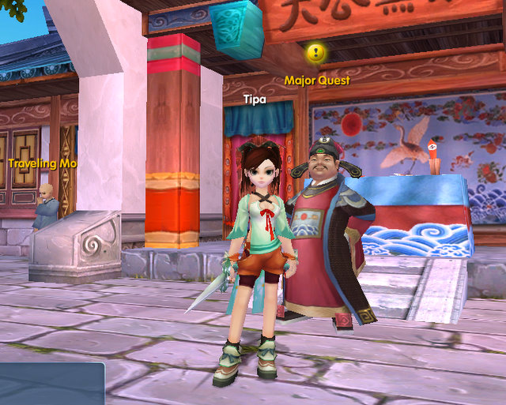

Back to: [West Karana](/posts/westkarana.md) > [2010](/posts/2010/westkarana.md) > [January](./westkarana.md)
# My first minute in Kung Foo!

*Posted by Tipa on 2010-01-08 08:11:34*

Just what it says on the tin, a picture from my first minute in the Kung Foo! closed beta. I was lucky enough to get a closed beta invite yesterday, and after confirming this is a closed beta I COULD write about, gleefully installed it. Oh yes, I was also watching my new Glee DVDs.

It was done by the time I woke up, so I jumped into this lighthearted martial arts-themed PvP MMO and ...

Hullo, Dream of Mirror Online! The graphics weren't quite as good, but the odd movement controls, the menus and the animation are right out of DOMO. That's not a problem with me; DOMO was a heck of a lot of fun, and a real addiction for awhile.

More on Kung Foo! once I've spent more than a minute in game.

