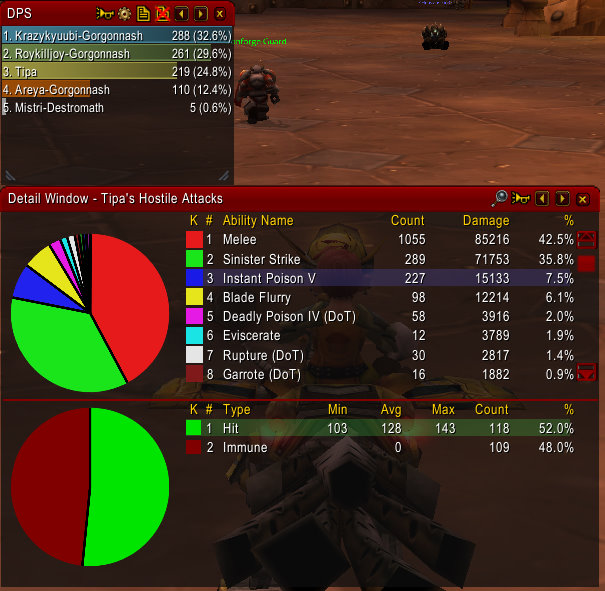

Back to: [West Karana](/posts/westkarana.md) > [2010](/posts/2010/westkarana.md) > [January](./westkarana.md)
# World of Warcraft recap: Improving my rogue DPS

*Posted by Tipa on 2010-01-11 07:52:25*

Thanks to everyone who commented on my [semi-frustrated post Saturday](../../../index.php/2010/01/09/world-of-warcraft-i-suck-at-this-whole-dps-thing/) about my cruddy DPS as a rogue newly come to Dire Maul East. Angry Gamer suggester changing my spec to Assassination, dumping my swords for daggers and relying on beefy crits to up my DPS. Myrix offered up a Combat-focused spec (as opposed to my Combat/Assassination spec), urged me to ditch my slow offhand for a fast one, and reminded me, with Rohan, to keep Slice-and-Dice up at all times. Gordon and Endelon worried that I was focusing too much on my DPS at such a low level (55). Many people thought the heavy emphasis on min-maxing in World of Warcraft hurt the pure enjoyment of the game.

To that, well, World of Warcraft (and EverQuest and EverQuest 2) are achiever-oriented games. I'm sure lots of people play WoW for fun or social reasons, but I suspect most people play it to improve their character. Certainly this is why I'm playing WoW.

Since I don't have any decent daggers at the moment (always looking!), I went with the Combat spec Myrix suggested and dropped my anti-elemental offhand sword for a fast fist weapon I picked up a few nights ago in Blackrock Depths in what might have turned out to be the last time the Looking for Dungeon tool would send me there. Thus equipped, I entered the dungeon queue and waited to see where I'd be sent.

A few minutes later, the LFD tool sent me to Dire Maul East. Yay! I'd never grouped with Death Knights before, and now there were two in the group. The tank was in the "I don't need a group, I can heal myself" "blood" presence, causing the hunter to make a disparaging comment about DKs who don't know how to tank and leave the group. He was replaced by a third death knight.

After three pulls in which I died because none of the death knights wanted to tank, I quit the group and logged out to do something else for awhile.

When I came back later, I got a group, again for Dire Maul East, and was happy to see there were no Death Knights in the party. The druid bear tank kept aggro, I was happy. The other DPS were a fire-spec'd mage and a hunter.

As suggested, I had Instant Poison V on my [Lord General's Sword](http://www.wowarmory.com/item-info.xml?i=11817) (procs +50 attack) and Deadly Poison IV on my [Bloodfists](http://www.wowarmory.com/item-info.xml?i=11744) (chance to wound). Can I give another shout-out to the LFD tool for letting folks do dungeons enough times to get all the best loot from them?

We didn't finish the instance -- the tank left and soon after the healer decided to take off, and after that we were dead. It's hard for people to join a group in progress in DM due to the respawning patrols. But we did finish three bosses and I had plenty of data from Recount to judge my performance.

My overall DPS improved from 148 to 219, over 70 points. Not bad! Against the three stand-and-strike boss fights, my DPS was 230, 231 and 260; number two in every boss fight behind only the hunter, and ahead of the mage and druid tank. If my poisons hadn't been resisted half the time, my overall DPS would have been a lot closer to my boss DPS.

So color me very pleased. Nobody could legitimately call me out for poor DPS in that group, and it's all thanks to all the very helpful and welcome advice!

## Comments!

**[Stargrace](http://mmoquests.com)** writes: wow what a nice upgrade in DPS! I'm glad that the second group was at least better then the first. Though it seems like there's a lot of "really really good" or "really really bad" when it comes to LFD (or at least, that's what I've noticed).

---

**[Angry Gamer](http://angrygamer09.wordpress.com/2010/01/09/how-to-play-a-rogue-and-be-better-than-90-of-the-pugers-you-meet/)** writes: Sounds good glad you had an improvement. I played my rogue a bit yesterday too but I spend most my time tanking now. Keep it up once in Outlands it will get better

---

**Selachii** writes: Enjoying your 'back to wow' write-ups a lot and they tug at me to go back and play the 'vanilla' content again.

That said, I played a rogue for a while as well, but abandoned it at around level 65, though I kinda liked the combopoints-for-SnD-vs-combat-length puzzle. Also try to use Blade Flurry, if you have it, when multiple mobs are being tanked. That should keep you above the mage during trash as well :)

---

**[Myrix](http://www.thewanderingrogue.com)** writes: Nice! Glad to see it helped. 

Don't get too down on the DK issue. I recently went through the late 50s and found nearly every DK I grouped with was either intentionally obnoxious and detrimental or simply horrible at the class. I can only assume this is due to the lack of time invested in the character at that point causing them to simply not care. Don't worry though, it does change. Most of the players that are like that seem to give up on their DK in the mid 60s. It's no wonder DKs have such a bad reputation though. It's hard to disagree with it when you come up in groups like that. 

While I know it is tough to find good weapons in these levels, finding a sword or axe for your offhand will further improve your DPS (likely by a very noticeable amount). Your Hack and Slash talent only works with Swords or Axes and having a fast weapon of this type in your offhand is going to assure that you get a substantial number of procs. I don't know how much gold you have currently but two very good offhand considerations for your level would be the Hanzo Sword or the Flurry Axe. Both can be purchased on the AH, with the Hanzo Sword being the cheaper of the two. If you don't want to shell out for those, look for a Dimensional Blade. 

Keep us updated!

---

**[Toldain](http://toldaintalks.blogspot.com)** writes: I've never used the LFD feature, but I have to wonder why someone who "doesn't need a group" uses it to get a group. For the teleport to the dungeon, I guess? Well, I wish I were the sort of person who could kick people from the group the moment they say something like that. You don't need a group? Cool! Good Luck! .

Congrats on the DPS boost.

---

**m** writes: I play wow for togetherness with my husband. My rogues DPS is in the middle too. I have a slow offhand, but thats not always what ya need depending on some factors. I, for some reason, don't quite grasp it all. My hubbs rogue has the highest DPS by far in all of his runs.

---

**Joscellin** writes: I'm glad to see you're enjoying your back to WoW time. The LFD tool definately re-invigorated the leveling game by a goodly bit.

As to DKs, they're hit or miss as to their quality. The well played DKs at that level (and until close to 70) are very very very good. Unfortunately, as you experienced, well played DKs at that level are also hard to come by :)

As an ex-EQ guy, I've loved following your blog for quite some time :) Keep up the good work!

---

**[Callan S.](http://philosophergamer.blogspot.com/)** writes: I would say getting through the dungeon is the achievement - DPS is simply a means to this end, it is not the end itself.

However, in terms of getting to the end it seems more like whether people flake out or not is the deciding factor.

Anyway, while it's fun to set goals for yourself in terms of DPS or whatever, you seem to be ready to beat yourself up about it. That just doesn't seem a fun way to set goals for yourself.

---

