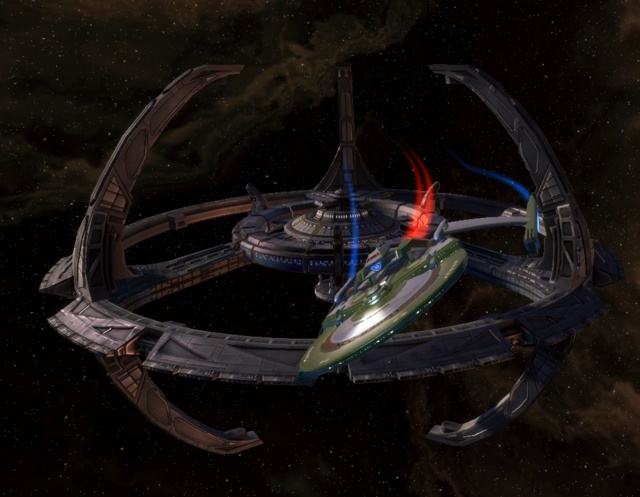

Back to: [West Karana](/posts/westkarana.md) > [2010](/posts/2010/westkarana.md) > [January](./westkarana.md)
# Star Trek Online: A First Look

*Posted by Tipa on 2010-01-11 21:34:19*

That's my ship, a customized *[Miranda](http://memory-alpha.org/en/wiki/Miranda_class)*-class light cruiser, warping away from Deep Space 9. I'd gone there to look at some advanced weapons from the Gamma quadrant I'd heard might be acquired, for a price.

I wasn't so busy that I couldn't relax on the upper level and watch ships head through the wormhole while sipping on a Cardassian Sunrise.

I pre-paid for a six month subscription to [Champions Online](../../../index.php/category/mmos/champions/), a game I thought I would enjoy more than I did (I was one of the many who were disappointed by the rebalancing done soon after the game went live). What sold me on that six month subscription was the opportunity to see [Star Trek Online](../../../index.php/category/mmos/star-trek-online/) go from its rough beginnings to a finished product.

If you're a Star Trek fan, you saw the pictures above and went straight to [the official Star Trek Online site](http://www.startrekonline.com/) and started downloading the open beta.

Maybe you're not the kind of person who cares to debate who would win in a fistfight between Kirk and Picard (Kirk, duh), and need to know what the GAME is like. It's for you that I'm writing all this. I'll meet my fellow fans at [Risa](http://memory-alpha.org/en/wiki/Risa) before we head off to deep space and take on the encroachments of the Klingon Empire.

Or maybe we'll *be* the Klingons who met each other in the battle pits of the Halls of Honor on Qo'nos, and we'll form a strike fleet to wrest control of a key mining operation back from the simpering Federation weaklings.

**The galaxy is embroiled in war.**

The Borg have arrived in force from the Delta Quadrant. The Romulan Empire has crumbled. The Cardassians are fighting anyone who comes near. The Klingons have broken their alliance with the Federation and, allied with the Gorn and other warlike races, are attacking the Federation on all sides.

Peace seems far away, and the galaxy is a deadly place. You were lucky enough to be on Starbase Alpha when a weakened Borg fleet dropped out of warp in Earth orbit. Your ship just barely escaped being turned into scrap, but all the senior officers are casualties. Together with the other survivors of that massive battle, you'll drive away the few remaining Borg ships and be given a field promotion to Lieutenant and the captaincy of your ship.

War is the backdrop to Star Trek Online, but the Federation still highly values its missions of exploration, diplomacy, and keeping the peace among the allied planets. Your path is set as the very first decision you make in the game.

Though any career track -- Science, Engineering or Tactical -- can fly any ship in the game (with the correct training) and learn any skill, you get some initial bonuses and, of course, determine the color of your uniform.

Science officers are trained in support roles -- medical, exploration, in battle weakening the enemy and strengthening allies. They tend to fly science and medical ships which do for fleets what the officers do on away missions.

The Engineers can make machines do things nobody else can manage. On the ground, they get more oomph from energy weapons and can deploy turrets and other devices to decimate their enemies. They tend to fly escort vessels, tuned to devastating attacks from a distance. In beta, escort ships tended to require a deft hand on the controls, but a skilled captain wouldn't fly anything else.

Tactical officers are deadly enemies, able to take far more damage and take control of a battle whether on land or in space. They often fly heavy cruisers, the behemoths of space. Nobody ignores the tactical officers. Not twice, anyway.

The roles are, yes, roughly analogous to the traditional MMORPG roles of healer, ranged dps and tank/melee dps. Since STO is a skill-based game, though, choosing one career path doesn't close out the other paths, and as you gain ranks and new ships, you eventually can fill any role adequately.

At least in the early game, having a good mix of different ships and careers doesn't seem all that important.

**You are never alone.**

News of your meteoric rise to command travels fast, and you'll find no end of junior officers eager to join your crew. Your first few 'episodes' -- missions -- will reward you with your choice of bridge officers who will man the tactical, science and engineering consoles in your ship, each of whom will have one or more special abilities. For instance, my science officer doubles as a medic on the ground. In space, he uses finely tuned tachyon fields to disrupt enemy shields.

If you don't like your officers, you can trade them in for new ones, hire tutors to teach your crew additional abilities, or just bring them to various shady characters on certain starbases and change their name, species, gender, uniform, etc. Nothing is stopping you from getting the exact crew you want.

Those same starbases often will, for a fee, take your ship into the shipyard and reconfigure it to your liking. Your ship will be uniquely yours.

The above picture is me (the Andorian in the middle) with my bridge officers. If you think the ~~redshirts~~ engineering officers on each end look really similar, it's because they do. Jill was caught in a transporter accident and now there are two of her. Best thing is, I only pay them one salary. I also designed custom uniforms for my crew JUST BECAUSE I COULD!

**Never a dull moment in the Alpha quadrant.**

Life as a Starfleet is never boring. Starfleet HQ won't run out of things for you to do -- hail them all day, they'll keep giving you assignments -- but if you like, you can just point your ship at a distant star and see if the natives need any assistance. You can just be flying along and notice an enemy ship flying nonchalantly and decide to check them out. Or perhaps they noticed you first. And then a high priority subspace transmission informs you that your ship is the closest to a potential trouble spot, and would you check it out?

Regardless of how you gain a mission, they fall into three broad categories -- space battles, planetary exploration, and those that have some combination of space battles and away missions.

A good example is the episode "Stop the Signal", which, when successfully completed, allows you to create characters in the Klingon Empire.

You warp into an asteroid field. Sensors show a strange installation on an asteroid quite far away, protected by a squadron of Klingons. Starfleet informs you that by navigating close to the asteroids, their strange electromagnetic properties could make you virtually invisible to enemy sensors. You and your teammates --

Did I mention when I did this, the game automatically grouped me with two other people doing the same mission? Yes, open grouping is a reality in STO, as are public quests.

-- anyway, we flew toward the listening post, hoping to get close enough for a deep scan so we could find out what data it was transmitting, and to whom. Unfortunately, as we neared, the Klingon squadron caught sight of us and we were forced to fight them.

When their ships were wreckage, we scanned the post and then warped off to the signal's receiving station, which turned out to be an installation on a large asteroid. We were prevented from beaming down by four transporter disruptors positioned in space around the asteroid. We flew to the closest and started firing at it -- provoking a cloaked Klingon squadron to decloak and attack. We finished destroying the disruptor and then turned to fight the Klingons, but they were supported by a heavy cruiser and we had to retreat.

All we had to do, though, was destroy the disruptors, so we flew to and destroyed the other three and ran from the Klingons that arrived to defend them.

Cleared to beam down to the installation, we selected the bridge crew that would accompany us and headed in.

The place was lousy with Klingons. It was a tough fight -- we all died at least once (there is no death penalty; you just reappear at the closest respawn point, whether on an away mission or in space), but we cleared them (and their little dogs, too!), planted explosives everywhere and uploaded all the station's data to Starfleet.

Analysis of that data sent us on to find that the whole thing had been a plot by an Undine incursion -- an alien species from pan-dimensional "fluidic space" who are implacable enemies of the Borg, which doesn't make them like US at all. We attacked the Undine flagship along with a Klingon squadron, unlikely allies indeed.

The best episodes have multiple objectives that open up as you work through them. But even the simple combat missions have the charm of letting you work on your dogfighting. But that's for another post.

First, though, let's take a moment and look at character and ship creation. 
## Comments!

**[West Karana » Star Trek Online: Character and Ship Creation](https://chasingdings.com/index.php/2010/01/11/star-trek-online-character-and-ship-creation/)** writes: [...] « Star Trek Online: A First Look Jan 11 2010 [...]

---

**[West Karana » Star Trek Online: Basic Space Combat (video)](https://chasingdings.com/index.php/2010/01/11/star-trek-online-basic-space-combat-video/)** writes: [...] the first post in this series, I gave a brief overview of the game. In the second, I covered the sorts of [...]

---

**[West Karana » Star Trek Online: PvP and the Klingons](https://chasingdings.com/index.php/2010/01/12/star-trek-online-pvp-and-the-klingons/)** writes: [...] my first Star Trek Online open beta post, I gave a brief overview of the entire game. In the second, I covered the basics of character and ship customization. After [...]

---

**Hawley** writes: Wotcha Tipa,
A lovely series of articles. I think these have done more to give me much hope for this game than anything Cryptic have said.
Ta muchly.
Cheers,
Hawley.

---

**[Tipa](https://chasingdings.com)** writes: I had a lot of fun in the beta. We'll see how it translates to the live game, but right now, I'm hopeful.

---

**[Anton](http://www.thallians.blogspot.com)** writes: Thanks for sharing this! Having a whole crew of my own sounds like so much fun. I wish you could crew the ship of a friend playing online, though--riding in the same ship together would be exciting, I think.

---

**[STO Reviews: Short and Long Form | Kill Ten Rats](http://www.killtenrats.com/2010/01/14/sto-reviews-short-and-long-form/)** writes: [...] A First Look [...]

---

**[Tipa](https://chasingdings.com)** writes: You may want to look into Allods Online and Puzzle Pirates, both of which allow many players to help in crewing a single ship.

---

**[Star Trek Online Impressions Wrapup &laquo; Bio Break](http://biobreak.wordpress.com/2010/01/14/star-trek-online-impressions-wrapup/)** writes: [...] Karana (one, two, three, [...]

---

**DeepSleeper** writes: Can you turn off autogrouping, if you don't want to play with anyone else?

---

