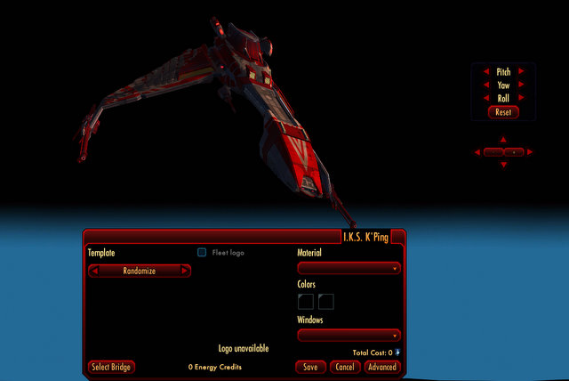

Back to: [West Karana](/posts/westkarana.md) > [2010](/posts/2010/westkarana.md) > [January](./westkarana.md)
# Star Trek Online: PvP and the Klingons

*Posted by Tipa on 2010-01-12 00:16:55*

In my first Star Trek Online open beta post, I gave [a brief overview](../../../index.php/2010/01/11/star-trek-online-a-first-look/) of the entire game. In the second, I covered the basics of [character and ship customization](../../../index.php/2010/01/11/star-trek-online-character-and-ship-creation/). After that, I went over some of the beginning tactics you'll be using in [space combat](../../../index.php/2010/01/11/star-trek-online-basic-space-combat-video/). In this post, I'd like to talk about PvP.

Where the Federation might waste time on missions of peace, mercy and diplomacy, facing only NPC ships, Klingons have no patience for such things. The only thing that gets them to put down the *gagh* and blood wine and get into their Birds of Prey is the prospect of seeing the explosions of Federation starships dot the starry sky like the ceremonial disruptor cannon firing at the feast of *batlhjaj*.

Klingons don't gain skill points in "episodes". They gain skill points by "killing Federation players wherever they find them."

While Klingon ships are no less customizable than their Federation counterparts, they have somewhat different abilities. They rely more often on disruptor cannons over phasers. Their narrow firing arc tends to reward an aggressive rush at the enemy. Every ship is equipped with a very functional cloaking device, that allows them to get quite close to their enemy before they tear them apart. It is unknown if the device helps cover a retreat, because Klingons NEVER retreat.

After the briefest of introductions to Klingon life (you must defeat your instructors in battle), you are given a ship and a crew and told to die bravely, with honor, in battle against the Federation scum. (Unlike Federation characters, Klingon characters start out at level 6 with a vast pool of skill points to spend -- they begin the game fairly powerful).

When I got used to a ship far nimbler than the Starfleet vessel I'd been flying with the Feds, I headed to the nearest system, where I was shown a list of ongoing PvP instances (and where I could create my own, if I wished).

I queued up for several. Despite the time estimate of "no wait", it took several minutes before I was brought into the map.

The map was a familiar scenario; There was a mining station, a refinery, and several drilling operations chewing up asteroids. Each point was marked with a giant Starfleet or Klingon symbol, denoting who controlled that resource. At the end of the battle, they who owned the most resource points the longest won the match. (This is very similar to the Arathi Basin battleground in World of Warcraft).

Federation players swarmed their control points while the Klingons helped to keep the map dangerous. Another Klingon invited me to join his team, and so three of us circled outside Federation control points looking for stray ships that were thinking about making a play for Klingon points. Occasionally the Feds would make a massive play for it, and we'd have to snipe at them at a distance.

The first match we barely lost. The second match, we wiped the map with the Federation. It was good fun -- but for all the different queues I joined, the only actual map I ever got sent to was the same Arathi Basin-type map.

I really got the impression that the Klingon side was lacking a lot of the polish that had gone into the Federation side. Expect to hear a lot more about that.

Here's a video of one of the PvP runs -- the first one.

I apologize about there not being any sound in these videos. I have no idea what happened to it.

Well, I think that's enough for now. Enjoy the open beta!

## Comments!

**Longasc** writes: I just watched the video and it was fairly impressive. You painted your Bird all red, very nice! People often compare STO to Pirates of the Burning Sea, which I do not know, but this totally reminded me of a spiced up Star Fleet Command III. The Federation players apparently have not found the recipe how to deal with all guns firing forward yet. I have only seen one performing a spin around maneuver to use all his shields. But the poor guys were apparently a bit outnumbered and outgunned.

---

**[Tipa](https://chasingdings.com)** writes: In huge fleet battles, it is best to not run out in front. If everyone moves together as a unit, it is very hard for an enemy to break through the line. But some hero always decides they're invincible, and then they get chewed up.

---

**[R.W. Harper](http://www.lorewriter.com)** writes: Great video and writeup Tipa. I look forward to more.

---

**Fabsterman** writes: This video really looks and feels like a WoW battleground. That disappoints me to a degree as i was hoping for a bit more than just a World of Warcraft in Space though. Maybe i am influenced a bit too much by my EVE Online experience... 

anyway a plain WoW in space ripoff is not what i expected....

---

**Longasc** writes: It is very different from WoW. It is also very different from EVE. It is action-oriented. A bit like a multiplayer action adventure in space.

---

