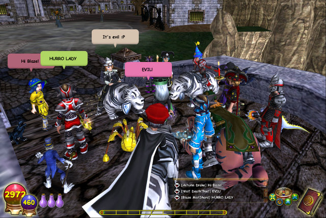

Back to: [West Karana](/posts/westkarana.md) > [2010](/posts/2010/westkarana.md) > [January](./westkarana.md)
# Wizard101 wants you to break their servers!

*Posted by Tipa on 2010-01-12 20:57:48*

KingsIsle is hoping W101 subscribers will log on to the Test Realm in the next couple of days, go to a certain area and just jump around, port there and back, and in general abuse the place.

Plus, you get 100,000 Crowns to play around with (but only on the Test Realm, alas!)

Here's what Professor Greyrose has to say about it:

> We've opened the Test Realm for just a couple of days, and we're asking you the players to test the limits! We want to see how many players can be in one area at a time, and the best way we can do that is to ask you to join us for a party at the Stormdrain tower! 

At the end of Triton Avenue's Haunted Cave lies an area surrounding Stormdrain Tower. Please take a moment to run there, change Realms, mark and recall, dance and generally have fun! 

If you happen to encounter a crashing problem, please send the report that appears after Wizard101 shuts down. 

KingsIsle employees will drop by from time to time to visit, so watch for our KingsIsle Support badges, and remember they're not a KingsIsle employee unless they have the badge! 

To learn how subscribers can log in to the test realm, visit our Test Realm page at <https://www.wizard101.com/game/testrealm> 

## Comments!

**[Fallon Shadowblade](http://www.diaryofawizard.com)** writes: Oh that's my alt Autumn in your pic (and Evil Theurgist, Friendly Necromancer, Olivia & Jester from Central)! LOL Good times.

---

**[Tipa](https://chasingdings.com)** writes: Oooo I have a pic of a lot of famous wizards! Woohoo!

---

**[The Friendly Necromancer](http://thefriendlynecromancer.blogspot.com)** writes: my body is covered by an evil balloon.

---

