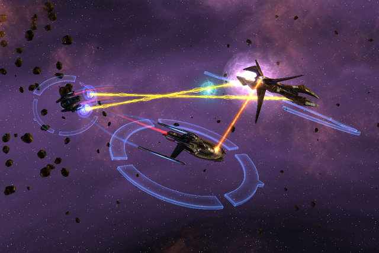

Back to: [West Karana](/posts/westkarana.md) > [2010](/posts/2010/westkarana.md) > [January](./westkarana.md)
# Weekend gaming: Super-rich edition

*Posted by Tipa on 2010-01-19 08:34:08*

Before I get started, I just want you all to know that I don't have to do this. No, really. I'm about to be rich. VERY rich. I just got a VERY intriguing email....

> i have a secured business proposal for you in the turn of US$85,000,000,00 and we shall share in the ratio of 60% for me and 40% for you. Should you be interested, contact me back.

I know this is on the up-and-up because it is written so horribly, and EVERYONE knows that the super-rich have no need to learn to read or write. But my mysterious benefactor had better invert that ratio. I'm holding out for 60%.

I'm happy to announce that the boys of Adventures in Monopoly are back, tanned and rested and ready to work, and they are bringing the Daily Blogroll back with them starting next month. I got burned out on MMOs for awhile....

This long holiday weekend was filled with lots of gaming goodness!

I don't really want to burn out on Star Trek Online during its open beta. I want it to be fresh so I can enjoy my two characters when the game goes live. Here, @Longasc helps me take out an Undine who has been manipulating the Klingon Empire and the Federation into armed conflict all throughout the galaxy. after, we helped in the defense of Starbase 24. He had to go after that, but I continued on in an open group for Stop the Signal that ends up being yet ANOTHER Undine plot. I wonder if the Undine are going to be the big baddies of whatever raid content STO has?

Regardless, my sole goal in STO during beta is to explore the Klingon faction. My Starfleet ship is hanging, dead and abandoned, in space somewhere. But I know precisely where my Klingon Bird of Prey is.

It's grounded on Qo'nos. See, the Klingons are all about the PvP. It's not always against the Federation; Klingons are perfectly happy to make war among themselves. However, out of all the missions I could find, only one of them required leaving Qo'nos -- and that was to explore a nebula where NPC Federation ships were milling about. I could barely (at the time) touch those. I tried to fly to Federation space, but was blocked.

In the end, I just returned to Qo'nos and queued up for every PvP mission I could find. On the space ones, I'd be in my space ship. On the ground ones, I'd be lugging around my disruptor cannon. And after, I'd be right back in Qo'nos.

Once I get level 11 and my ship upgrade, maybe I'll try that nebula again. Otherwise, the PvP aspect of the Klingon faction seems very much like queuing for battlegrounds in WoW (and with EQ2, come the expansion). You just sit in the city and queue for stuff.

I very much hope Cryptic is working on fleshing out the Klingon side of things somewhat. PvP is fun and all, but there's no CONTEXT. Don't the Klingons care how the Undines are manipulating them?

I'm still rather undecided about the Star Trek Online business plan. Only two character slots? For a subscription game? People screamed bloody murder when EQ2 shipped with only FOUR (and it was forced to add more). On the other hand, Final Fantasy XI Online only had ONE -- every other added a dollar to your monthly subscription fee. It's clear Cryptic will be pushing the STO store as heavily as any Free to Play game does.

Why not just bite the bullet and GO free to play? I don't know many people who wouldn't find a spot for STO on their hard drive if it were F2P. Mark my words, in a year STO will be doing well, and it will be F2P.

Here's another prediction: When WoW's next expansion launches, Horde and Alliance will be able to speak to each other, group and so on. The Cataclysm will erase all the old feuds as they come together to save Azeroth itself. Crazy? Maybe. But I have been using the LFD tool to find dungeons both for my (relatively) high level characters (level 60 and 61), and for my lower level characters. And I just can't tell the difference between them. I took my 25 Horde Tauren druid through Stormwind Stockade and Gnomeregan, and it was exactly like any Alliance group. All blood elves except one undead and a cow (me). Pally tank. Way back when, Horde groups would have orcs and trolls in them. Now, Horde is just a pale reflection of the Alliance. GJ, Alliance. You won by being more photogenic.

Sirhyl/Niiko and Noffin/Severan each made Death Knights on my server (Kirin Tor) to say hello and to prove that DKs weren't all confused. We did a bunch of instances with me healing, and they went pretty well. We even did Hellfire Ramparts and, aside from not knowing how to get back to the instance after a wipe, we did okay.

I made level 58 (finally!) with my rogue and went immediately to the Outlands. I did a lot of the quests, got several nice upgrades, looked at my shiny new GearScore in the mirror and queued up for another dungeon. What, Dire Maul AGAIN? AGH.

Back to the Outlands. More quests. FINALLY, LEVEL 60! That gave me enough points in the Combat tree to get Killing Spree, where you jump from mob to mob, giving each one stabs of love to their waiting backs. It's yummy. I got into a Hellfire Ramparts group, this time as a stabbity stabber, and parsed #1 on two of the bosses. I was very happy and I won a belt with space for two red gems.

Afterward I returned to the Plaguelands to continue work on my Scholomance key. With Killing Spree and my new Outlands gear, those undead looked really confused as they dropped meatily to the ground.

Thanks for all the advice on uberfying my rogue :) She is VERY fun now!

Sirhyl was getting a hankering to try EverQuest 2 again and asked if I wanted to Recruit a Friend him and come along for the fun. Sounded fantastic to me! I had a level 14 Fae berserker that I hadn't done much with since I sneaked her into the Labs once a few years back. Sirhyl made an Inquisitor, and we headed to Timorous Deep to see how things were going.

With the mentoring bonus, the 200% recruit a friend bonus and the 40% holiday weekend bonus, it didn't take long for Sirhyl to catch up and rocket past my level 14. At the end of the run, I was level 31 and he was level 30, and we finally finished a long, LONG haul in Splitpaw, getting the glowing azure shard that lets us return there anytime. Now we can do the instances.

The Arena and even the Trials of Harclave were kinda tough at 30 when you're dressed in level 12 armor and weapons, by the way. It was a lot of fun when we were able to do the final instance together.

My Hobbesian cleric and the rest of the Sunday night crew met in Dungeons & Dragons Online again to do all the instances over once more in Hard and Elite. We all wanted to go to Stormreach, but none of us wanted to head over before we'd wrung all the ~~loot~~ ~~favor points~~ *adventure* we could from Korsha Island. 

The henchmen hirelings were a huge help. Each of us brought one along on the elite missions, and we all figured out how to get hirelings to rez and rest at shrines, and all of us had fun being dead. Those adventures are NOT EASY.

There was a bit of fun, though, when a group of mobs knocked me unconscious. They would considerately stand around me while I would bleed away closer to death, then miraculously start struggling back to health, heal to 1 hit point, stand up, get knocked down, bleed, start healing, stand up, etc. This went on three times before they finally just up and killed me, all while the rest of the group was trying to fight their way back to me.

At the end, some of us had enough points to buy the Son-To-Kor expansion (whatever the correct name), but I didn't. I hope to earn enough doing normal-level missions in Stormreach. I was considering buying the Drow race and restarting as a less grim-looking cleric, but she's level 3 and I don't feel like leveling all that up again. I'll just have to make do with her looks. I SWEAR there's more than a little orc in her.

I got some EVE time in there, too! But more on that later.

Have a great day!
## Comments!

**[Spinks](http://spinksville.wordpress.com/)** writes: "I don’t know many people who wouldn’t find a spot for STO on their hard drive if it were F2P."

Can't disagree with that. And glad to hear you are getting your enthusiasm back. Sounds like you have had a blast in all these games recently!

---

**[Pete S](http://dragonchasers.com)** writes: Looking forward to the return of the daily blog roll, but it's posts like this one that I most enjoy. Thanks!

---

**Endelon** writes: No Alliance/Horde groups in Cataclysm, they are moving away from the "united against the common enemy" theme of BC and WotlK and going back to Horde vs. Alliance in this expansion. No new neutral city either! I think both of these things are huge pluses :D

---

**[The Friendly Necromancer](http://thefriendlynecromancer.blogspot.com)** writes: Hey Tipa, why are you making fun of my business proposal? You could be the richness. Just for that I'm making the ratio 61 to 39.

I'm simply astounded by the number of quests in Stormreach . . . I'm not sure where to start other than the quests right around the docks.

I will most likely shoot you an e-mail about this tomorrow. So check your junk mail would ya?

---

**TheRemedy** writes: I hope it doesn't go F2P as I already paid for a years subscription.

---

**[Ysharros](http://stylishcorpse.wordpress.com)** writes: This is where I ask if you don't want one more wafer thin MMOmint...

---

**alex deathshade** writes: i just want to suggest a cool game to you (its more like a bunch of games)
-the game fate (find it at playfate.com)
-feudlism II (at onemorelevel.com)

---

**[Saylah](http://notadiary.typepad.com/mysticworlds)** writes: I loved the blogroll too but can appreciate how much work that must have been. I'll certainly take it when I can get it though. I've have had one too many new MMOs with a bitter after taste for me to do more than buy the game and regular sub. There are only two games I'd consider doing that for, neither of which will ever do it while I'm still a heavy MMO player. EQ2 because I think one day they'll fix the questing suck (sorry still hate their quests), add LFG and make solo play more engaging. WOW because there's always something to do and with all my kids and nephews having played the game, someone at some point, will want in again.

---

**[/AFK &#8211; Let&#8217;s All Play Whatever Stargrace Is Playing Edition &laquo; Bio Break](http://biobreak.wordpress.com/2010/01/20/afk-lets-all-play-whatever-stargrace-is-playing-edition/)** writes: [...] West Karana is literally all over the place in MMO gaming, and she likes it that way! [...]

---

**Longasc** writes: I missed that posting? Hu! I guess I am the last person to suggest item shops and the F2P model to any game, but I dare to say I believe STO would do even better than DDO with this model. They now will apparently have 3 slots at launch, better than nothing, but I would call this a minimum appeasement marketing strategy. ;)

STO will probably do fine with subs, but I cannot help and still think this game would live longer and prosper even more with a non-sub business model.

---

