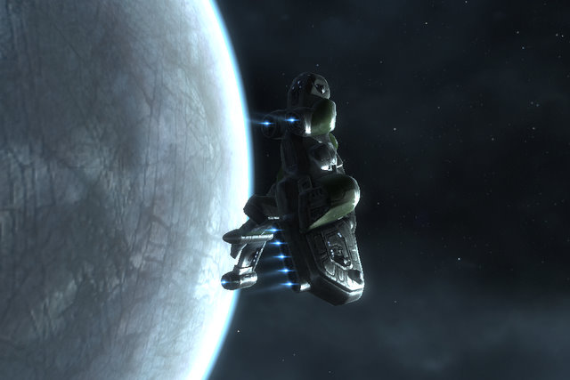

Back to: [West Karana](/posts/westkarana.md) > [2010](/posts/2010/westkarana.md) > [January](./westkarana.md)
# EVE Online: Pinneau/Ethomas Industries christens first ship

*Posted by Tipa on 2010-01-22 08:00:03*

Named "Hathor" after the Egyptian goddess who welcomed the dead to the afterlife, the first Helios covert ops frigate born of the collaboration between Tipa Pinneau and Ethomas rolled from the Federation Navy yards in Eglennaert last night to the cheers of the workers. It rounded the station twice before cloaking and heading to parts unknown.

I don't know if there's any way I can make back on Tech II ship building what it cost to get in the business. I did manage to get an Incognito Ship Data Interface for only 32 million ISK. The datacores for the invention attempts were supplied *gratis* by my research agents. The Imicus blueprint copies that form the base of the Helios blueprints were copied from an unresearched Imicus original blueprint. My one success in four tries at a Helios bp resulted in a very poor quality product. I've since done some material research on the Imicus original, so perhaps the next one will be a little better.

Ethomas spent about 15 million ISK for the Helios components; I had the skills necessary to actually put them all together. It took 13 hours and 20 minutes to make the ship, and untold weeks for Ethomas to learn to fly it. It was a true collaboration.

While my main focus is still making Hammerhead II drones, I'm trying now and then for another Helios bp of better quality. If there's 5 million ISK profit to be made from them, then it's possibly worth the time to make one now and then. Level 4 missions, though, make that much in a couple of hours with bounties and salvage taken into account. It's just one step on the road toward more complicated ships -- in the coming months, I will start working on my Ishtar heavy assault cruiser.

I am really loving invention and manufacturing. I hardly ever do missions now, and when I do, it's just the fun ones. Whether or not I ever turn a profit on it, the fun is worth the work.

## Comments!

**Longasc** writes: If I recall correctly, I never ever had a real blueprint, only copies. And I could only create generic cruisers and frigates. But that was already much fun! Creating such an awesome cover ops ship is really amazing.

I think they should focus more on this when they promote EVE next. I think this is much closer to what makes this game so fun than the "someone scammed someone else" crap they post all the time.

So congratulations, Captain Pinneau! I wish you good luck in your advanced crafting adventures. Ysharros would probably like that, too.

---

**Aliesthan** writes: God, I hate when you post about Eve. I feel the urge to resuscribe. Must... not... return...

---

**[Magson](http://phoenq-magson.blogspot.com)** writes: Congrats! I've been playing almost 2 years now I and I still haven't got the 1st idea how to build anything, much less research, invention, etc.

How much are you charging? I'd be interested in buying a Helios for my collection (I can fly every T1 and T2 frig out there and am collecting them over time, though I'll admit I'm more likely to keep using my Anathema than the fugly Helios. . . ) from you instead of generically off the market.

---

**[Casiella Truza](http://rift.chromebits.net)** writes: Always glad to see someone else get the invention bug.

A few notes: BPO ME level has no effect on the ME of the invented BPC. For that, you'll need to use decryptors. Also, don't think that the datacores are "free". Well, in one sense they are -- no direct ISK outlay -- but they have value because you could choose to sell them instead.

To make your T2 ships profitable, try shopping around for components in hubs (you might even have to go to Jita), and source your stuff through buy orders wherever possible. Dominion drastically altered the T2 materials market, so that's still undergoing a lot of upheaval and many of us have stopped producing T2 ships and some modules until it stabilizes and we can make some profit.

Have fun!

---

**[Stabs](http://stabbedup.blogspot.com/)** writes: That's fantastic, well done indeed.

A couple of thoughts on marketing them.

1) Try selling fitted Helios on contract. Nuke It Now ready to go stealth bomber may be more attractive to people than running around fitting it for themselves.

2) Try selling them in a null sec war zone. Usually it would be too risky to take trade goods to such a place but you can jump clone, sneak in with the stealth bomber, put up a contract, advertise it in Local then self-destruct your jump clone to get home. (Or if they're receptive get them to blue you so you can run stealth bombers to them on an ongoing basis).

---

**[Can&#8217;t Touch This &laquo; Shattered](http://shatteredblog.wordpress.com/2010/01/24/cant-touch-this/)** writes: [...] Touch This As you may have already seen on another blog the first T2  ship made from Tipa’s invention skills is now zipping around the skies of [...]

---

**[Lockefox](http://www.twitter.com/LEIGIndustry)** writes: If you are really looking to take your invention to the next level contact me in game (Lockefox). I am in the process of looking for a partner in Gallete space to expand our operations there. Unfortunately, with my current membership, the barrier to entry into those markets is WAY too high. 

I represent LEIG, and more importantly our industrial and invention programs. We run dedicated teams of inventors in two regions to produce for the combat needs of the EVE population. We run a very tight operation, and make a lot of money doing it. All alliance expansions are funded solely by this program and we take it very seriously.

Contact me in game (Lockefox) and we can discuss the prospects. If you were willing to help us, we would be willing to front the startup costs. Under the wing of Darkmatter Initiative I think we both can expand our reach!
~Lockefox

---

