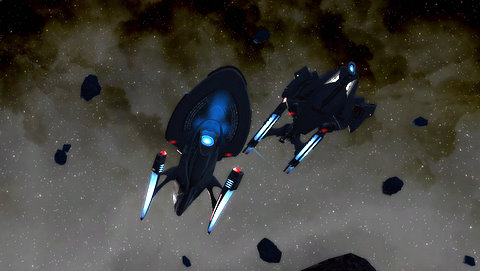
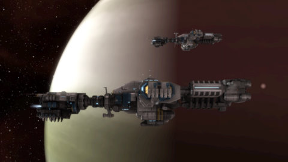

Back to: [West Karana](/posts/westkarana.md) > [2010](/posts/2010/westkarana.md) > [July](./westkarana.md)
# Assault on the Inbox: Independence Day Edition

*Posted by Tipa on 2010-07-02 06:52:02*

Exciting MMO news lands in my inbox; I pass it along.

**Cryptic is dropping prices in their "C-Store"** for the holiday weekend on existing items. Emphasis on existing; they also announce that [the Galaxy X/Galaxy Dreadnought class cruiser](http://startrekonline.com/node/1878) will soon be available in the shop. This is the three nacelled Enterprise-D variant that Riker commanded in the future segment of The Next Generation's "All Good Things", and in particular is the ship that @Longasc has been trying to earn via getting people to sign up. Well, it'll be in the store soon. 

No word on if it will just be a re-skin of the regular Galaxy-class cruiser. If it is, that would be somewhat unfortunate, as the Galaxy-class cruiser is not a rear admiral ship. Since the Galaxy Dreadnought will be the only cruiser that can use the super-damaging dual cannons, a lot of admirals may find themselves downgrading.

Should be a monster in PvP.

STO Executive Producer [Craig Zinkievich](http://startrekonline.com/node/1875) is saying goodbye to Cryptic to spend more time with his kids. That's definitely a good reason, but I can't help wondering if he'd still be leaving if STO had been a wild success.

**City of Heroes** unleashes its [Super Booster Pack V: Mutant](http://www.cityofheroes.com/newsletters/07-01-10/usonline.html). This mini expansion adds Tron-like glowing armor sets to your repertoire, new costume change emotes and Secondary Mutations for your heroes with mutation-based powers. Looks very cool -- like EverQuest, City of Heroes never lets its age stand in the way of innovation.

CCP is [giving away a Primae](http://www.eveonline.com/devblog.asp?a=blog&bid=772), a planetary resources hauler, to every current **EVE Online** player. These one-of-a-kind ships have special cargo holds for the resources you get from your planetary command centers, and is the fashionable ship of choice for experienced atmo-skimmers.

These irreplaceable ships PROBABLY won't be targets in [Hulkageddon III](http://tagn.wordpress.com/2010/06/21/hulkageddon-iii-dates-announced/). Probably.

**Runes of Magic** announces their [patch 3.0.2](http://news.frogster-online.com/ov?mailing=1URFFJU-93SVIL), which includes a new instance, the "Warnoken Arena", two-seated mounts, a new pet system and new public events. They are also having a discount on Diamonds (cash shop currency) for the US Independence Day weekend, though in deference to their non-US players, they have taken special care to not mention the holiday. 

The iPad/iPhone MMO **Pocket Legends** announces their lates expansion, [Alien Oasis, Part 2](http://us1.campaign-archive.com/?u=29cb8fb751eed3095b53cf4a8&id=1b9aca9b6d). This expansion raises the level cap to 45, adds all new gear, and continues the saga of anthropomorphic bears, cats and hawks as they struggle to survive in a world gone mad.

I need to get back to playing that game....

The folks at **Perfect World Entertainment** announce [double experience](http://view.email.perfectworld.com/?j=fe5d1576776204787213&m=fec216717c6d0778&ls=fdee12787764037c7c177870&l=fe8f1770776c007473&s=fe2b15717463077a761c75&jb=ffcf14&ju=fe3715787766057b741572&r=0) for the Independence Day weekend in Perfect World International and Battle of the Immortals. 

I can't help but think a battle between immortals would probably take more than one gaming session. "WHY... WON'T... YOU... DIE!!!!! Oh yeah. Immortal."

**Aion** announces [free character server transfers and server merges](http://us.ncsoft.com/newsletters/aion/06-24-10/us-inactive-static.html). This isn't a bad thing; PvP-focused games require very active servers, because if there is nobody to kill, half the fun evaporates. 

Aion's next expansion, Assault on Balaurea, will raise the level cap and continue the epic, world-shattering story of the devas of Atreia as players battle back against the bloodthirsty NPC faction.

And ... that's all the time I have this week. If you're in the US, enjoy your Independence! If you're in the UK, enjoy not having to take responsibility for us! If you're anywhere else, just enjoy!

## Comments!

**Longasc** writes: Tentonhammer already posted a "Primae Suicide Ganking Guide".

The Galaxy X costs 2000 Cryptic Points, which is ~ 20,75 EUR ~ 25,9 US $ = Sparkly Pony.
And people cheer, those who bought 5 copies of the game boo. Some argue the price, some the principle.

And of course I say it is all wrong. It should have been a special recruitment reward or people should be able to earn it ingame. In a harsh carebear killing questline.

P.S. nice screenshot! And I share your opinion regarding Zinc's departure.

---

**[Bri](http://vanillabri.blogspot.com)** writes: The fact that the Primae is irreplaceable, combined with the fact that planetary installations are not attackable, pretty much guarantees flying one is akin to painting a giant red "shoot me" sign.

---

