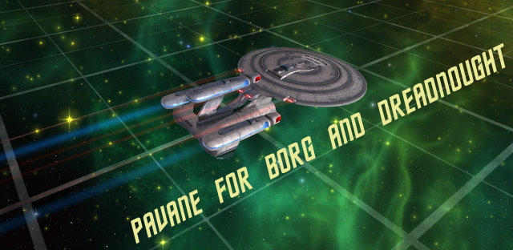

Back to: [West Karana](/posts/westkarana.md) > [2010](/posts/2010/westkarana.md) > [July](./westkarana.md)
# STO: Sparkle Ponies in Space -- Adrift with the Galaxy X

*Posted by Tipa on 2010-07-05 18:29:42*

I resisted the original sparkle pony in World of Warcraft, felt no urge to get the Cash Cat in EverQuest 2, nor the Stationbuck Steed in EverQuest. Everyone has their price -- mine was the Galaxy Dreadnought (AKA Galaxy X) cruiser. It can cloak! It can equip phaser cannons! It has a unique weapon -- the spinal phaser lance! It can crush your enemies. Riker flew one in an alternate future timeline in the "Star Trek: The Next Generation" series finale. It is a futuristic update to the standard TNG Enterprise-D, which in this alternate future, was not destroyed by the comical yet bumbling crew in "Star Trek Generations".

The Galaxy X was originally obtained only by those master recruiters who managed to get five people to subscribe to the game. Like many other of Star Trek Online's unique rewards, though, it eventually did come to the Cryptic "C" Store. Now, if your recruiting skills are rusty, you can just purchase one at what has become the MMO industry standard price for unique conveyances, US$25.

That's how I came by mine.

Unlike mounts in other games, a change in ship can have a vast affect on your gaming style. The Galaxy X dreadnought has room for four engineering consoled, but only two science and tactical. Similarly, only your chief engineer can use her most powerful abilities (in my case, Aceton Field III), with every other bridge officer struggling to keep up.

I found the ship in my inventory after I purchased it. I kinda expected it to be in my dry dock, but nope, it was in the inventory. It will be available for all my Federation Rear Admiral 5s and better.

Since the Galaxy X can equip escort-specific cannons, I traveled to the Gamma Orionis forward fire base on the edge of Borg space and traded in some of my daily mission tokens for some plasma cannons. Plasma cannons don't fit. I bought some phaser cannons. Phaser cannons DO fit, but I've built my skills around plasma. I should have replaced the aft turrets with beam arrays; I'm missing the nimbleness of my recon science ship and could use some broadsides power.

The ship is fine, but I find I'll probably be heading back to my science ship. I'm used to the style of gameplay where you shut down the enemy ships and destroy them while they are helpless to retaliate. The cruiser is much more about taking whatever is thrown at it and outlasting enemy ships. The Galaxy X does bring a fair amount of increase in DPS, but it is the positional kind of DPS, where for full effect, enemies should be in a narrow arc in front of the ship.

I took a video of a couple of encounters using the ship. If you could fly it better, well, you probably could. I'm a science officer, what do I know about cruiser command?

Watch it in 480p if you can.

## Comments!

**Longasc** writes: I already told you that sparkly ponies are just bad, and buying them sets a bad trend for more sparkly ponies in this and other games.

STO Insider talk:
The thing is, the spinal lance requires phaser spec for full effect, has a narrow arc and huge cooldown, shared CD with beam overload. In fact for this and the cloak you lose one rear weapon slot and one tactical console!
If you manage to use the spinal lance on CD and hit with it, you are still behind in firepower compared to the regular Assault Cruisers and have a weaker rear weapon array. These cruisers don't turn well, this is a real problem.

This said, nothing is wrong with the Galaxy X. It is a fine addition to STO. But it is still a sparkly pony in the end.

---

**PeterD** writes: Dammit, you're making me want to re-up to STO. Stop it!

---

**[Adventurer Historian](http://combat-archaeology.net/)** writes: I kid you not, I went to hit 'PrinScrn' when the Cube exploded.

---

