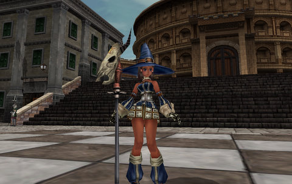

Back to: [West Karana](/posts/westkarana.md) > [2010](/posts/2010/westkarana.md) > [July](./westkarana.md)
# Fantasy Earth Zero Blogfail: Under the Radar

*Posted by Tipa on 2010-07-06 06:34:48*

After writing [my own review](../../../index.php/2010/07/04/fantasy-earth-zero-mmorts-goes-mainstream/) of Fantasy Earth Zero a couple days back, I went looking for other reviews to find out why the heck I'd never heard about this game. Or if I had heard about it, dismissed it as just another Asian F2P MMO.

By the looks of it -- graphics incredibly dated (it is, after all, a four year old game) -- huge anime influence -- it looks entirely humdrum. None of the reviews I could find hinted at the all levels invited, grind-free RTS gameplay hidden inside.

I hit 20 last night, and after searching around, found a place where I could buy higher level sorcerer armor for gold alone. Gold is plentiful. The outfit is SLIGHTLY less revealing. I also found out how to hide the UI so I could take screen shots. (You hold down the PAGE UP key. Not very intuitive. I'd just been trying all the keys on the keyboard to see what they did). The lack of information on how to do certain things is, I concede, rather frustrating. I still haven't figured out how to use a Dragon Soul to become a dragon on the battlefield. I know you have to die first, in a special way.

You get resurrected as a dragon, you see.

[MMOHut](http://mmohut.com/review/fantasy-earth-zero) devoted a paragraph to their review of the game; looks like it was excerpted from [the Wikipedia article about it](http://en.wikipedia.org/wiki/Fantasy_earth_zero). 

The [Gamers Daily News reviewer](http://www.gamersdailynews.com/article-2382-Fantasy-Earth-Zero-Handon-Preview.html) had played an early build of the game, but the state of the game at that time seems much different from that of the live game. Most of his objections don't seem to be problems now. They may want to take a look at it.

IGN has [a couple paragraphs](http://pc.ign.com/objects/703/703632.html) about it, clearly not based on actual play.

Massively has been good about keeping the [Fantasy Earth Zero news](http://www.massively.com/tag/fantasy-earth-zero/) updated on the site, but I read every article on Massively and nothing Eliot Lefebvre wrote made the game stand out. (Please send note with pronunciation of your last name. Yahoo! Answers suggests luh-FEVR or luh-FEVRA. How cool is it to have the pronunciation of your surname be a topic of discussion on the internet?)

No, I don't blame the game sites. There are hundreds of game sites out there that actively rewrite press releases and get the word out. I blame the bloggers.

It is the sacred duty of the blogger to actually play these games and write about it from the player perspective, the perspective of someone who has played enough MMOs to get past the issues of familiarity and 'polish' and discover if the game is 'fun'.

But to blog usefully about a game, you have to be a player of that game. Most of these F2P games have fairly respectable user bases; FEZ can support a half dozen 50v50 battles at a time. Plenty of players clog Dragonica Online, Fists of Fu (well, while the closed beta test was running), and on and on. Why aren't these players becoming bloggers? It's the best way to get the REAL world out for a game. Without blogs, all you have are recycled press releases ad infinitum.

I guess what I'm really asking for players to step up and start blogs about the games they play. We absolutely need more bloggers to explain WHY games are worth the time to download. I've downloaded a few real dogs that sounded exciting in their press releases, and a few words from a player would have saved me some time.

[Wordpress](http://wordpress.com/) and [Blogger](http://www.blogger.com/) will get you started on your own blog for the cost of FREE and the time expenditure of ZERO. If you are an expert or even a fan of your game, and you want to get the word out -- BLOG!

*Note: In all fairness, after some digging, I did find some bloggers who at least played the game: [Metro City Gamer](http://metrocitygamer.com/?p=1138) played what appears to be the first leg of the tutorial, and the reviewer for [MMO Online Beta Information](http://mmos-beta-information.blogspot.com/) looks like he or she played long enough to get out of the tutorial and into the battlefields. These were the only blog posts I found written by people who had actually played the game. We need more!*
## Comments!

**[Scopique](http://levelcapped.com)** writes: You know, I've often wondered/considered why I don't blog about "a game" aside from an initial post in which I try REALLY HARD to not get into impressions, especially if I haven't played it long enough to consider myself worthy of giving an opinion that matters to people. 

I'm actually rather jealous of people who DO write about specific games, mainly because they stick with it and get their hands dirty at a level that I don't. In the end, I guess that is the point: since I rarely stick with a single game for long, I'm not qualified to dish out info on whether or not people should play it. Even when I DO play a game, I'm not a stats-monger, loot whore or achievement collector. I play to experience what's fun for ME, which is strictly the immersion, the sights, the experience of the game. While those might sound like the kind of things that people SHOULD be writing about, it seems like a lot of people would rather discuss the nuances of system X or the benefit-to-cost ratio of Y. I don't get down to that level, personally. I just play the game. 

(Xpost from Buzz :D)

---

**[Tipa](https://chasingdings.com)** writes: Well, my only point is, if you're having fun in a game, you have at least a little obligation to help spread the word. A blog is better for that purpose, I feel, than a forum post, Twitter or Facebook-- though the two latter have important roles. 

Gaming sites that only rehash press releases cannot tell someone if a game is fun. Nor should they. That's OUR job. 

---

**Longasc** writes: See, this is why blogs are great.

I no longer read game review sites, stopped so years ago. Such a report is infinitely much better.

---

**Fuzzy** writes: And this is why I love Beau's new "Rise and Shiny" section on Massively. Covers all those other games you hear about but never bothered to try.

http://www.massively.com/category/rise-and-shiny/

---

