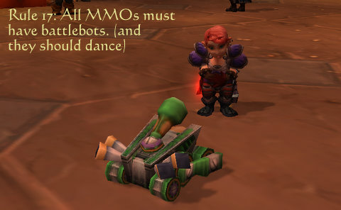

Back to: [West Karana](/posts/westkarana.md) > [2010](/posts/2010/westkarana.md) > [July](./westkarana.md)
# Does WoW set impossibly high standards?

*Posted by Tipa on 2010-07-06 22:37:51*

It wasn't the "[Warhammer 40K MMO needs just one million of WoW's players](http://www.massively.com/2010/07/01/war40k-courts-1-million-users-wow-players/)" line from Danny Bilson's [ebulliently gleeful speech](http://www.computerandvideogames.com/article.php?id=254087) about the game THQ plans to publish that caught my eye. Every game that comes out admits they'd be happy to get just ten or twenty percent of World of Warcraft's player base. 

And if a million people each send me a dollar, I'll send you all a little booklet explaining how to become a millionaire. (Please enclose a self-addressed stamped envelope).

Here's the line that got me:

> "I'm a diehard MMO player myself - going back to EverQuest. I've spent lots of time in WoW. As a WoW fanatic, I'm going to go right to 40K as soon as it comes out. It's very friendly to the WoW player."

Seems to me that WoW fanatics aren't looking for a new game. Two things about competing with WoW. The first is, nobody makes a better WoW than Blizzard. You can't out-WoW WoW. Second is, the only WoW players you have a HOPE of keeping are the ones that are sick of WoW in particular and all WoW-like MMOs in general.

By making a game (or rather by publishing it in THQ's case) you hope appeals to WoW fanatics, you've already lost twice over before you ship your first box.

He does go on to explain how Warhammer 40K will differ from WoW. 

> "The brand is fantastic - it's so deep and so wonderful," he said. "There's just so much for us to play with. There's more vehicles in our thing [than WoW], the combat's completely different; you can get four guys in a tank and go. 

WoW is not exactly known for its vehicular combat, though Lake Wintergrasp has some. I'm not sure how much "In Warhammer 40K, Battlefield 1942 meets Lake Wintergrasp!" will grab the WoW folks, but at least it's different. I'm sure THQ will at the very least grab 10% of Warhammer: Age of Reckoning's player base.

Doesn't matter. People play WoW because they want to play WoW. They don't build checklists of dream features that include "multi-person vehicular combat" and "war everywhere, all the time", tote up the checks and having compared all the offerings, choose WoW. They play because it's WoW.

It's just like that legendary [iPhone vs EVO spoof](http://www.youtube.com/watch?v=FL7yD-0pqZg) that got that Best Buy guy fired. (An annotation on the video says he got offered his job back, so yay)

Anyway. The reality is that a successful subscription MMO these days gets about 150-300K subscribers. I don't see any reason why the Warhammer 40K MMO [won't do at least that well](http://www.gamasutra.com/view/news/28417/THQ_Warhammer_40K_MMO_Doesnt_Need_A_Million_Subscribers.php) once it settles down. 

150,000 subscribers is a success. 300K is a WILD success.

Enough about that.

The other reason new MMOs have such a hard time making the splash they feel they are owed is because WoW has done a really good job at setting the bounds of the discussion. There's now a mental list of "must have" features without which no MMO can possibly succeed. Get ready to nod your head as you agree with every one.

Modern-era MMOs are required to:

 * Have luscious, colorful epic vistas

 * Be able to run on nearly any computer or operating system ('runs on a toaster!')

 * Always have a clear progression path to max level

 * Offer clearly marked quest hubs that lead the player through the content in the local area

 * Allow solo gameplay

 * Make most content easily consumable in half hour chunks

 * And above all, polish, polish, polish.

Well, hard to argue with that list, ain't it. Those would be the MINIMUM for any MMO that would hope to compete with WoW, and you could probably double the size of that list without thinking too hard about it. This is the world as WoW would have you see it.

Problem is, good games can take that list, achieve every bullet point and add some neat bits nobody else thought of, and they still don't get their measly million subscribers. If that list were any indicator of the required minimums for an MMO, they'd be doing better.

The problem is, that list is a recipe for enjoying the World of Warcraft, no more, no less. It doesn't say a thing about any other game.

I like World of Warcraft, but I like other games, too, and a lot of those games don't stack up very well on that list. Take my new obsession, Fantasy Earth Zero.

 * Dated, half decade old polygonal graphics
* Runs only on Windows (as far as I know)

 * Has a clear progression to max level: keep playing battlefields

 * Few quests outside of the tutorial.

 * Can't solo battlefields. You can solo some PvE maps until the progress of battle turns them into PvP maps, but the best xp is in the tactical PvP.

 * Battles are usually about half an hour, so it gets this one.

 * The game is about as far from polish as you can get. And yet, it works, and it's fun.

If a game is fun, everything else is negotiable. 

Blizzard would have you believe the mythical bar that is set at such a high level that only WoW can cross it is stored in a vault in Irvine, but that's just them trying to define the MMO genre in ways only WoW can match. 

Everyone has their OWN bar. It's totally absolutely positively fantastically RIGHT to enjoy WoW. It's a fun game and there's lots to do. But claiming to have made a logical decision to play WoW based on its feature set is like writing a classified job ad that only matches one person -- you're just shutting out applicants and games you might enjoy just as much, merely because they can never exactly meet some list of arbitrary specs.

## Comments!

**[Matt Warren](http://longgame.org)** writes: Very good post. You got your hands on some feelings that I've had regarding WoW. I'm not a WoW fanatic. I did my three months and was done, but that's because I want a different game than WoW *is*.

What WoW does, it does super well, but as you note: a "me too" attitude isn't going to create a post-WoW success.

Now, to see if I can put "WoW" into more sentences. :)

---

**[Tipa](https://chasingdings.com)** writes: You'll have to put WoW into LOTS more if you hope to come close to the truckload of mentions I dumped into that post :)

---

**[Stabs](http://stabbedup.blogspot.com/)** writes: One of the more interesting aspects of game design is that a great many things are zero sum. For instance if you have hardcore raids that only a small elite can run you achieve very desireable design goals of keeping the players wanting more, allowing people to truly shine etc etc. The democratisation of raiding in WoW had more things for it than against it for most people but still there was an element of throwing the baby out with the bathwater.

Similarly with the economy. In a hardcore economy you can be a Master Crafter and have it really mean something. It's nice for an armorsmith to log on and immediately get 5 tells from customers who want you and no one else.

I think to successfully compete with WoW designers should look at these zero sum elements and review whether they can go the opposite route to WoW. For instance WoW generally has fast travel times. With the exception of the new Night Elf running from Darnassus to Westfall all WoW players travel very quickly to anywhere. Eve relishes in its slow travel with the emergence of a whole range of player behaviours that depend upon slow travel. Trading, suicide ganking afk autopilots, scouting, contracting freight - all depend on travel being slow.

One of the interesting things is that WoW itself has taken the opposite stance on many of these elements. At one time all pvp was world pvp. That might be a good line for WH40K - look into doing away completely with instanced pvp.

AoC instances work like WoW's did in 2005. You form a group from global chat, all have to run to the instance. Because it's a big effort to get a group going the groups are determined and competent. People don't bail after a wipe.

It's those sorts of Yin Yang design elements that MMO developers should be (but generally aren't) looking into.

---

**Longasc** writes: Very interesting thoughts by Stabs, these Yin/Yang design elements idea.

(This is a bit off-topic, but I fear instance teleports in LOTRO are more a bandaid to fix the still rather clumsy travel system and WoW copy than a good idea. I am quite concerned about the canned content idea for LOTRO, instances and skirmishes sold for coin... as what appealed to me in LOTRO the most was the HUGE connected world full of quests, mobs and places to explore. Be it the Mines of Moria or various elegantly connected zones in Eriador, they do not jump from desert to snow within 10 pixels radius for instance.)

I think Guild Wars already has all the positive qualities mentioned. I am not kidding, it even offers more. What I just do not get is that there are still millions who fail to see the beauty of Guild Wars 1. But thankfully millions see it.
But while you can play GW alone, it is a group/team game - you take henchmen or heroes to fill up, true "soloing" is only done for farming and very few quests/missions. Guild Wars 2 will be very different in this regard.

Maybe it is also the total lack of brains needed to play WoW by now. I do not get it why it was that necessary to dumb down mobs in early areas just because people are endgame obsessed nowadays.

"Offer clearly marked quest hubs that lead the player through the content in the local area" -> not really necessary! I am all for dynamic events and players finding quests. The !!!! christmas trees aka quest hubs in WoW and quest quality have too often become menial tasks anyway. I think we can do without them and make Quests again a major undertakings. The super simple quests should be renamed to tasks, because this is what they are. Maybe make them repeatable and do away with badge accumulation through daily quests.

---

**Rokuzachi** writes: WoW has had so much work done on it and it's almost six years old as a released product - so players of it are used to this level of polish and smooth product. I think it's hard for new games of this type to be both developed and polished to a relative (to WoW) attractive level.

What I think average joe doesn't understand and/or remember is that WoW was a mess at release just like most MMOGs. But now it's been so refined that you've got lots of people expecting that to be the standard for a new experience, which usually isn't the case.

In a way I think that's the genres own self-damning legacy - the further along we get, the more we expect of a release.

I think that's right... sometimes I can't quite write down what I'm thinking on the first try.

---

**[Pai](http://pensiveharpy.blogspot.com/)** writes: What most people forget that it wasn't the GAME that was a mess, it was the servers melting down every 5 minutes because of so many people trying to log in and play at once.

I remember, because I was there. I think some folks' memories are flawed, because you can't compare 'unstable servers' at launch to a 'buggy unfinished product' at launch.

---

**Rokuzachi** writes: There weren't a ton of bugs Pai (I remember plenty of annoying, but not game-breaking ones), but you can remove "buggy unfinished product" from that line and be pretty accurate. Many talent trees were considered worthless and horribly underperformed, were boring/bland, et cetera. Gear as a whole and its stats were woeful. Quest rewards were often just as bad. Balance was so far off kilter that recent issues with it seem damn near acceptable. All through vanilla the game was in pretty weak shape in those respects.

That's my point, though. People expect newer MMOGs to be at release where WoW is now in regards to those things. After years of playing that, something that certainly feels like a finished product compared to a lot of things, people simply don't want to tolerate waiting for a game to mature after its release. Let's see... enjoy a run through an optimized questing zone with actual good rewards, or go play some new game where one of the quests might not be doable at the time because of a bug, or the rewards serve no purpose for you?

---

**Bhagpuss** writes: I'm not completely convinced that you couldn't sell a "new WoW" to committed WoW players, but it probably would actually have to use the I.P. 

I'm an Everquest player. My all-time favorite MMO is EQ and my third is EQ2. Second comes Vanguard, which is basically EQ2-and-a-half. I'll play most any MMO (I have 19 on my desktop right now) but the one I am really waiting for is EQ3. Until that happy day, though, any company that manages to make an MMO that is really very much like EQ has a very good chance of taking my money.

When it comes right down to it, while I'm happy to try out new, innovative gameplay, I already know what I really like and that's kiting Ulthorks across Eastern Wastes. Make an EQ-clone that is there or thereabouts as good as the original but with 2010 graphics and I'll be happy. I wonder if WoW fans don't feel the same, only the problem with WoW wannabe MMOs from their point of view is that there hasn't yet been a really good one. 

Maybe W40K can be the first, but from the little I've seen so far I really doubt it.

---

**[Tesh](http://tishtoshtesh.wordpress.com)** writes: There's a simple marketing principle at play here. You don't find consistent, significant success *chasing* trends. You have to *create* trends. Everyone chasing WoW's playerbase, as you rightly note, Tipa, has *already lost*.

I learned this explicitly in a marketing class in college; the entry level "marketing for Dummies" sort of class (OK, OK, I was one of the top three in the class of 200+, but it wasn't brain surgery). I've seen it validated since by watching various markets. "Me too" game design and marketing just doesn't work well. It can work to get some outliers and make a meager living, but it's not enough for venture capitalists and big publishing houses to bank on.

---

