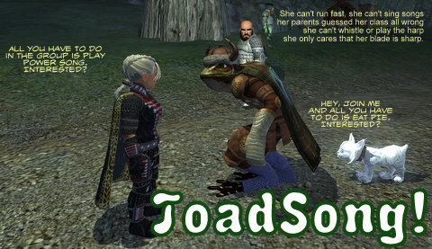

Back to: [West Karana](/posts/westkarana.md) > [2010](/posts/2010/westkarana.md) > [July](./westkarana.md)
# EQ2: Toadsong, the Not-a-Bard

*Posted by Tipa on 2010-07-17 14:58:51*

When I start a new MMO, I want to be dazzled -- right up front. I know that MMOs want you to start out weak, with few abilities and few decisions to make, and introduce new abilities to you as you progress through the levels....

But I don't care about all that. Drop me in the middle of the action, put me in an epic storyline, show me where I fit into the world, and you've got my attention. Lord of the Rings Online does that. I may not be LotRO's biggest fan, but they know how to start a MMO. EverQuest USED to have custom starting areas for every single race, and by the time you ventured into the wider world, you knew your race -- and class' -- place in the world. EQ2 USED to have race-specific villages around their capitals that did the same thing, after a common tutorial zone.

This being washed up on a beach without a past.... Thanks, DDO, EQ2, AoC and the rest of you. Been there, done that.

EQ2 recently opened up a new starting zone, the re-built city of New Halas. SOE has a history of trumping old starting zones with new brilliance, more or less making the old ones obsolete. Greater Faydark was supplanted by Neriak, which bowed to Gorowyn, and now, it's barbarian time.

I started Toadsong, a froglok paladin, to see if EQ2's latest starting zone could match the strong storyline that, if you were a Sarnak, anyway, admirably did the job of explaining your origins and how you fit into the world. The quests sometimes didn't make a lot of sense if you were some other race, but hey. Sometimes all of us look a little lizard-like in the evening.

New Halas is a lost colony of dwarfs, Faydwer dwarfs building upon the ruined battlefield of Coldain dwarfs from the not-yet-rediscovered continent of Velious. With Mithaniel Marr's blessing, New Halas has been rejoined to contemporary Norrath, and the follows of Mithaniel and his dead sister, Erollisi, have flocked to the new land in order to live simple lives of bravery and valor, and to form a front-line defense against the harsh snow orcs of the north -- and the ancient, mysterious evil that slumbers beneath.

You, the player, awake with no memory of the past after your boat is attacked by snow orcs. Too weak to fight, you must first acquaint yourself with the basics of movement, combat, crafting and harvesting.

With those new skills at your command, you come upon a group of pilgrims trying to make their way to New Halas to worship the Marr twins. Beset on all sides by nature gone cruel, you earn your first complete set of armor, and make your way to an ancient battlefield, where the spirits of dead orcs and dead dwarfs continue their eternal battle for a small stretch of ice.

Not far past that, a small camp of barbarians send you to investigate the various orc-filled islands in the area, which lead eventually to an investigation of strange creatures from tunnels beneath New Halas itself -- creatures from lost Velious.

Having finished all the tasks set her by the people of New Halas, I ended up level 26, in a decent suit of armor, with my crafting at level 9, and a mission to head to Butcherblock to pick up the Golden Path storyline which starts above the docks.

New Halas does its job; introduces the basic mechanics, tells a story and predicts Velious' rediscovery, isn't so difficult that anyone would ever feel challenged or in danger or with any need to group (unlike, famously, the old newbie islands, with at least one and usually more like three encounters for which you would really need to group).

I got a little tired of swimming back and forth between the surface and the subterranean tunnels after awhile. But it wasn't all that far.

Once to Butcherblock, though, things took a turn for the dull. Milling groups of mobs, just waiting for an adventurer to kill them for quests. Gad, that's SO BORING. I get bored just writing about it. The "Golden Path" story just has you doing quests until you hit 32, after which you may proceed to Steamfont.

The quests in Butcherblock always were in hubs, but some hubs have been combined. The docks now are combined with the old Gorowyn outpost quests. The above the docks quest hub has been vastly expanded; I haven't spent much time there, but I suspect some Kaladim-area quests have been moved. After the occasionally interesting New Halas quests, Butcherblock comes as a real dunk in cold water.

So, New Halas thoughts:

Good: Decent introduction to the game, tells a story through its quests and leaves the player equipped as well as via the evil-leaning Gorowyn starting zone.

Bad: Tired "shipwrecked and powerless" storyline. I personally don't like all-white landscapes, I think they look boring. My opinion. Fails to give people any idea of their role in a group, or why they would even want to group.

[gallery]

## Comments!

**Egat** writes: OMG Polar Bear Hat!!!!!!!

---

**[Ysharros](http://stylishcorpse.wordpress.com)** writes: Pretty much agree on all fronts. It didn't wow me. Then again, I last played it when it was on Test so that's not a fair assessment.

The houses though... zomgdowantbbq!

---

**OrderedChaos** writes: I keep going back to EQ2 to check out the new areas, but after I hit the mid 20's, I sort of lose interest. The New Halas are is great, and I do really like the Housing they give you character. A real Window that you can look out of! Of course, all you see is a floating chunk of ice on the water, but it is better than mothing. It has a loft also. Plus, I like all the quests that give you items to decorate your new digs with. One needs lots of rugs, when you live in an area with cold weather all the time.

---

