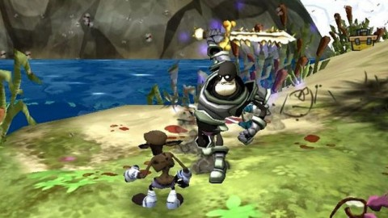

Back to: [West Karana](/posts/westkarana.md) > [2010](/posts/2010/westkarana.md) > [July](./westkarana.md)
# Kingdoms of Amalur: Reckoning = God of War?

*Posted by Tipa on 2010-07-23 06:15:07*

38 Studios and Big Huge Games released the first cinematic trailer for their Kingdoms of Amalur: Reckoning at the San Diego ComicCon yesterday.

It's hard to get a sense for the game based solely upon its cinematic trailer. Videos like this aren't supposed to be acquainting you with the UI and the gameplay, but for its milieu. What can be told from this?

The opening shot shows a standard musclebound [Kratos](http://en.wikipedia.org/wiki/Kratos_(God_of_War))/[Den](http://en.wikipedia.org/wiki/Den_(comics)) type, beaten, chained, being infused with some sort of mystical force that turns him into a killing machine.

We see him next defeating a mob of skeletons with a variety of physical and mystical powers. A huge monster sneaks up behind him; he pulls a giant meat tenderizer out of nowhere and jumps into battle.

I dunno, but at this point it's seeming like a better-rendered version of Deathspank....

... which isn't a bad thing. All games of this genre deal with a hero-type single-handedly defeating armies and legions of enemies while earning levels, new gear and awesome powers that will allow them to survive one more day.

You can't fault a fantasy RPG company for coming out with another entry in the genre, but... for all the immensely talented people working on the project, I was hoping for something a little more memorable. God of War can absolutely match and beat these same visuals, features huge battles against huge villains and has cinematic trailers cut from GAME FOOTAGE -- and two sequels. So a year before Amalur comes out, I want to know why I can't just play through God of War again right now.

(The trailer also reminded a lot of people of the PS3 single player RPG "Demon Souls" -- I was trying to remember the name of that game! But yeah. My only problem with the trailer, really, is just how generic it all seemed. The heroic adventurer single-handedly fighting against impossible odds is DONE, and done WELL. Show me what makes KoA:R DIFFERENT.)
## Comments!

**[cyanbane](http://www.cyanbane.com)** writes: "Good Afternoon, Oppressed Fisherman!"

As for the trailer, it looked neat. I totally agree though, in the post WAR MMO world I am now clearly able to separate cool trailers from actual gameplay. Show me the gameplay.

---

**[cyanbane](http://www.cyanbane.com)** writes: I meant to say "post WAR *release* MMO world".

---

**Drakul** writes: Frankly, I'm not impressed. Bioware's latest rendered movie blows this amateur crap out of the water. I have an awful bad Vanguard feeling about all of this....

---

**Wonderwyrm** writes: I smell "Epic Fail" all over this.

Bioware has set the standard for fantasy RPGs, or any RPGs in general. If you cant trump them, or bring it up to there quality level, dont even bother. Even there trailers are getting up to Blizzard quality.

I watched this trailer and said meh after it was over!

---

**[Tipa](https://chasingdings.com)** writes: Even though EA is publishing both Kingdoms of Amular: Reckoning and Star Wars: The Old Republic, 38 Studios hasn't had the benefit of the endless money rivers given to SWTOR.

But, even so....

Their game has a generic name and a generic trailer which compares unfavorably to console Action RPGs like Demon's Souls, Devil May Cry and God of War. Most of the press for the game emphasizes the names of the creative talent while being unforgivably vague about the setting and gameplay. I want to be excited about this, but they are giving me little to hold on to. It's past time for them to be telling us about the celebrities involved, and time to start telling gamers about the GAME. Look at how much we already know about SWTOR; we should know that much about KoA:R AND about Project Copernicus.

---

**[Tipa](https://chasingdings.com)** writes: @Wonderwyrm -- I want to see the Star Wars movie the trailers are cut from :)

---

**Drakul** writes: I think it has less to do with the amounts of money and more to do with talented artists. There is a finite amount of talented people in the world and I suspect the "best" don't work at 38 studios.

---

**[Tipa](https://chasingdings.com)** writes: I'm certain 38 Studios hired an outside company to produce the trailer.

---

**Drakul** writes: That's a good point.

---

**Drakul** writes: As a side note, a game that keeps looking and sounding better and better is Guild Wars 2. I was thinking SWTOR was my next game but GW2 has me leaning their way.

---

