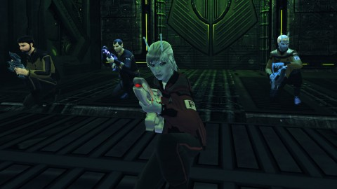
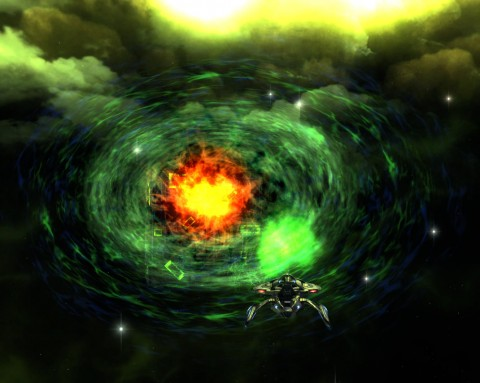

Back to: [West Karana](/posts/westkarana.md) > [2010](/posts/2010/westkarana.md) > [July](./westkarana.md)
# Star Trek Online: Assimilation

*Posted by Tipa on 2010-07-29 05:55:12*

I started last night on the main plot missions for Star Trek Online's Season Two. Season Two is all about trying to find a way to form an alliance with the Undine. The Undine don't have much respect for the beings of normal space, but the Federation hopes we can find common cause with them against the Borg.

Alarmed by the Borg's sudden interest in an obscure section of space, Starfleet sent the reconnaissance science vessel USS Monterey to investigate. After some small tussles with some outlying Borg spheres, the Borg broke off and joined a larger fleet heading toward a field of glowing anomalies.

Since we were clearly the lesser threat, we were ignored by the Borg as we tagged along.

We found the Undine and the Borg engaged in fierce combat outside portals into fluidic space. Starfleet ordered us into the fray; if possible, we were to see that no ships of either side survived. Though the Monterey is not a warship, we do have some tricks of our own. By making the Undine and Borg fights more even, we managed to get them to kill each other while taking almost no damage ourselves.

The fight was easier than it could have been because part of the Borg fleet was in fluidic space. This presented a problem, solved with an immense Borg cube, larger than we had ever before seen, emerged from fluidic space with an Undine mother ship in tow. Starfleet ordered us to attack the cube and its guards. With the cube's resources devoted to keeping the Undine ship tethered, we might have a shot.

We killed the cube's guards and disabled its shields and propulsion. The Undine ship managed to return to fluidic space. We were ordered to board the Borg cube and ensure that the Borg had not figured out how to assimilate the Undine.

We were ignored by the Borg on the cube itself, for awhile, anyway. Eventually our efforts to find a way deeper into the cube were noticed and we were forced to fight our way through an army of drones.

We all wondered how it came to be that the Borg no longer could adapt to our weapons after a couple of shots. Weren't they able to assimilate the crew at some point? Anyway.

Starfleet's worst fears were realized; the Borg had indeed learned how to assimilate the Undine. The cube and everything on it had to die before this knowledge reached the collective. Our only chance was to lower the cube's internal shields and overload the viridiculum -- the heart of the ship.

But first, we'd have to fight an assimilated Undine, a creature that combined the best, or worst, features of both the Borg and the creatures from fluidic space. An attack that seems to come from all sides still gives me nightmares. We were able to use the technology of the Borg ship itself -- specifically, the point-to-point transporters -- to separate drone guards from the Undine and eventually take them all down.

We had the viridiculum set to overload before the Borg could recover, and we were out of the system with the Borg cube exploding behind us in a Michael Bay moment to remember.

Starfleet now wants us to enter fluidic space itself, and see if we can make common cause with the Undine, using this Borg incursion to put the fear of assimilation into them. But can we really ever trust such unusual creatures?

---

This mission, my B'Tran dailies and a diplomatic mission I stumbled across at the Sierra outpost brought me to Rear Admiral, Upper Half, 2. It was another busy night in the Federation News Service; we had reporters in place all over the alpha quadrant sending back dispatches. I believe I heard FNS operative Xerxes had made Attache in the Federation Diplomatic Corps!

## Comments!

**[Thac0](http://phentaripress.wordpress.com/)** writes: OMG Spoilers! LOL

---

**PeterD** writes: Ok, that sounds like a really cool mission. If I wasn't so busy playing Starcraft 2 you'd have just convinced me to re-sub . . .

---

**[Tipa](https://chasingdings.com)** writes: Yes, alas, this is a spoiler. So will be the other Season 2 story missions. I've decided, though, not to spoil the diplo missions at all. 

The story missions are cool, challenging and fun! I just gotta write about them!

---

**[Adventurer Historian](http://combat-archaeology.net/)** writes: Indeed I did! I was very happy, especially because I got it with using only three of the preset diplomacy missions (the ones on Memory Alpha). Good times!

Who knew that I'd actually come to look forward to the relief/aid missions? CRAZY TIMES

---

**[Star Trek Online, Undine Front: The Return (spoilers) - West Karana](https://chasingdings.com/index.php/2010/08/07/star-trek-online-undine-front-the-return-spoilers/)** writes: [...] given you by Starfleet as you embark upon Season Two. It opens similarly to the other mission, Undine Front: Assimilation, with a sudden congregation of Borg ships causing some concern in the quadrant. Not only that, but [...]

---

**[Star Trek Online: Fluid Dynamics (spoilers!) - West Karana](https://chasingdings.com/index.php/2010/08/09/star-trek-online-fluid-dynamics-spoilers/)** writes: [...] saved the Undine from forced assimilation at the hands of the Borg in the previous episode, Assimilation, Starfleet believes the Undine might be convinced to form an alliance with the Federation to remove [...]

---

**[West Karana » Star Trek Online: Ambassadors](https://chasingdings.com/index.php/2011/02/20/star-trek-online-ambassadors/)** writes: [...] arc for an excursion into fluidic space, starting with the mission “Assimilation” (which I wrote about last July). You fight a little skirmish with the Borg, who then suddenly break off to address an incursion [...]

---

