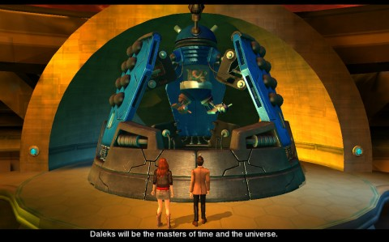

Back to: [West Karana](/posts/westkarana.md) > [2010](/posts/2010/westkarana.md) > [July](./westkarana.md)
# Doctor Who Adventures: Metal Gear Dalek

*Posted by Tipa on 2010-07-31 00:28:30*

Coolest place in the galaxy? Well, if you're in 1963, the coolest place in the galaxy is ~~Cardiff, Wales~~ London, England. And if you're NOT in 1963, you'll probably need a time machine of some sort if you ever want to meet ~~John Lennon~~ Ringo Starr just when he was getting started. If you're Amy Pond, you've managed to ditch your hand-gun hubby and go off on an exciting trip through time and space to soak in all the fun and excitement Trafalgar Square has to offer.

Did you know that the statue of Lord Nelson was forged from the melted guns of defeated French ships? That there are 8000 double decker buses rolling the streets of London? That the Chinese invented paper? That hackneys have been a London fixture for decades? No? As you dodge Daleks at the end of time, you'll find out many fascinating things you slept through in grammar school.

Oh, the Daleks? Yes, well... there's been an incident, and the Daleks -- mutant cyborg creatures in salt-shaker shells -- have killed all humans (except for one) (well, two if you count Amy) (well, one and a half, if you count Amy) (well, now we're down to one half).

This is not history as it ought to have been. Daleks aren't supposed to destroy Earth until 2008. You will take the Eleventh Doctor and his companion, Amy Pond, beneath the streets of London, across the galaxy, and to the end of time itself, to bring events back to their proper course. With only his sonic screwdriver, his wits, and whatever spare parts he finds along the way, the Doctor will save the day. If he doesn't get exterminated first.

Doctor Who Adventures: City of the Daleks is a throwback to those classic point and click adventures of yore, except that this one is 3D, you can move with your standard movement keys, and you don't have to carry around twenty five mystery items, wondering how they'll all go together.

Most of your time will be spent dodging Daleks. These Daleks are very deadly, but have a severe weakness; they can only see where they are pointed. If you can just stay out of their visual range and be somewhat quiet, you can often sneak past them. A glowing green arc shows their visual range; if they hear you or catch a glimpse, it turns yellow; red means they have you in their sights and you restart at the last autosave point.

The rest of the time, between trading quips with Amy, the Doctor will be playing minigames -- a rewiring game to unpower the rails in the Underground; various electrified mazes through which you thread delicate components; and a cute hacking game where you have to match and rotate symbols to match the ones tossed at you at an increasing pace.

If you get stuck, you can ask Amy for help. She's pretty quick; she'll start out with vague suggestions, and work up to tell you the exact solution to the present puzzle if you give her enough time. 

As far as adventure games go, it's not all that hard. You have Amy the Walking Hint Machine, infinite retries if things go wrong, and only one time-sensitive puzzle at the climax. As a new story involving the Doctor and his ancient enemies, the Daleks, it's priceless. There's the cold open where Amy and the Doctor discuss their excitement at exploring 1963's London, to when they open the TARDIS door to see only devastation -- and Daleks -- and THEN the opening theme comes and you're off.

Doctor Who Adventures: City of the Daleks and the second adventure, Blood of the Cybermen, are free (from what I understand) if you're served by the BBC. The rest of us can get it for $5 [from Direct2Drive](http://www.direct2drive.com/3/9642/product/Buy-Doctor-Who:-The-Adventure-Games---Episode-1-and-2-Download). Two Doctor Who adventures for $5? Yeah. It's worth it.

[gallery]
## Comments!

**Egat** writes: Possibly the coolestest blog post ever made! I want mine!

---

**[Oakstout](http://oakstout.blogspot.com)** writes: I just started getting into Doctor Who the series and for 5bucks this looks like it could be a nice nerd fix for me. lol

---

