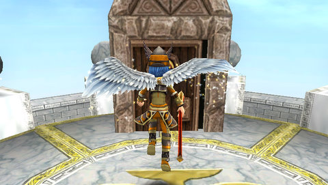
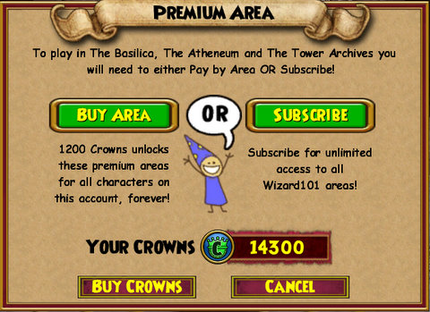
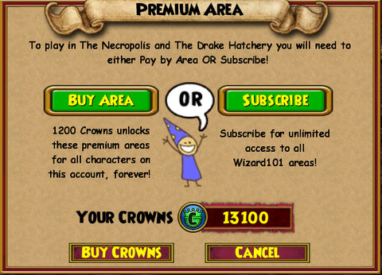
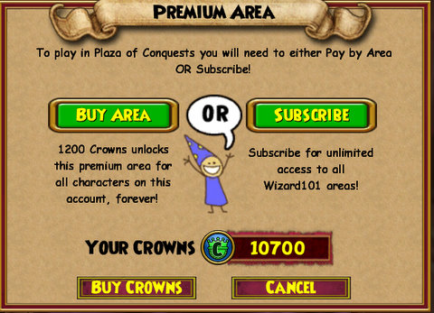

Back to: [West Karana](/posts/westkarana.md) > [2010](/posts/2010/westkarana.md) > [June](./westkarana.md)
# W101: Wizard City on 1200 Crowns a Day

*Posted by Tipa on 2010-06-16 23:39:12*

Amazon.com panicked; they'd let me download the "Symphonic" Les Mis soundtrack before they tried to charge my debit card. The debit card, it was dead. Bank of America, fearing a leak of card information, had revoked their debit cards and sent new ones out; mine was in an envelope on my desk. But unless I informed Amazon and every other outfit which had my debit card information about the new number, all my recurring subscriptions and everything else would, as they tried and, like Amazon, failed to remove money from my account, remove me from their rolls.

I watched all my MMO subscriptions come to an end in their times. EVE Online. EverQuest and EverQuest 2. Wizard101. World of Warcraft should be up soon. Star Trek Online, I have for a year, so that's in no danger.

Friends wanted to play Wizard101, though, and I'll play anything if I can play with friends. I decided to keep the subscription for my main character. Since KingsIsle had downgraded my second account to "Trial" when their charge was denied, I thought I might see how Wizard101 was when you had to pay for each new zone.

It's a pretty sweet deal when you think about it. Once you buy a zone, it's yours. No subscription fees, any other character on that account can use it without further charge. I bought $25 worth of Crowns from the online shop; that's about $2.18 per zone. My friend Mike and I did some Marleybone quests; $2.18 every time I ported to him. He moved on to Mooshu, and it was $2.18 for every new instance or adventure zone. Amber Stargem asked if I'd be interested in a Kensington run; I love Kensington! It cost me $2.18.

Unfortunately, Amber got accidentally locked out, and a fire wizard, Kyle FireSword, and I had to finish it ourselves, without any ports to each other lest we get locked out as well. Didn't even get any pets from it.

The problem with buying zones *à la carte* is that after, you're locked in. If you change your mind and decide to subscribe once again, you've wasted all that money spent unlocking zones one at a time. The only possible way to protect your investment is to keep buying zones at $2.18 each.

How do these economics work out?

I blazed through my initial $25 investment in one night of grouping. That would pay for almost three months of subscription time. When I returned to Dragonspyre to finish up some quests there, I had to spend another $25 for crowns to unlock that world. Two days of play cost me $50 -- five months of subscription time, which would certainly have taken me through this summer's new world of Celestia. As it stands now, I will have to pay, I imagine, another $25 as I travel through the new world. Sure, I won't have to pay to unlock them *again*. I'll have spent enough for a discounted year's subscription at that point, though.

That's assuming nobody invites me to group in Grizzleheim, Krokotopia or the non-free portions of Wizard City (I can guess Briskbreeze Tower will cost me another $2.18).

I've been recommending potential Wizard101 players try out the "pay as you go" plan if the thought of another game subscription is what's keeping them away. After taking my own advice, I'm going to have to back away from that recommendation. The numbers don't add up -- the "pay as you go" plan will end up costing you far, far more in the end than a subscription. The linear nature of the game will give you little reason to return to those unlocked zones, unless you have friends asking you back, or level more than one character through the game.

Even so, you're better off subscribing. You'll find plenty of other ways to spend those Crowns.

## Comments!

**[Rohan](http://blessingofkings.blogspot.com)** writes: I think you're just the wrong audience for the purchase zones plan. Someone who played for much less time, say once a week or so, and mostly solo'd, would be much better off with the purchase zones plan, as far as I can see.

---

**[Matteo Anelli](http://rockstargamer.wordpress.com)** writes: Well, Tipa, I think you are correct in your analysis, it's the scenario that's wrong.

You're spending so much in so little time because you're almost at endgame and you have friends scattered on various tiers and zones you hadn't already bought during progression.

I played W101 from the start on a new account without a sub and I must admit the model works a lot better if you start with it: in fact my average monthly fee was about 4$ in a six month period. In this way, if I need to catch a friend or group with someone it's most likely that I already own the zone, since grouping upwards doesn't work as better as grouping downwards. I subbed for a year with my main account and sadly, buying zones would've been a lot more convenient to me, since I wasn't able to play for weeks, in several occasion.

---

**[Tipa](https://chasingdings.com)** writes: The friend I'm playing with is moving through the world just this fast; he went from Krokotopia and entirely through Marleybone in just a few days, and now he's in Mooshu. He's have spent a lot if he weren't a subscriber.

---

**Ryver** writes: I do agree that it seems to depend on how much you play. I'm playing with my daughter ('Daddy, how about a little game of Wizard 101') on a pay as you go plan. I think we have invested $25 for a card months around easter. So far, I think she has unlocked 2 zones in the initial city. I can easily see her playing a year before we use up her initial funds.

My initial guess is that if you are playing more than ~2 hours / day, you probably want to pick up a yearly sub when they go on sale.

---

**Longasc** writes: Wonder if the latest EU lifetime deal for LOTRO was in the end a really good deal. Or if I as old subscriber get at least all the old areas for starters.

Let's see if i can take a cheap ride to Mordor or come to the same (should better have subbed/bought lifetime) conclusion in the end.

---

**[Capn John](http://capnjohnsblog.blogspot.com/)** writes: I bought two 12-month subs (one each for the boy and I) but later regretted not just buying Crowns and unlocking Zones & Instances as I went. I can't justify buying another sub right now, not when the boy is playing Combat Arms and Maple Story, and especially not when LOTRO will be RMT/F2P later this year.

---

**[Tesh](http://tishtoshtesh.wordpress.com)** writes: My scattered schedule makes the zone purchase plan *far* better than a sub, even at the super-reduced $60/year they occasionally offer. I just don't play enough per day/week to make a sub worthwhile.

What's nice is that there are options. Absolutely, a sub will be best for some, purchases for others. The trick is finding out how fast you consume content and basing your spending on that. There's a sweet spot where the recommendation changes... and even that is based somewhat on playstyle. If you just like to look around and goof off, buying content is once again a clear winner.

---

**[Green Armadillo](http://playervsdeveloper.blogspot.com)** writes: I've always had that impression of W101's pay-go plan based on the relative prices of zones compared to the subscription fee. It's nice to hear it confirmed by someone actually playing the game.

Ironically, DDO's pricing seems to be skewed the opposite way - you can permanently unlock a lot for $50, most of what a reasonable player needs for $100, and just about everything for $150, especially if you're prepared to be patient for sales. Now, like you, I feel locked into pay-go because the subscription would mean paying to rent content I already own. 

Perhaps both games would benefit from offering some discount on the subscription based on the percentage of the subscription benefits you have permanently unlocked?

---

**[Jomu](http://www.justonemoreunlock.blogspot.com)** writes: I like a la carte pricing.. i like the way DDO seems to do it with the 'micro' and not 'macro' transactions and how they still give free content to both free and subscribers

glad to see an entry; thought you fell of the side of the planet!

---

**Shadowangel** writes: I feel that wizards101 (kingsIsle Entertainment) is a rip off. They take your money give you shuck and jive stories about fixing gaming problems and then ignore you believe me i know im one of them. The recent cant connect problem where people lost items, levels, equipment. I was one of those lucky people only my problem was i was in an instance that got messed up now i am STUCK in the instance and cannot advance anywhere AT ALL until they fix it. They have ignored me for over a week until i called a left a message at one of their office. THEY WONT talk to anyone (hmmm wonder why) anyway they finally disconnected me to FIX THE CHARACTER PROBLEM .. I went back in there and its STILLLL NOT FIXED.. if me as an adult can get so infurated with this scam, con, or whatever you want to call it i can just imagine how a child would feel. they are rip offs they take peoples money then ignrore any problems they have

---

**GirlinBlack13** writes: I suggest, if you're not sure that you're going to be on Wizard101 much longer, buy a subscription for a month. It keeps renewing, and very very easy. :)

---

**Carm** writes: Wizard 101 does allow you to keep "unlocked" zones once your subscription exires. I think it is actually is a good idea for your younger kids, you know, the "rainbow brigade" younger children who do not get too far anyway. I unlocked to end of Krockatopia and then did a year. I still have everything I unlocked, so the younger kids still enjoy.

---

**Danny** writes: hi tipa!
what is that area in the top picture? is it a house or world? please reply.

---

**[Tipa](https://chasingdings.com)** writes: It's the entrance to the Balance house.

---

**Danny** writes: ok thanx.

---

