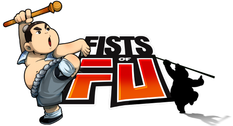

Back to: [West Karana](/posts/westkarana.md) > [2010](/posts/2010/westkarana.md) > [June](./westkarana.md)
# Is Outspark's Fists of Fu a Dragonica Killer?

*Posted by Tipa on 2010-06-18 23:01:25*

Casual gaming portal [Outspark](http://www.outspark.com/), known mainly for its Fiesta Online MMO and snowboard racing sim Project Powder, looks to be soon entering the F2P beat 'm up MMO world with the forthcoming "[Fists of Fu](http://fistsoffu.outspark.com/)".

I took a look at the teaser video (embedded below) and could only think that someone's been playing a little too much of THQ*Ice's "[Dragonica Online](http://dragonica.thqice.com/)". Both games are pure, balls-to-the-wall action MMOs; both use 3D engines to add an extra dimension to largely side-scrolling game play. Both have pretty much the same classes. Both have four player groups. Neither really shines in the character creation department, though arguably Fists of Fu isn't really into that, as each of the six available characters has their own class and back story. (The available characters just happen to include the three available starting classes in the two available genders).

As in Dragonica, you eventually choose a specialty class -- archers, for instance, can choose to become snipers or shaolin hunters.

Fists of Fu has much smoother animation, pushing their 3D a lot more heavily, but otherwise... we'll see how it goes. Outspark is holding a one day Closed Beta event next Wednesday, and if I get in, I'll take pictures.

