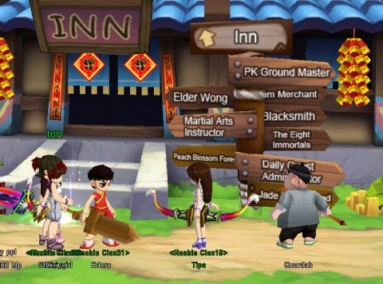
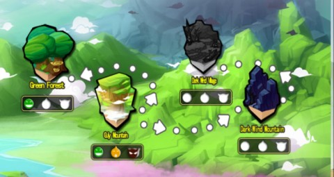

Back to: [West Karana](/posts/westkarana.md) > [2010](/posts/2010/westkarana.md) > [June](./westkarana.md)
# Fists of Fu: Beat 'em Up MMOs go Platform

*Posted by Tipa on 2010-06-25 06:56:40*

***Note: Fists of Fu is currently in a short closed beta period. I expect open beta to start fairly soon.***

You'd hardly know Outspark's [Fists of Fu](http://fistsoffu.outspark.com/) is an MMO to look at it. What we usually consider an MMO has a long history back through MUDs and to the pre-history of tabletop, pen-and-paper games. You learn to expect adventure to come at a fairly slow and sedate pace.

The Beat 'em Up MMO genre, though, has no time for thought. With its roots in arcade games like the 80s video game [Double Dragon](http://en.wikipedia.org/wiki/Double_Dragon), the only real decisions you need to make are how close to get and which combo to use. THQ*Ice's [Dragonica Online](../../../index.php/2009/08/25/a-first-look-at-dragonica-online/) may be the most prominent example of the genre here in the US. Outspark hopes to raise Beat 'm Up MMOs to a new level with Fists of Fu.

Known also as East Fantasy, Fists of Fu has its roots in Nexon's Beat 'm Up MMO "[Elsword](http://steparu.com/reviews/mmo-rpg-reviews/90-elsword-season-2-review)", with which it shares the gameplay engine and [a few other things](http://ggftw.com/forum/elsword/77993-fists-fu-east-fantasy-list-noteworthy-stuff.html). Both Elsword and Fists of Fu take the standard side-scrolling action and add elements of platform games to it. This tends to slow down the action somewhat as you spend time trying to get your enemies all at approximately the same level on the screen so that your combos hit for maximum effectiveness.

New players won't spend much time in the character creator. You have six characters to choose from, male and female varieties of the mage, warrior and archer which, at level 20, can subclass to more specialized versions of each. You will see and group with many, many copies of your character, which can become especially embarrassing in team or PvP play when you lose track of which of the identical characters is yours. By level 6, I still looked identical to every female archer I met. Eventually gear differences and cash shop appearance clothing will allow you to somewhat set your own style.

Once created, a short tutorial goes over the basics of movement, fighting and basic combos. You are then dumped with a thousand other new characters into the starting village, little more than a row of quest-giving NPCs who teach you about the battle maps, PvP, enchanting items and daily quests. You now have all you need to succeed in Fists of Fu.

Unlike Dragonica Online, there are no open-world combat maps. All the PvE combat is done by selecting maps from various combat hubs. Once selected, you can choose a difficulty (Solo/Beginner, Expert and Hardcore, beating one unlocks the next) and try to form a team if you don't have one. You're briefly shown an overview of the map, and then you're off. Run toward the right and kill everything you see. In the final section of the map lives the Monster King, a far more powerful (and larger!) creature who hits hard to start and once shifted into its fury mode, can unleash a wide variety of one-shot kill attacks. Best to be running the other way when it starts to flash red.

PvP is offered from the very earliest levels. The PvP maps I've seen tend to be fairly small and extremely twisty, allowing quick getaways from sticks situations. PvP experience comes separately; though you may be a powerful adventurer, your PvP rank raises only by killing other players. Though the game offers various game modes, like team deathmatch or free-for-all, in my experience, every match turned into a free-for-all, no matter how it was labeled.

Whether completing an adventure or a PvP map, you are graded at the end by your performance, which directly influences the coin and experience rewards for the level. Take a long time and fail to complete combos, and your grade will reflect it. Mow through the enemies and get a hundred hits in a row and you'll like what you see. I missed Dragonica Online's slot machine payoff screen, though.

Games of this genre are also defined by their cash shops. This one offers the same variety of experience potions and fashion items as the others in the genre. And like them, leveling soon becomes tedious without the help of potions -- by design.

So how does it stack up? Fists of Fu wants to be funny, but OGPlanet's [LaTale](http://latale.ogplanet.com/main.og) is funnier. Fists of Fu aims to play fast and furious, but I find Dragonica Online's controls to be more precise. Once a long combo is started in Fists of Fu, I was powerless to stop it as the situation changed. I never really accepted the reason for the lack of character customization, either. Perhaps it's just because I haven't played long enough, but compared to LaTale and Dragonica Online, the world of Fists of Fu seemed much smaller.

On the other hand, the animations in Fists of Fu are top-notch. The heavy use of 3D and platform mechanics in the adventure and PvP levels had me thinking back to [Crash Bandicoot](http://village.crashbandicoot.com/splash/). Where advancement in Dragonica Online is nearly impossible without a lot of people forming teams for the instanced missions, Fists of Fu allows a solo character to advance, if they are very careful.

If you're a fan of Beat 'em Up MMOs, it's worth giving Fists of Fu a try if only for the cool animations and elaborately designed adventure maps. That Fu allows PvP from very low levels and from anywhere is another mark in its favor. The slushy controls, lack of character customization and derivative gameplay, though, left me unsure if the graphical excellence could tear me away from Dragonica.

Check out the video of character selection and a run through a portion of an adventure map.

## Comments!

**Longasc** writes: Very interesting - in a way. Never ever played games/MMOs like that before.

---

**[Tipa](https://chasingdings.com)** writes: It's easy to get trapped in a narrow definition. The EQ design, while the most successful, is only one among many. MMOFPS, MMORTS....

---

**PeterD** writes: That actually looks suprisingly good . . . is the game in open beta, closed beta, or released? Sometimes I want to be able to go online and just quickly smack some stuff around, not spend 30 minutes gathering quests and traveling to a location and then hunting for the 10 foozles or the x of y drops I need.

---

**[Tipa](https://chasingdings.com)** writes: It's in closed beta, a fact I should have mentioned. Closed only in that you need a beta key, not that they ate hard to come by; they sent me two. 

It's a very decent drop-in, drop-out game; that comes from it's arcade sensibility. 

---

**[Anjin](http://bulletpointsblog.blogspot.com)** writes: Very cool. Thanks for sharing your thoughts on this one. I may have to broaden my horizons a little.

---

**PeterD** writes: I'll have to check my e-mail, I get so many beta invites to these sorts of games that I don't even look at them anymore :P

---

**[Wiqd](http://www.digital-lemonade.com)** writes: I tried to play it, but just couldn't. It reminded me of all the things I dislike in an MMO and all the things I love in a regular ol' console beat em up :P To each their own.

---

