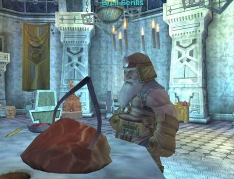
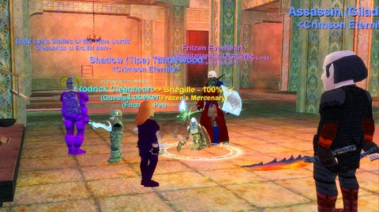
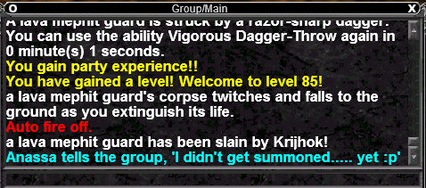

Back to: [West Karana](/posts/westkarana.md) > [2010](/posts/2010/westkarana.md) > [June](./westkarana.md)
# EverQuest: Over & Underfoot

*Posted by Tipa on 2010-06-27 23:25:17*

Modern, traditional MMOs are full of "yes you CAN". Yes, you CAN get great gear with little effort. Yes, you CAN get useful things done in just a few minutes. Yes, you CAN choose to never group at all and yet see and do most everything. Yes, you CAN play through the entire game and never connect with even one other person, if that's what YOU want.

EverQuest's original tag line was, "[You're in OUR world now](http://everything2.com/title/You%2527re+in+our+world+now)." Play their game, you play by their rules. EQ came from the MUD world, where chatting and roleplaying were as important as gaining levels and loot. EQ was a really elaborate graphical chat room built around bringing people together and giving them things to do -- together.

That's fallen out of fashion. You shouldn't HAVE to play with others if you don't want to, and because quite a lot of people felt that way, quite a lot of people left to play MMOs with somewhat more options in how to play and with whom to connect.

EQ remains its old curmudgeonly self, still emphasizing the social part of MMO gaming, still requiring grouping and friends to progress. Now that EQ's had another round of server merges, there's no better time to start hooking up with the people. It's taken this much time for the EQ server communities to recover from the LAST server merges; they should be used to new people by now.

I returned to EverQuest as my rogue, Tipa. I'd changed mains to Dera/Brita during the Gates of Discord expansion when the level cap was 65 and Crimson Eternity was largely in Plane of Time gear, but I'd leveled her on an alt basis to the Omens of War level cap, 70, in the years before I quit EQ entirely. I'd casually played now and then since, so she was level 71 and at about 420 AAs when I started playing again a couple of months ago.

The current standards for a beginning raider in EverQuest at the moment are level 85, 1000 AAs, and flagged through Tier 9, which opens up all the group zones and instances in Underfoot, the latest expansion.

14 levels wouldn't be that much in WoW -- a couple weeks of solo questing mixed in with some normal mode dungeons along the way. In EQ2, about the same amount of time. In EverQuest, each level is a battle. There was a quick method to gain levels up until about level 80 via doing three specific monster missions and then turning them all in at once while under the effects of the Lessons of the Devoted veteran's award, but that's been fixed. Nonetheless, I made it to level 81 doing those.

Then came the flagging through Seeds of Destruction (previous expansion) and up through Underfoot. These were the Tiers; the first several tiers give you the ability to hire more powerful mercenaries, which, with the recent addition of melee and wizard mercenaries, now form integral parts of most groups. The last couple tiers open up Brell's Temple, the shining city of Kernagir, Volksa's Husk (the body of a immense but dead lava worm) and the Convorteum, the xp and loot zone where all the cool kids go.

It would have been impossible to do this at all without friends, and without Krijhok, it would have been impossible at all. He decided to get me flagged, and whenever I'd log in, if he was around, he'd take me along on another mission.

Through Krijhok and other friends, I've been on a whirlwind tour of the newest bits of EverQuest, and am now at level 85 (yay!), 503 AAs (/shrug, but better than 420), and flagged for Volska's Husk, the first Tier 9 zone.

So here's the rankings of the new content I have seen.

**The "Old Man McKenzie" Monster Missions** -- AKA the Plane of Knowledge Monster Missions -- these missions, which require your group to be of the average level of 80, have you go back in time and take on the roles of characters in the end-game dungeons of pre-expansion EverQuest. You can choose your characters from any race/class combination that was available at the time, and they all are equipped in what would have been very good gear for the time. Your mission is to kill a selection of the named mobs from Sol B, Lower Guk (Live Side) and Lower Guk (Dead Side). Your reward is a heck of a lot of experience, a lot of plat, a brew that can be turned in for level 80 rewards, and a heaping shovelful of nostalgia. It's not that hard to find or make a group to do them, either. **A+**

**Secrets of Faydwer** -- I only went to this expansion a couple of times to grind mobs for xp. I found it dull. I did not see very much of it all, so I can't really speak to the whole thing. It was fun to be with friends I hadn't seen in years, but the friends were the fun part. Grinding mobs can only be dull. **C**.

**Seeds of Destruction** -- Players rampaging in the Plane of Time have caused so much damage that time itself has been rent asunder. The player's job in this expansion was to mend time by going back to pivotal events in Norrath's history and assuring that things work out for the best. Among the zones re-imagined was the whole Qeynos Hills area, back when Blackburrow was a real power in the region and Qeynos itself just a small village named Oceangreen. Many of the quests can be done solo, but they usually end with a group mission. **B**

**Underfoot** -- Dungeons built on the WoW model, with scripts and minibosses, but without the AEs, even though you would really like to just AE the stuff. But, in the inimitable EQ style, any one mob could wipe the group and every mob has some ungodly number of hit points, so that's out of the question. Still, it's the most dungeon crawl-focused expansion since Dragons of Norrath. However, the tiered flagging required means a lot of people are left banging on the doors, hoping for flagging missions to get them in. It does ensure, however, that everyone sees all the new content -- they have no choice. **B-**

EQ is still going strong and it's still EQ. All the good things about EQ are still there; some of the bad things, like death penalties (mostly gone) and the inability to solo or form balanced groups (mercs can help a lot) aren't really a problem now. The recent mergers mean, for the moment, the places are crowded. But the game really isn't made for people who want to solo the game. It might be possible, but I can't imagine it would be any fun. And after all, there are games for that.

I guess all I have left to say is this:

DING!
=====

## Comments!

**TheRemedy** writes: You're off leveling while poor Anassa is still waiting for that summons. :(

---

**Longasc** writes: Seems you found something traditional to do over the summer! Maybe post a map - dunno if instances and stuff make that impossible, but I really have problems to follow people through their Everquest adventures.

---

**[Tipa](https://chasingdings.com)** writes: @TheRemedy -- Anassa's pet was the tank, and we were all trying not to get summoned by doing too much damage and pulling aggro. Which is why I was using throwing knives instead of melee :P If I'd gotten in melee range, I would have been the one with the aggro. This last group was mage, necro, rogue (ne) and three cleric mercs.

@Longasc -- Underfoot is another plane of existence. It connects to Norrath at the bottom of the Hole and in Corathus Creep (from the Depths of Darkhollow expansion). There's maps, but they don't correspond to a new continent in the above world or anything.

---

**Egat** writes: It's a shame you missed Secrets of Faydwer when it was the current expansion. It was really well done, with lots of major quest strings and great zones. The only downside for many were the various faction grinds in order to receive the best spells/skill tomes. Still, I enjoyed SoF a lot.

---

**[City of Heroes: What Is Old Is New Again &laquo; Bio Break](http://biobreak.wordpress.com/2010/06/29/city-of-heroes-what-is-old-is-new-again/)** writes: [...] how older MMOs like EverQuest used to be.  Groups mindlessly farming while chatting away.  Tipa summed up the experience in a recent post, and I’m inclined to think that CoH, in a way, is actually heading back in that [...]

---

