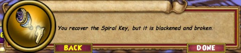
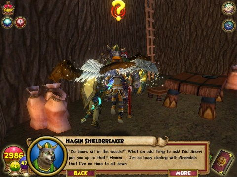
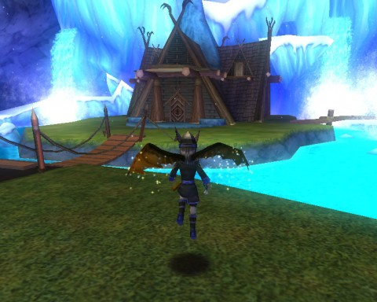

Back to: [West Karana](/posts/westkarana.md) > [2010](/posts/2010/westkarana.md) > [June](./westkarana.md)
# Wizard101: The Road to Celestia

*Posted by Tipa on 2010-06-29 06:22:30*

The sunken world of Celestia moved a step closer to reconnecting with the Spiral in Wizard101 yesterday when KingsIsle added a teaser pre-quest to the Test server and, we hope, very soon to the live servers.

We don't get to go to Celestia YET... but we do find out quite a bit of the circumstances behind its loss, long ago. It comes as no surprise that there are elements both in the Spiral and in Celestia itself that don't want to see wizards swimming with the sharks; but we defeated Malistaire. Nobody tells us what we can't do.

The quest starts with the Storm school teacher in Ravenwood. There's a machine that has turned up on Triton Avenue; further investigation shows that it displays a long enciphered message. Sure, we could just sit down and figure it out, or we could assemble a Rosetta stone of sorts by killing bosses in Krokotopia, Mooshu, and Dragonspyre. 

The deciphered text turns out to be a call for help from a Marleybone expedition lost to an attack by the Umbra Queen. The wizards of the Spiral are then charged to search a nearby warehouse (a re-purposed Big Ben) in order to find the spiral key for Celestia.

Like Briskbreeze Tower, the two boss fights are full of deceit and trickery. I playing my life wizard, Tara Mythcrafter, another life wizard, a storm wizard and an ice wizard gathered together for the fights.

Several floors up, the first boss is Celestian -- General Stormclaw, a crab. He summons three skeleton minions to help him out. If you attack the enemies in the wrong order, the group will get hit continually by level 48 group spells. The life minion will cast rebirth on their side, and the group will get pummeled by storm and (I think) ice group spells. Not on the monster's turn, no; they will retaliate during the player's turn. Kill the minions from left to right (life, ice, storm) and then the boss, and everything will be fine.

They don't have THAT many hit points. Our storm wizard kept using his group spell, which did cause us to get pummeled by enemy AEs, but with two life wizards in the group both casting rebirth, we survived it and won the battle.

At the top of the tower sat Estrakir Gloomthorn with her good friends Knuckles McCloud and two rat illusionists. Knuckles has some tricks to show. If any member of the party casts a heal, HE will cast rebirth on all the enemies. If any member of the party casts one of the level 48 AE spells, he will turn around and cast the very same spell immediately on the party.

We defeated the enemies once at a time, focusing on the two rat illusionists, healing up after each one (which caused the remaining enemies to heal up, but that was okay). Once we managed to get Knuckles down, the boss began spamming us with Scarecrow and Nova, but we were free to heal and there wasn't much doubt we'd win after that.

In Grizzleheim, Snorri Oysterbloom is pondering [kōan](http://en.wikipedia.org/wiki/K%C5%8Dan), which would seem an unusual detour into philosophy for a race not known for its self reflection. Nonetheless, Snorri finds himself stumped by two questions -- does a bear "sit" in the woods, and if a tree falls in the forest and there is nobody around to hear, does it make a sound? You're sent to talk to a bear and a tree to get answers to these age-old questions. You manage to dash off before you're asked to find the sound of one hand clapping.

It's a nice enough quest, but from the lead singer of one of my favorite bands, I'd expected a little more.

We're not done with Grizzleheim yet. KingsIsle is introducing Grizzleheim-themed housing, a multi-level A-frame house set in a small meadow, surrounded by glaciers. The house itself has a couple of balconies and several smaller rooms above a spacious ground floor. It's a cozy refuge from the bustle of Wizard City for people who aren't expecting a great deal of company. I'd recommend it for the Ice Wizard who just can't take all the ice of the official school house.

Big update today, but I am a little concerned about Celestia. If all the boss fights in the new world are as tricky as the ones in the tower, it's going to be fairly difficult for people to make it through the expansion. Grizzleheim and Dragonspyre, though, both only had a couple of tricky fights, so we'll see.

We're definitely getting astral magic, though, and I can't wait!

## Comments!

**[Sierra Starsong](http://www.modernautomagic.com)** writes: If you liked the Grizzleheim house from the Crown shop, swing by the new recipe vendor in the Griz commons. The new crafted house is incredible - and insane to make.

---

**[Tipa](https://chasingdings.com)** writes: I saw that in the release notes. Classic MMO tradeoff -- spend money to buy something, or spend time to make it. Options are good!

---

**[M.W.S](http://sorcererofthespiral.blogspot.com/)** writes: Very nice post Tipa! You released much of the information that was needed to know!

---

