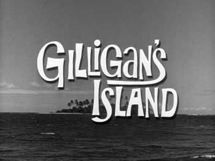

Back to: [West Karana](/posts/westkarana.md) > [2010](/posts/2010/westkarana.md) > [June](./westkarana.md)
# TV Recap: Gilligan's Island (pilot episode)

*Posted by Tipa on 2010-06-29 22:33:11*

Aside from the famous theme song which tells the story, the American television audience of 1964 never saw the events that drove the ill-fated crew and passengers away from civilization and onto an uncharted ~~densely jungled~~ desert isle. The pilot episode, "Marooned", tells the whole story, but that's been lost to the desert sands of time... until now, that is. The WB has the whole thing -- the entire run, the 98 regular shows and the unaired pilot. So for the very first time perhaps in forty years... a recap of the very first episode of [Gilligan's Island](http://en.wikipedia.org/wiki/Gilligan's_Island).

> In tropical sea is the tropic port,
Vacation fun is the favorite sport,
This is the place where the tourists flock,
Renting the boats at the busy dock.
Two secretaries from U.S.A.
Sail on the Minnow this lovely day.
A high school teacher is next aboard;
All taking trip that they cannot afford.

(full lyrics at [theme-songs.info](http://www.theme-songs.info/gilligans-island-theme-song/))

The theme song talks about two secretaries, a high school teacher and two millionaires, and this is why you never hear this version of the theme song again (and why they never aired the pilot).

Two secretaries with bodies to die for board the S.S. Minnow as the Calypso singer sings about them, followed by a stuck-up high school teacher wearing a full suit and carrying a book. Party person, he is not. Thurston Howell and his wife come aboard, with Gilligan staggering under their luggage behind them. (They even bring golf clubs, in case, I guess, the Minnow sprouts a course at some point).

*The weather is clear and the sun is hot....*

BOOM! SUDDEN STORM! (*The weather is .... clear? I think it is not!* sings the singer).

Aye carumba!

> The sea is now calm, and the weather grand;
There is the Minnow upon the sand.
What happen now, will give you a smile:
The adventures of Gilligan… and the skipper…
And the millionaire… And Mrs. Millionaire…
And the other tourists… on Gilligan’s Isle!

**ACT I**

Everyone is curled up and sleeping peacefully amidst the wreckage of the ship. The two secretaries are in adjoining beds. the high school teacher and the Skipper are asleep on the floor, and Gilligan is curled up uncomfortably on the [gunnel](http://en.wikipedia.org/wiki/Gunwale). 

The Skipper bolts suddenly awake, stands up, sees that the Minnow is beached amidst fern trees and sand. The Skipper jumps onto the sand to look around, shouting at Gilligan to wake up.

After a few more shouts, Gilligan wakes up (how can he sleep in that position?) and looks around in panic for the Skipper, not finding him on the boat. "Oh no! MAN OVERBOARD!" he shouts. He heroically dives onto the beach.

Ouch.

The Skipper explains the Minnow is beached. They discard the idea of telling the passengers they've docked at the marina and hoping they won't notice. "We were supposed to be home in six hours!" shouts Gilligan. "It may take a little longer," says the Skipper.

"Well, I'm happy to be here," says Gilligan. "I'm so happy I could kiss the ground!" He does so. "This island tastes terrible!"

The secretaries and the high school teacher wake up. "What a beautiful place!" shout the secretaries. "I've never been so glad to see terra firma!" agrees the high school teacher. "See? He even knows the name of the place!" says a secretary, who has a strong New Jersey accent.

"There's been a slight change of plans!" announces the Skipper. "That's right," adds Gilligan. "Instead of dropping you off at the marina, we've brought you to this very spot... wherever that is."

Gilligan lowers a ladder for the Millionaire and Mrs. Millionaire. "I wonder if tipping would be in bad taste," wonders Millionaire.

The secretaries and the high school teacher -- since none of them have names, might as well just call them The Nobodies -- the Nobodies thank the Skipper for saving their lives. One secretary expected to become shishkebab on the nose of a swordfish, and the other one can't swim.

The Millionaires wish for their luggage to be delivered to the closest limousine. When the Skipper wonders if there's a limousine on the entire island, Millionaire claims Mr. Hilton has hotels everywhere. The Skipper says the storm blew them hundreds of miles off course; the island doesn't even appear on his Navy charts. The Millionaire says that he should have gotten them from a more reliable source -- his yacht club.

The Skipper tells the Nobodies to stay put and safe while he and Gilligan explore the island. Gilligan pops up on deck loaded with gear, then falls through the collapsing deck and out through the hole in the hull.

I keep wanting a polar bear or a smoke monster to show....

The Skipper finds the tallest palm tree on the island, from which someone could see the entire island.

"But who's going to climb it?" asks Gilligan. "There's only the two of us, and you can't go because you're the Skipper, and I can't go because... because I don't know how to climb coconut trees, and I'm afraid of heights...." The Skipper silently stares at him. "I'm not starting a mutiny, Skipper, but I'm not climbing that tree," continues Gilligan. "No sirree. Not me!"

Gilligan is curled up at the top of the tree, covering his eyes. "What do you see?" shouts the Skipper. "Nothing!" shouts Gilligan. "I have my eyes closed!"

"There's nothing to be afraid of!" shouts the Skipper. 

"You're right!" says Gilligan. "I can see everything!" He knocks a coconut off the tree, which falls and hits the Skipper on the head. "Look out below!" shouts Gilligan. "Thanks for the warning," says the Skipper.

Gilligan takes out a pair of binoculars and starts looking around. "You were right!" shouts Gilligan. "There are people here! They're just standing around -- but they have a boat! Skipper, we're saved!" Gilligan slides down the tree, knocking over the Skipper, who is hit in the head by another falling coconut. And another. And another. And another.

"Are you sure you saw some people?" demands the Skipper. "Yes sir, and their boat. Follow me, I know exactly where it is." Gilligan leads the Skipper back to the beached Minnow.

**ACT II**

 The crew and passengers listen to a radio tuned to a local station. The USS Minnow has been declared lost at sea, and the Coast Guard has given up the search. The Millionaire, bored, gets excited as the news turns toward the stock market.

The Nobodies are trying to get the ship's radio transmitter to work. The high school teacher has now been named The Professor and is wearing the Professor's usual outfit, though it is not the same actor as would go on to play him in the regular series.

Skipper assigns the Professor to keep working on the radio. Gilligan is assigned to fishing for dinner "And you girls... You girls wash all the dirty clothes on board." "Aye aye, Skipper!"

The Skipper asks the Millionaire, Mr. Howell, to bring back fresh water from a nearby spring. "Why, I can't do that! I'm retired! I haven't worked since... darling, when is the last time I worked?" His wife helpfully reminds him that he has never worked.

The Skipper resigns himself to carrying the water himself. "Oh, Captain," calls the Millionaire's wife. "We always have dinner at eight." Mr. Howell adds, "With cocktails ahead of time!"

The Professor shouts in delight as he gets the transmitter working. As he runs to get the Skipper, Gilligan catches the transmitter in his fishing line and hurls it into the ocean. "It was right here with the radio!" insists the Professor, holding up the radio. Gilligan catches the radio in his fishing line and hurls it into the ocean. "Now I know what happened to the transmitter."

The Skipper jumps into the waves to rescue the delicate electronics. "Hi, Skipper," says Gilligan. "Going in for a dip?"

"NOW HEAR THIS!" shouts the Skipper to the waves. "If there be a man eating shark out there -- WHAT ARE YOU WAITING FOR?"

**ACT III - Night**

Gilligan is asleep up a tree (he can sleep anywhere). The Skipper sits at a campfire. He hears a noise, and silently draws a pistol and looks out into the jungle. Gilligan walks up behind him, startling the Skipper into firing a shot. "That was our last bullet!"

"Let me stand guard," offers Gilligan. "I want to help. Someone needs to relieve you. You're exhausted!"

"You're right," agrees the Skipper. "Maybe the Professor..."

"But he's just a passenger!" says Gilligan. "I'm you're own crew!"

"Don't remind me," grumbles the Skipper.

"I know I'm to blame," says Gilligan. "I lost the anchor. I lost the transmitter. I lost the radio. And without the transmitter, we're never going to be rescued. You don't have to pay me for this week's work."

The Skipper despairs because without bullets for the pistol, they are defenseless against wild animals and cannibals from other islands. Gilligan happily announces he has managed to save a box of cartridges. The Skipper asks for them so he can reload the gun, but Gilligan accidentally drops them into the campfire, where they explode.

Morning, and a grass hut is taking shape on the beach. The professor brings more palm branches, and he and the Skipper talk about their plans to survive until they are rescued. The professor goes off for more supplies. Gilligan walks up. The Skipper tries his best to ignore him, but Gilligan won't be ignored.

"You're just bad luck," says the Skipper. "Remember that time when we were serving on the destroyer, and a depth charge came loose and was rolling toward me?"

"Yes," says Gilligan. "I pulled you out of its path and saved your life."

"No," says the Skipper. "You PROLONGED it."

Gilligan finds the professor cutting palm branches. "Hey professor, can I help you?"

The professor admonishes Gilligan, telling him that CORRECT English would have him say, "MAY I help you?"

"Well, MAY I help you?" asks Gilligan. "No," answers the professor.

The girls are washing clothes in the spring. Gilligan runs up. "Can I help? I'm very good at washing!" One of the girls replies, "well, I'm really good at WISHING, and I WISH you'd get lost!"

Gilligan returns to fishing, and has a long battle with a shark as the Howells look on, who loudly wonder if now is the best time for water sports. He ends up bringing in a pile of fish, one of which is broadcasting an exercise radio program. Gilligan starts exercising, until he realizes one of the fish must have swallowed the radio. The professor estimates the chances of catching a fish that has swallowed the transmitter at a million to one.

The cast run to the pile of fish and start talking into fish, hoping to hear their voices transmitted to the radio.

**ACT IV**

The radio is announcing (again) that the search for the Minnow has been abandoned. Suddenly, they hear a plane flying overhead. They quickly decide to form the word "HELP" from the bodies of the dead fish. Gilligan is in charge of the letter "P", which he makes backwards.

> We leave all our friends on this tropic shore,
Perhaps they will be here, forevermore.
Maybe a rescue will set them free?
Tune in next week, and then you will see!

## Comments!

**[Pete S](http://dragonchasers.com)** writes: Gilligan's Island was my babysitter for (it seems) years when I was a kid. Of course back then people thought nothing of letting a 10 year old kid make his way home from school alone and hang out until mom & dad got home from work. Wasn't even a latchkey kid since back then we never bothered to lock the doors.

Anyway GI was on in reruns after school and I saw it just about every day... loved that show. :)

Thanks for sharing this!

---

