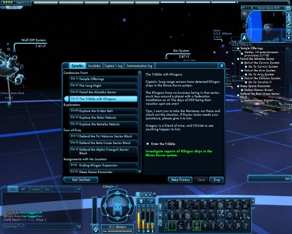
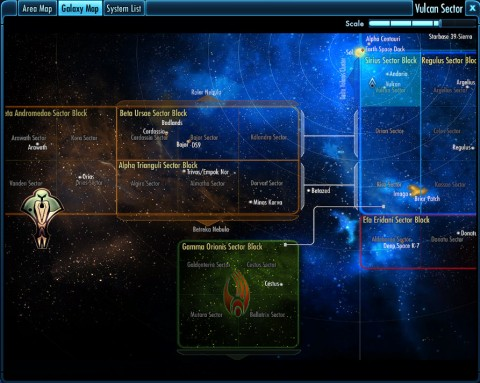
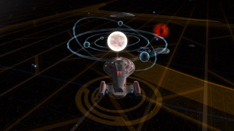
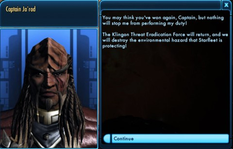
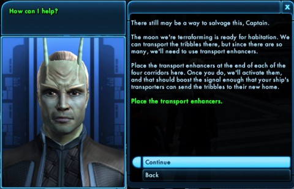
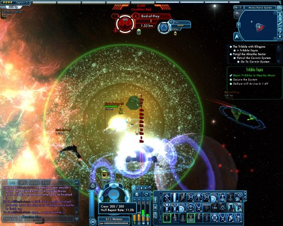

Back to: [West Karana](/posts/westkarana.md) > [2010](/posts/2010/westkarana.md) > [March](./westkarana.md)
# Star Trek Online Playthrough: The Tribble with Klingons

*Posted by Tipa on 2010-03-02 08:06:02*

I thought it might be fun to do "playthroughs" of certain MMO missions, to try and give a feel for what it's like to simply play the game. I play a good variety of MMOs, so what I'm going to do is go through each one of them and do a mission or quest from start to end. For this first one, I will be doing a Star Trek Online "episode" called "The Tribble with Klingons". Klingons and Tribbles have never gotten along... but why?

We open on the bridge of the USS Monterey, 93940-B, an *Intrepid*-class long range science vessel on leave at Starbase 01. Commanding her is my character, Captain Tipa D'zoph. Captain D'zoph is an Aenar, an Andorian sub-species once considered mythical but in reality just very private. D'zoph's congenital blindness was corrected with gene therapy while still in the womb, and the Aenar are finally taking their place in Andorian society. Commander Tarah is first officer and unofficial 'minder' for the captain. It wasn't easy for Andoria to allow an Aenar to command full-blooded Andorians; Tarah keeps D'zoph on a short leash. At the console behind them is Chief Engineer Sryn.

[caption id="attachment\_4770" align="aligncenter" width="480" caption="Click to enlarge"][/caption]

A message from Starfleet!

> Captain, long-range sensors have detected Klingon ships in the Minos Korva system.

The Klingons have no reason being in that sector, much less around a planet with a Federation installation on it! The days of DS9 being their vacation spot are over!

Tipa, I want you to take the Monterey there and check out the situation. If Doctor Jones needs your assistance, please give it to him.

Gregory is a friend of mine, and I'd hate to see anything happen to him.

I've fought the Klingons before. No other race gives me so much trouble on the ground.

[caption id="attachment\_4771" align="aligncenter" width="480" caption="Click to enlarge"][/caption]

The Minos Korva system is in the Dorvan sector of the Alpha Trianguli sector block. I have some patrol missions to do in that area, so it's likely we'll be seeing a lot of that sector. I leave Commander Tarah in command and retire to my ready room as the Monterey travels to the system via the sector maps.

The Gamma Orionis sector that dominates the bottom of the map is the future home of the first few "raidisodes". I'm going to have to be an admiral to help with those.

[caption id="attachment\_4772" align="aligncenter" width="480" caption="Click to enlarge"][/caption]

The sector map is a weird display that is meant to suggest some sort of tactical overlay over the galaxy, showing stylized representations of the systems in the sector. Here's we're outside the Minos Korva system. The Eye of Sauron-like thing represents an open sector defense mission; I could fly into it and immediately be in a shooting war with an enemy faction -- probably the Terran Federation in this sector, Mirror Universe enemies who want to take over our reality.

But some admiral's friend is in ~~tribble~~ trouble, so we let the evil twins be for the moment and enter the system.

[caption id="attachment\_4773" align="aligncenter" width="480" caption="Click to enlarge"][/caption]

> Captain, Starfleet has requested we investigate reports of Klingons in the area of Minos Korva.

There is an exobiology research station on the planet's surface. Their research isn't military in nature, but Starfleet is concerned that the Klingons will attempt to disrupt their work.

Our orders are to engage any Klingons we find and convince them to leave the area. Then, we are to beam down to the surface and check on Doctor Gregory Jones and the exobiology team.

Convince the Klingons? Starfleet is always being diplomatic. The only kind of diplomacy Klingons understand is PHASER diplomacy.

[caption id="attachment\_4774" align="aligncenter" width="480" caption="Click to enlarge"][/caption]

There is a Klingon fleet in orbit around Minos Korva; the battleship IKV Kang, along with two Bird of Preys and a Raptor Escort, all a level higher than me. The USS Monterey is a science vessel, and science vessels allow for a lot of dirty tricks. I scramble their sensors, jam their targeting, use a viral matrix to hold the battleship in place and do various other cool things until the fight is mostly won and the IKV Kang breaks off and cloaks (the cowards; the generals ALWAYS flee).

[caption id="attachment\_4775" align="aligncenter" width="480" caption="Click to enlarge"][/caption]

Captain Ja'rod of the IKV Kang hails us.

> You may think you've won again, Captain, but nothing will stop me from performing my duty!

The Klingon Threat Eradication Force will return, and we will destroy the environmental hazard that Starfleet is protecting!

Captain Ja'rod then runs away. Run away, Klingon, run away home! Your House is on fire and your children have flown!

[caption id="attachment\_4776" align="aligncenter" width="480" caption="Click to enlarge"][/caption]

Time to beam down to the planet and see what's happening down there that would cause such consternation among the Klingons. My away team consists of myself, first officer Tarah, chief engineer Sryn, chief of security half-Romulan Karas, and medical officer Saylah (yes, named after Saylah of Mystic Worlds!).

When we arrive, we find tribbles everywhere! Of every size and color. And they are under attack by several squads of Klingons!

First officer Tarah is incensed.

> It appears the Klingons are attacking ... tribbles, sir.

Did Ja'rod bring a fleet into protected space just to do that?

We can't let the Klingons destroy harmless creatures, sir. it's not right.

I recommend that we stop the Klingons and find Doctor Jones' lab. Maybe he can explain what's happening here.

[caption id="attachment\_4777" align="aligncenter" width="480" caption="Click to enlarge"][/caption]

Sounds good to me. Ground missions mean taking on pockets of enemies who are generally a decent match for the group, especially since in this case, they are all higher level than my characters.

Since these are Klingons, that means we'll be fighting Targ Handlers, who summon pig-like Targs until killed, and the occasional Dahar Master, a special kind of warrior-priest who dual wields disruptor pistols and has a devastating melee attack. The only way to deal with him is to keep out of his way. Karas has a temporary force field he can deploy to give away team members a chance to recharge their personal shields. I often rely upon that, especially in open-air missions where there isn't much natural cover.

We fight our way up the hill to Doctor Jones' lab.

[caption id="attachment\_4778" align="aligncenter" width="480" caption="Click to enlarge"][/caption]

We thought there were a lot of tribbles OUTSIDE the lab! The lab itself is infested with them. We're beginning to understand how the Klingons feel about the little parasites. Doesn't mean we're not going to kill all the Klingons we find, however. The only good Klingon is a dead Klingon. Unfortunately, dead Klingon is the one food tribbles WON'T eat.

[caption id="attachment\_4779" align="aligncenter" width="480" caption="Click to enlarge"][/caption]

Doctor Gregory Jones, we find when we finally meet him, turns out to be related to the famous Cyrano Jones, a trader who first introduced tribbles to the Federation two hundred years ago. Cyrano Jones was a human; Gregory Jones seems to be some sort of weird hybrid of human, Andorian and Orion. When he describes his grandfather as a 'bit of a rogue', he ain't lying. He asks us to help him out by putting transport enhancers at the four corners of the base so that we can beam all million or so tribbles into the transporter pattern buffers until we can bring them to a moon being tribble-formed so that they can live in peace and harmony, safe from Klingons forever.

We place the transport enhancers and return to the Monterey.

But this wouldn't be a Star Trek Online mission if it ended there. It always has to end with a fight, and this one is no exception.

Starbase Deep Space 9 hails us to let us know that a Klingon fleet is headed for our location! Looks like Captain Ja'rod has found some more lackeys and is on his way to destroy us. DS9 is sending along the Defiant to help out. Our job is just to hold off the Klingons until the Defiant arrives.

We're actually more than capable of defeating the IKV Kang AGAIN, and all his support ships, too, but we're always grateful for the assist.

[caption id="attachment\_4781" align="aligncenter" width="480" caption="Click to enlarge"][/caption]

I hail Starfleet and tell them that the mission is accomplished. They thank me, give me some xp and DING! Captain 6! Only five more levels till admiral!

This was a fairly typical STO "episode" -- space battles followed by a running battle on the ground, some mission objectives, then back into space for another space battle. I find the ground portion of these missions to be more tactical; constantly moving around to try and either get flanking shots, or to draw fire so that the rest of the team can flank. As a science officer myself, I get to wear a science kit that gives me all sorts of heals and other support capabilities; I often try to let my bridge officers tank while I do debuffs and attempt to open up 'expose' conditions and get flanking shots.

My next 'play through' will be a dungeon in Dungeons & Dragons Online.

## Comments!

**Longasc** writes: Very nice! I am really looking forward to your D&D playthrough. I must admit I thought it was Tipa D'Zap and not D'Zoph for some reason. For the sake of Klingon purity I must correct you, it is IKS, Imperial Klingon Ship, not IKV. Though V for Vessel could work as well.

The large tribble piles in this station - I believed them to be all dead! Tribble mass graves, tribblecide. How horrible! :(
Jam/Scramble/VM is also my favorite setup for science vessels.

---

**[Tipa](https://chasingdings.com)** writes: It was the IKV Lang in this case, it might have been their error but that's what it was ;)

---

**Alexa** writes: Now that the Tribbles are safe, they can plan their revenge against the Empire!

---

**Thac0** writes: I finally caved and bought STO yesterday. I liked this blog very much.

---

**[Jomu](http://www.justonemoreunlock.blogspot.com)** writes: great screen shots! :D

---

**[Amuntoth](http://manifestpixel.wordpress.com/)** writes: Hey, I've been reading the blog for a couple of weeks now and I just wanted to comment on this entry. Amazing. I really enjoyed the little walkthrough of the mission. I'm doing a few Let's Plays on my site, one of them being Star Trek Online, so this was extra interesting.

How do you like being a science ship?

---

**[Tipa](https://chasingdings.com)** writes: I like science ships; they're like hybrids between the tanking cruisers and the glass cannon escort ships. Best of both worlds, really, and the admiral-tier science ships even take that a step further. One of the ships tends more toward the tanking aspect, and the other more toward the blasting, while still having the flexibility to take on a support role when needed.

---

**[Tipa](https://chasingdings.com)** writes: How are you liking it so far?

---

**[Amuntoth](http://manifestpixel.wordpress.com/)** writes: I'm having a blast, but I'm taking my time. I've heard, like most MMO's, there is a lack of content at end game this close to launch. I'm trying to not get there too quickly.

And doing the Let's Play is actually helping me enjoy the game more. I'm creating a story inside the story, and I'm kind of getting behind it.

My first character was a science officer with a science ship, but I rerolled to tactical, we'll see how that goes.

---

**[Blue Kae](http://www.bluekae.com)** writes: Finally catching up on my RSS. Great writeup, Tipa!

---

