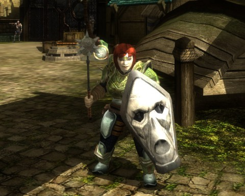
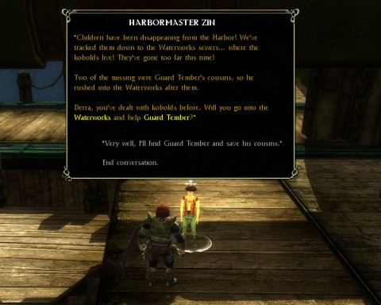
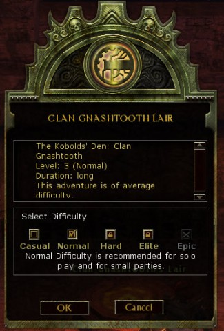
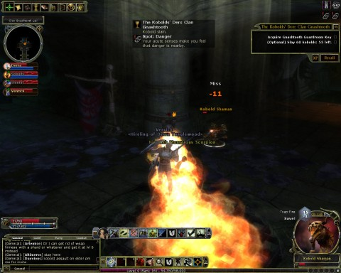
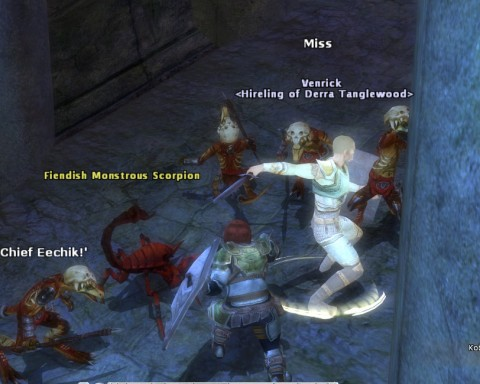
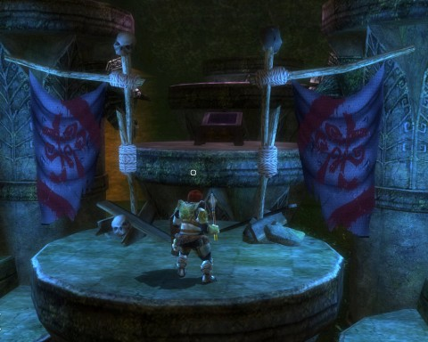
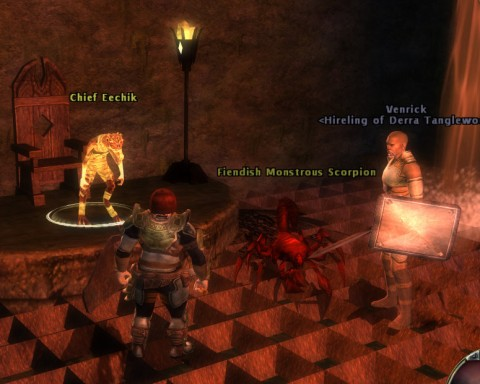
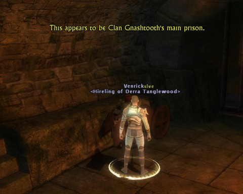
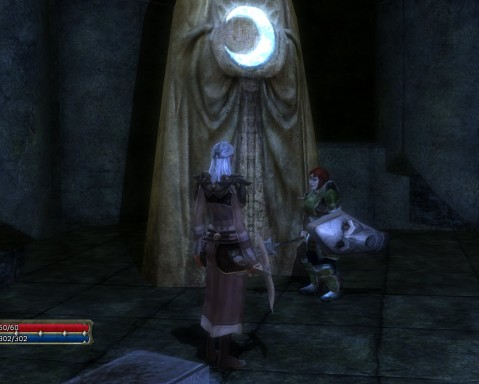

Back to: [West Karana](/posts/westkarana.md) > [2010](/posts/2010/westkarana.md) > [March](./westkarana.md)
# Dungeons & Dragons Online Playthrough: The Waterworks

*Posted by Tipa on 2010-03-04 08:38:53*

Even if you have a static group in Dungeons & Dragons Online, it's a good idea to familiarize yourself with the dungeons by trying them yourself on the casual or normal settings. If nobody in the group is a subscriber (as none of the people in my group are), then SOMEONE has to have done it at least once so that the group difficulties -- hard and elite -- open.

Last weekend, Stingite and Shintai had already done the first wing of the Waterworks, a vast, damp complex below the city of Stormreach and home to that city's beloved kobold population. We were forced to move on to the second wing (on normal mode, alas), but that first wing was still there for me to do so I could catch up on the quests.

I took some screenshots along the way :)

Dera Tanglewood is a fourth level dwarven cleric of the Sovereign Host, with a special affection for Arawai. I call her a Hobbesian cleric because, like Thomas Hobbes' description of life lived according to the whims of nature, she is "nasty, brutish and short".

DDO's world of Eberron is one that [pays only lip service to the gods](http://en.wikipedia.org/wiki/Religions_of_Eberron). There are no churches or temples (that I have found, anyway). Dera's compact with the Sovereign Host is more of a business arrangement. It is her job to nurture the life of those who follow the path of the light, and to ruthlessly destroy any that live in the shadows. By dissipating negative energy, positive energy may flourish. More alchemical than divine in nature, religion in Eberron is very different from that in your normal fantasy universe.

The first stop before any solo adventure is Groodug Meathands, the Hireling Vendor. This half Ogre has his massive fingers on the pulse of the Stormreach freelance adventuring community -- and he has their contracts hidden in a vault. Those adventurers are forced to work for whomever Groodug commands, but they aren't resentful, much. Every job completed is another step closer to freedom, after all.

I ask Groodug to lend me the services of Venrick, a level 2 paladin, and I also hire a level 3 wizard for backup.

Then, it's off to the docks for the main entrance to the Waterwork's sewer complex.

Harbormaster Zin stops me before I enter. Guard Tember has rushed into the sewers to rescue some cousins of his that were kidnapped by kobolds. There is no possible way that a Stormreach guard could defeat kobolds on his own. I agree to meet up with Tember and see if he can use my help.

Since the Waterworks isn't an adventure, I don't get to choose a difficulty when I enter. It IS an instance, so I don't meet anyone else as I explore the drippy tunnels.

Once inside, I summon Venrick the Paladin. We stand there at the entrance for a couple of minutes, letting our eyes adjust to the darkness. Actually, my eyes never adjust -- the Waterworks for me is a zone I can barely see. I have brightened up the rest of these pictures in Picasa, but when adventuring, my path is mostly guesswork and a constant eye on the mini map.

I can adjust the video settings to make the picture brighter, but then it resets and can't be changed after I take the first screenshot with FRAPS.

We make our way toward the first wing of the Waterworks, taking on kobolds as we find them. The treasure bags dropped by the critters contain collection items that re valued by various NPCs within Stormreach. My bag space is half filled by various collection items from treasure bags, random fungi, crates and what-not. Finding the people who want those things is somewhat tedious but financially lucrative.

Guard Tember, hot on the trail of his missing cousins, urges us to take over his quest and find his cousins FOR him. He'd go himself but he, um, has a nasty cough and, uh, it's nearly dinner time and, um, it might be really dangerous down there and he didn't become a city guard to fight! He just likes how he looks in the uniform! If guards protected the city, they wouldn't need ADVENTURERS, now, would they! Think!

Venrick and I agree to to let him have his dinner in peace. We will hunt down the missing children for him so that he will be able to return them to their families and take all the credit. As long as his gold is still good, we're on the job.

This is the true mission entrance, so I get to choose the difficulty. I choose Normal, which is a challenging difficulty for a solo adventurer. "Casual" is the mode for classes that don't solo well. Clerics, though, have heals and buffs, and I also have a hireling, so I expect to be the match of any organized kobold resistance. It's pretty clear Guard Tember doesn't know about the casual setting. Or maybe he is just really, REALLY lazy.

The helpful, unseen Dungeonmaster gives continual helpful hints, like the one where he warns you of possible danger nearby as you are being bathed in napalm by a trap. Gee, thanks, DM! Fortunately, I have Potions of Fire Resistance for just this purpose. Unfortunately, I can't figure out how to get my hireling to drink one, so I rush through the trap as quickly as I can so that he'll follow me without dawdling in the flames.

If I had a rogue along, they could disarm these traps. I toy briefly with the idea of buying a level or two in rogue at some point.

One of the kobolds mentions something about guarding a Chief Eechik! We now know the name of our enemy. Chief Eechik must die!

Before I can get to Chief Eechik, I need to kill the commander of the guard. Unfortunately, the guardroom is too dark for me to see. I have brightened this screen shot up considerably. On the plus side, Venrik found a ladder somewhere and climbed up and killed the head guard for me while I was still swimming around below, trying to find a way up. So all I had to do when I noticed him climbing DOWN a ladder, was to climb UP that same ladder and loot the chest.

Stormreach's major export? Crates. They are known the world over for the finest, most fragile crates; they'll burst into splinters no matter how lightly you touch them. When you have treasure that you care nothing for, stash it in a Stormreach crate, and you can be sure it'll be gone by the time you get home.

Old Man Murray used to rate games by [the time it took from start until they saw the first crate](http://www.oldmanmurray.com/features/39.html). They'd have loved Dungeons & Dragons Online.

The guardroom key opened a dungeon section that, once cleared, gave us the key to Chief Eechik's lair. After we fought our way to him, we decided to spare him if he would tell us how to get to the missing kids. It was no surprise to us when he told us that we were IN THE WRONG INSTANCE. But he'd tell us how to get to the one we needed.

That scorpion, by the way, is a summoned monster. I take all the help I can get.

After sparing the Chief's craven life, we find our own way to the prison and enter. All seems quiet, but we expect trouble.

What we find is a dozen kobolds, half warriors and half range classes (shaman and 'throwers'), and a Warden boss, all on a narrow ledge. I do my best to fight them off, but Venrick dies, and I fall into the trap of trying to keep myself healed while not doing that much damage to my attackers, so I die, too, and revive back in the inn.

Venrick's timer has run out, so when I return to the dungeon, I summon my wizard, Rita. We head back to those cells of DEATH, and this time, we win -- but Rita took too much aggro and died, and I'm out of mana. I can't yet raise the dead (as far as I know), so I pick up her soulstone and go looking for a shrine.

Along the way, I manage, via potions and other mystical items, to survive the kobold stragglers and come to the lair of an optional boss. I back slowly away and continue hunting for a shrine.

I finally discover a shrine behind a secret wall that I was fortunate enough to be able to detect. I suspect it was MADE easy enough so even nightblind folks like myself would be able to get to them. Rita resurrects at a shrine and we both rest up to full health and mana. We then easily defeat the last boss of the dungeon who has TWO treasure chests of loot for me.

Alas, the prison held only one of the Guard Tember's cousins, but the one we did find told us that the other had been taken away by even more sinister kobolds. We touch base with Guard Tember and vow not to rest until both children are returned safely to their parents.

I then run out of the Waterworks and head to the bar for some loot selling and ale drinking. The kid can wait :)

If dungeon crawling solo or in groups is your kind of thing, DDO is where you need to be. It's free to play -- I haven't paid a cent so far, but I intend to (thinking of making a drow of some class for fun). The game is incredibly deep, deeper than I can play. I have no idea how to build a character even now, and at some point I imagine I will have to respec and do everything the RIGHT way.

## Comments!

**[Ardw ulf](http://ardwulfslair.wordpress.com/)** writes: What server are you playing on? Me and my guys are on Argonessen.

---

**[mbp](http://mindbendingpuzzles.blogspot.com)** writes: My abiding memory of the Waterworks Tipa is the Oozes in can tunnelworm's lair and the way they dissolve your gear. My poor wizard was naked after he finished that one. Picture to prove it here: http://mindbendingpuzzles.blogspot.com/2009/10/ddo-autwind-wheres-your-trousers-i-hate.html

---

**[Tipa](https://chasingdings.com)** writes: I'm on Cannith, but I've been thinking about making an alt...

---

**[Ardw ulf](http://ardwulfslair.wordpress.com/)** writes: I'm Hrakn and Rafian in-game!

---

**[Jomu](http://www.justonemoreunlock.blogspot.com)** writes: looks like you're having fun ;)
i tried ddo.. and maybe its b/c i like playing with friends only and not really pugs, that i didn't get into it
i did like the online shop

add me if you like www.justonemoreunlock.blogspot.com

---

**[Stabs](http://stabbedup.blogspot.com/)** writes: Nice write-up.

I'd advise against paying for Drow. You can unlock the Drow option with 400 overall favour which isn't that hard to get. Press P, look at the last tab and the bottom line should be filling up with yellow towards the word Drow.

---

**Randolph Carter** writes: Hey Tipa,

These are the kinds of posts I hate. I don’t have time for another game. Please cease and desist (or at the very least make it sound a little boring).

It was nice hearing you on No Prisoners No Mercy, by the way.

RC

---

**[Callan S.](http://philosophergamer.blogspot.com/)** writes: What's with the hirelings? Is it like GW, where you aren't forced to party with others, you can use henchmen?

---

**[Tipa](https://chasingdings.com)** writes: It's more like a pet, you can only have one and you can't directly command them except in vague pet ways. They will use their special abilities on command; I had my wizard deactivate a rune for me last night, when my character's wisdom would not allow it.

---

**OrderedChaos** writes: Once you get into the Marketplace, you will start to see Temples and such. The "Catacombs" infact, takes place inside the Silver Flames Church. Great quest thread, with lots of undead and a good story. The other houses have churches and temples in them too.

---

**Jalent** writes: Tipa! We haven't spoken to each other in a while, I hope things are well. I have been lurking on your site as I always do. Love the write-up on DDO, been thinking about trying it but I barely have time for any games lately. FYI, I am in a great guild in VG with a RL buddy of mine. If you get the itch to fire up VG again let us know. Would love to play with you again.

---

**[Tipa](https://chasingdings.com)** writes: Gosh, Vanguard.... you know, at one point that would have been the perfect game for me. I don't know why it doesn't click with me now. Probably because I was always soloing, and soloing is inherently dull.

---

**[Tipa](https://chasingdings.com)** writes: Ah, my inexperience is showing! Thanks, I'll look for them when I get out of the harbor :)

---

**[Tipa](https://chasingdings.com)** writes: @Stabs - I'm at 129/400 favor now. And now that I know where to LOOK for favor, I can WORK on it. Based on that handy little patronage screen, I went back to Korthos Island last night and started filling in Elite quests, doing rare encounters and exploration and stuff. That screen is absolutely the direction I was looking for; I'll be heading back to Stormreach with clear goals in mind for what to do outside of our normal play night.

Thanks!

---

**OrderedChaos** writes: At 75 Favor with the Coin Lords, you will get the all important extra bag space! (20 extra slots)

---

**[Magson](http://phoenq-magson.blogspot.com)** writes: Hm. I have some toons on Cannith. Maybe I'll start logging in on that server from time to time to look for you.

That's the server that for me... well, Cannith created the Warforged, so all my characters are WF. I think I even have a warforged monk on there for an attempt at being a bit different.

---

**[Tipa](https://chasingdings.com)** writes: Warforged monk? That IS pretty weird :) Love to group up sometime.

---

