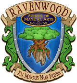

Back to: [West Karana](/posts/westkarana.md) > [2010](/posts/2010/westkarana.md) > [March](./westkarana.md)
# Wizard101: Broad hints about upcoming PET WARS!?

*Posted by Tipa on 2010-03-06 07:04:25*

Well, the fine faculty at the Ravenwood School of Magical Arts have put a month's worth of speculation into a handful of paragraphs. The full press release is below, but let's take a look at it, shall we?

First, the picture of Pets on a Podium. We can't help but notice that there's a crab or lobster pet wearing the banner "Celestia". This more or less confirms what we students have long suspected, that the next would be Celestia, a land that apparently contains water and beaches and an emphasis on flight. Jonathan Livingston Seagull World? MAYBE!

More interesting is what they promise about our pets, who too long have just been content to dance alongside us.

The pets have just won some sort of competition. Could this be a pet arena of some sort where you control your pets directly in competition? Pets will "take you to unseen parts of familiar worlds" -- pet-only portions of the realms we know? "... and in time to come, worlds beyond those you know". Well, clearly, Celestia, coming some time after the pet battles -- which were hinted at months ago by @jtoddcoleman on Twitter (well, he didn't say PET BATTLES, but he did hint at a new kind of combat which I can only assume refers to what they have announced).

Lastly, Ambrose says, cryptically (oh wait, I guess that would be KingsIsle-ally): "The answer you seek may be in the stars...." Could this be the ALSO hinted-at Astral Magic (magic of the Sun, the Stars and the Moon) from long ago? Only time will tell!

Here's the full release -- make your own guesses!

 

/* default css */

table {
 font-size: 1em;
 line-height: inherit;
 border-collapse: collapse;
}

tr {
 
 text-align: left;
 
}

div, address, ol, ul, li, option, select {
 margin-top: 0px;
 margin-bottom: 0px;
}

p {
 margin: 0px;
}

pre {
 font-family: Courier New;
 white-space: pre-wrap;
 margin:0;
}

body {
 margin: 6px;
 padding: 0px;
 font-family: Verdana, sans-serif;
 font-size: 10pt;
 background-color: #ffffff;
 color: #000;
}

img {
 -moz-force-broken-image-icon: 1;
}

@media screen {
 html.pageview {
 background-color: #f3f3f3 !important;
 overflow-x: hidden;
 overflow-y: scroll;
 }

 

 body {
 min-height: 1100px;
 
 counter-reset: \_\_goog\_page\_\_;
 }
 
 * html body {
 height: 1100px;
 }
 /* Prevent repaint errors when scrolling in Safari. This "Star-7" css hack
 targets Safari 3.1, but not WebKit nightlies and presumably Safari 4.
 That's OK because this bug is fixed in WebKit nightlies/Safari 4 :-). */
 html*#wys\_frame::before {
 content: '\\A0';
 position: fixed;
 overflow: hidden;
 width: 0;
 height: 0;
 top: 0;
 left: 0;
 }
 
 .pageview body {
 border-top: 1px solid #ccc;
 border-left: 1px solid #ccc;
 border-right: 2px solid #bbb;
 border-bottom: 2px solid #bbb;
 width: 648px !important;
 margin: 15px auto 25px;
 padding: 40px 50px;
 }
 /* IE6 */
 * html {
 overflow-y: scroll;
 }
 * html.pageview body {
 overflow-x: auto;
 }
 

 
 
 .writely-callout-data {
 display: none;
 }
 

 .writely-footnote-marker {
 background-image: url('MISSING');
 background-color: transparent;
 background-repeat: no-repeat;
 width: 7px;
 overflow: hidden;
 height: 16px;
 vertical-align: top;

 
 -moz-user-select: none;
 }
 .editor .writely-footnote-marker {
 cursor: move;
 }
 .writely-footnote-marker-highlight {
 background-position: -15px 0;
 -moz-user-select: text;
 }
 .writely-footnote-hide-selection ::-moz-selection, .writely-footnote-hide-selection::-moz-selection {
 background: transparent;
 }
 .writely-footnote-hide-selection ::selection, .writely-footnote-hide-selection::selection {
 background: transparent;
 }
 .writely-footnote-hide-selection {
 cursor: move;
 }

 /* Comments */
 .writely-comment-yellow {
 background-color: #ffffd7;
 }
 .writely-comment-orange {
 background-color: #ffe3c0;
 }
 .writely-comment-pink {
 background-color: #ffd7ff;
 }
 .writely-comment-green {
 background-color: #d7ffd7;
 }
 .writely-comment-blue {
 background-color: #d7ffff;
 }
 .writely-comment-purple {
 background-color: #eed7ff;
 }

 

 
 .br\_fix span+br:not(:-moz-last-node) {
 
 position:relative;
 
 left: -1ex
 
 }

 
 #cb-p-tgt {
 font-size: 8pt;
 padding: .4em;
 background-color: #ddd;
 color: #333;
 }
 #cb-p-tgt-can {
 text-decoration: underline;
 color: #36c;
 font-weight: bold;
 margin-left: 2em;
 }
 #cb-p-tgt .spin {
 width: 16px;
 height: 16px;
 background: url(//ssl.gstatic.com/docs/clipboard/spin\_16o.gif) no-repeat;
 }
}

h6 { font-size: 8pt }
h5 { font-size: 8pt }
h4 { font-size: 10pt }
h3 { font-size: 12pt }
h2 { font-size: 14pt }
h1 { font-size: 18pt }

blockquote {padding: 10px; border: 1px #DDD dashed }

.webkit-indent-blockquote { border: none; }

a img {border: 0}

.pb {
 border-width: 0;
 page-break-after: always;
 /* We don't want this to be resizeable, so enforce a width and height
 using !important */
 height: 1px !important;
 width: 100% !important;
}

.editor .pb {
 border-top: 1px dashed #C0C0C0;
 border-bottom: 1px dashed #C0C0C0;
}

div.google\_header, div.google\_footer {
 position: relative;
 margin-top: 1em;
 margin-bottom: 1em;
}

/* Table of contents */
.editor div.writely-toc {
 background-color: #f3f3f3;
 border: 1px solid #ccc;
}
.writely-toc > ol {
 padding-left: 3em;
 font-weight: bold;
}
ol.writely-toc-subheading {
 padding-left: 1em;
 font-weight: normal;
}
/* IE6 only */
* html writely-toc ol {
 list-style-position: inside;
}
.writely-toc-none {
 list-style-type: none;
}
.writely-toc-decimal {
 list-style-type: decimal;
}
.writely-toc-upper-alpha {
 list-style-type: upper-alpha;
}
.writely-toc-lower-alpha {
 list-style-type: lower-alpha;
}
.writely-toc-upper-roman {
 list-style-type: upper-roman;
}
.writely-toc-lower-roman {
 list-style-type: lower-roman;
}
.writely-toc-disc {
 list-style-type: disc;
}

/* Ordered lists converted to numbered lists can preserve ordered types, and
 vice versa. This is confusing, so disallow it */
ul[type="i"], ul[type="I"], ul[type="1"], ul[type="a"], ul[type="A"] {
 list-style-type: disc;
}

ol[type="disc"], ol[type="circle"], ol[type="square"] {
 list-style-type: decimal;
}

/* end default css */

 /* default print css */
 @media print {
 body {
 padding: 0;
 margin: 0;
 }

 div.google\_header, div.google\_footer {
 display: block;
 min-height: 0;
 border: none;
 }

 div.google\_header {
 flow: static(header);
 }

 /* used to insert page numbers */
 div.google\_header::before, div.google\_footer::before {
 position: absolute;
 top: 0;
 }

 div.google\_footer {
 flow: static(footer);
 }

 /* always consider this element at the start of the doc */
 div#google\_footer {
 flow: static(footer, start);
 }

 span.google\_pagenumber {
 content: counter(page);
 }

 span.google\_pagecount {
 content: counter(pages);
 }

 .endnotes {
 page: endnote;
 }

 /* MLA specifies that endnotes title should be 1" margin from the top of the page. */
 @page endnote {
 margin-top: 1in;
 }

 callout.google\_footnote {
 
 display: prince-footnote;
 footnote-style-position: inside;
 /* These styles keep the footnote from taking on the style of the text
 surrounding the footnote marker. They can be overridden in the
 document CSS. */
 color: #000;
 font-family: Times New Roman;
 font-size: 12.0pt;
 font-weight: normal;
 }

 /* Table of contents */
 #WritelyTableOfContents a::after {
 content: leader('.') target-counter(attr(href), page);
 }

 #WritelyTableOfContents a {
 text-decoration: none;
 color: black;
 }

 /* Comments */
 .writely-comment-yellow {
 background-color: #ffffd7;
 }
 .writely-comment-orange {
 background-color: #ffe3c0;
 }
 .writely-comment-pink {
 background-color: #ffd7ff;
 }
 .writely-comment-green {
 background-color: #d7ffd7;
 }
 .writely-comment-blue {
 background-color: #d7ffff;
 }
 .writely-comment-purple {
 background-color: #eed7ff;
 }
 }

 @page {
 @top {
 content: flow(header);
 }
 @bottom {
 content: flow(footer);
 }
 @footnotes {
 border-top: solid black thin;
 padding-top: 8pt;
 }
 }
 /* end default print css */

/* custom css */

/* end custom css */

/* ui edited css */

body {
 font-family: Times New Roman;
 
 font-size: 12.0pt;
 line-height: normal;
 background-color: #ffffff;
}
/* end ui edited css */

/* editor CSS */
.editor a:visited {color: #551A8B}
.editor table.zeroBorder {border: 1px dotted gray}
.editor table.zeroBorder td {border: 1px dotted gray}
.editor table.zeroBorder th {border: 1px dotted gray}

.editor div.google\_header, .editor div.google\_footer {
 border: 2px #DDDDDD dashed;
 position: static;
 width: 100%;
 min-height: 2em;
}

.editor .misspell {background-color: yellow}

.editor .writely-comment {
 font-size: 9pt;
 line-height: 1.4;
 padding: 1px;
 border: 1px dashed #C0C0C0
}

/* end editor CSS */

 
   

  

 

 
 
 

 
 
 

 
 
 

 
 
 

 
 
 

 
 **FOR IMMEDIATE RELEASE** 
 

 
 
 

 
 ***Ravenwood*** ***School*** ***of Magical Arts*** ***Welcomes Spring Competition***
 

 
 
 

 
 **WIZARD CITY, The Spiral** (March 5, 2010) – The winds of spring are blowing across Wizard City, and with them come the fresh spirit of competition. Inspired by Earth’s finest athletes at their winter games, Wizards from every school and many worlds of the Spiral are ready to set forth on grand new adventures with their loyal pets alongside them, with exciting new activities and fresh challenges soon to come. 
 

 
  
 

 
                                                             
 

 
  
 

 
 When asked what’s in store for pet-owners, Merle Ambrose, headmaster of Ravenwood School of Magical Arts, replied: “This spring, pets will be able to do more than you have ever dared hope! These fine creatures will serve alongside you in wonderful new ways, taking you to unseen parts of familiar worlds, and in time to come, worlds beyond those you know! If you think you have seen all that the Spiral has to offer, young Wizard, you will soon discover an all new breed of entertainment!”
 

 
  
 

 
 When asked to elaborate, Ambrose replied cryptically, “The answer you seek may be in the stars... or it just might be there alongside you.” 
 

## Comments!

**Geo** writes: I myself think that celestia might still be sky based, and that the crab is representative of the constellation Cancer. Could be wrong, though.

---

**Geo** writes: I think that Celestia may still be sky based, and that the crab might mean something about the Zodiac (Cancer).

---

**[Wizard 101 announcement raises more questions | cadiviempresas.com](http://cadiviempresas.com/gaming-and-tech/wizard-101-announcement-raises-more-questions/)** writes: [...] 101 announcement raises more questions March 8th, 2010 admin Wizard 101 players recently received a jolt of excitement as they were told to expect “a big announcement coming soon from Merle Ambrose.” Soon [...]

---

**[The Pron Stash &laquo; GamePron](http://www.gamepron.com/news/2010/03/08/the-pron-stash-19/)** writes: [...] Online details Lord of the Rings Online QA team write a diary and then share it with you. Wizard 101 announcement has raised more questions than it answered. Black Prophecy to be released in April, free-to-play [...]

---

**[David the rabbit lover](http://www.rabbitsshop.com/)** writes: I myself suppose that celestia may still be sky primarily based, which the crab is representative of the constellation Cancer. might be wrong, though.

---

