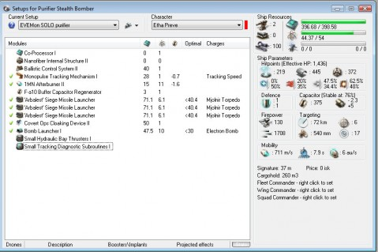

Back to: [West Karana](/posts/westkarana.md) > [2010](/posts/2010/westkarana.md) > [March](./westkarana.md)
# EVE Online: Building the Stealth Bomber

*Posted by Tipa on 2010-03-12 08:09:35*

A few days ago, my alt in EVE Online, Etha Preve, finished enough training to fly the Amarrian stealth bomber, the Purifier. After grouping with a friend who had just gotten the skills to fly his own bomber (a Nemesis), I knew I'd want one on my alt to help with level 4 missions.

There's this time in Level 4 missions where you've taken down all the lesser ships with drones, and all you have left are slow, lumbering battle cruisers and battleships. These seem to take the most time, because I am usually ALSO in a slow, lumbering battleship. The ships are gravy for stealth bombers. They can stand out of missile, beam and gun range and just lob missiles and torpedoes into the fray. If they get aggro, they can move out of targeting range and cloak. As a fleet member, they are first-rate damage and, with sensor dampeners, can even take on missions by themselves, using their small signature radius, high flight speed and ability to jam enemy sensors to dance outside of firing range, making their entire lack of any defense less of an issue.

I bought the Purifier, stopped by Dodixie for a Covert Ops Cloaking Device II, and then headed into my base in Aunia and parked it.

The real work was about to begin.

As a pilot who has trained for Amarr ships all her career, Etha had very little in the way of missile skills. There's no point in sitting at the edge of a fight lobbing missiles if they don't hit their targets.

It was time to plug the numbers into the EVE Fitting Tool.

[caption id="attachment\_4829" align="aligncenter" width="479" caption="Click to enlarge"][/caption]

I started my hunt for good fits over in BattleClinic. BattleClinic is THE go-to site for help with EVE Online, if you want a good overview for what is really happening in the game. They are also the #1 destination for sample ship fittings. EVEMON ties directly into their database.

I started with [a fairly recent fit](http://eve.battleclinic.com/loadout/36699-Solo-Purifier-Valadeya-039-s-Fit.html) that depended upon speed and stealth for its power, and was advertised to be able to solo as well as it performed in a fleet.

It's important to consider the BattleClinic fits ONLY as starting points. For one thing, they tend to use unrealistically expensive modules or require very advanced training. My alt is still relatively new -- just over 6 million skill points -- and has a ways to go.

Since I mean for this stealth bomber to pair with my Ishtar, and the Ishtar will fit a target painter, I was able to dispense with that. Since I NEVER plan to let this ship get within range to use the warp disruptor, that went. Nonetheless, I added a Monopulse Tracking Mechanism and a Small Tracking Diagnostic Subroutines to up the chance to hit. I replaced the MicroWarpdrive with an Afterburner as this is a mission running/plex set-up, replaced one of the Nanofiber Internal Structures (add speed) with a CPU Co-Processor because... I needed more CPU. Flip the cap booster with a cap regenerator and it was done -- a fit that Etha could put on her ship with the power skills she has trained.

Missiles good out to 40km; I have not seen many NPCs fire effectively from that distance (though they do try). I have also not seen many NPCs with a velocity greater than 500m/s, so at 711m/s cruising speed under afterburners (which this ship can run full time), it should be impossible for any ship to get close enough to do serious damage, especially if the Ishtar is doing its job and keeping aggro and killing stuff with drones.

[caption id="attachment\_4830" align="aligncenter" width="479" caption="Click to enlarge"][/caption]

I mentioned before that, as an Amarr pilot, Etha had little training in missiles. I took all the skills needed from the list EFT provided and plugged them into EVEMON.

Some of the skills only need level I training, but I go by the philosophy that every skill should be trained up to at least III. It doesn't take THAT long in most cases, but brings big benefits (or at least, doesn't hurt).

Eleven days until this thing can be taken out to its first level 4 mission. Those torps and siege missiles are NOT CHEAP. If I'm firing a thousand ISK at something, I want it to HIT. So training comes first. I can wait. Patience is the prime characteristic for the EVE pilot, after all :)

There's few things that I like as much as getting a new ship and thinking of all the things I could do for it. When I come up with a fit all my own, and take it into the black and see that it works -- that's a great feeling. Few MMOs let you have the freedom to be as creative as you like. And few MMOs have the amazing community to provide the sort of tools you need to really make your mark in the game.

## Comments!

**[Rolinthor](http://boredspaceman.blogspot.com)** writes: You'll probably want to reconsider the tracking module and rig. They only affect turrets, not missiles. Missiles always hit. Or am I crazy? Being a pure-Amarr pilot myself, I rarely use the damn things, but it's my understanding that target speed and signature radius (hence the target painter on your Ishtar is a good idea) are the only factors that affect missile dps.

---

**[Tipa](https://chasingdings.com)** writes: Hmmm... Always I am learning how much I don't know! Thanks for the advice! Back to EFT :)

---

**Gremrod** writes: Yeah the tracking rig and mod are useless for a SB. They do nothing for missiles.

======
By predicting the trajectory of targets, it helps to boost the tracking speed and range of turrets. This module can be loaded with scripts to increase its effectiveness in certain areas.
======

The above as far as I know is for projectile, hybrid, and lasers turrets?

---

**shokoti** writes: Rolinthor is correct. Missles always hit, and tracking modules won't help missles. Try and squeeze in a balistic control or a calyfication rig for extra punch. Sb's are my favorite :)

---

**[Ibridi](http://almightybuserror.com)** writes: You should switch the tracking module for a target painter and the rig to something else, and its not like you need that cap module either since missiles don't use capacitor.

---

**[Jomu](http://www.justonemoreunlock.blogspot.com)** writes: wow are those actual game windows, or are they mods for Eve?
Looks complicated! ;)

---

**[Tipa](https://chasingdings.com)** writes: They are separate programs. EVE Fitting Tool, the first, helps you design fits for your ships. EVEMON, the second, helps plan skill training, among many other things.

That said, the in game windows aren't all that less complicated!

---

**[Magson](http://phoenq-magson.blogspot.com)** writes: Why all the missile skills other than torps? Missiles aren't like guns where you gotta train the prior smaller gun 1st -- you can ignore the standard and heavy missile training, if you want.

I'm not sure why you're training the gunnery skills either. You won't be using them on the SB at all.

I know that your alt doesn't have all the fitting skills that I do, but FWIW, this is what I'd go with on a Purifier:

[Purifier, Purifier 01]
Ballistic Control System II
Ballistic Control System II
Nanofiber Internal Structure II

1MN Afterburner II
Sensor Booster II
Phased Weapon Navigation Array Generation Extron

Covert Ops Cloaking Device II
'Arbalest' Siege Missile Launcher, Mjolnir Torpedo
'Arbalest' Siege Missile Launcher, Mjolnir Torpedo
'Arbalest' Siege Missile Launcher, Mjolnir Torpedo
[empty high slot]

Small Hydraulic Bay Thrusters I
Small Rocket Fuel Cache Partition I

No tank to speak of, 374 dps, 3347 volley. 817 m/s and cap stable at 74% with everything running. Torp range is ~75 km too. Love the bonuses on the SB's! And switching to faction EM torps bumps dps up to 429.

I didn't fit a bomb launcher becuz using bombs in hisec is an extremely easy way to get concordokkened, so it's not necessary. And it would take me about 10 cpu over. Easily solved with a 3% cpu implant, but why bother when you don't need the module?

In theory if you wanted more dps from this fit, you could fit that 3% implant after all and drop the nano for a 3rd BCS. With faction ammo it then shows 483 dps. Normal ammo is rated 420. Using my skills, I know, not yours, but tbh you're about 80% of the way there already it looks like.

---

**[Tipa](https://chasingdings.com)** writes: Whoa! No, I definitely thought I needed lots of missile skills - thrilled to find I don't need them. Still plenty of beam skills to train.

Thanks for the fit suggestions - can't wait to get home and see how they fit in with my training!

I have no idea how gunnery got in there..,

---

**[Magson](http://phoenq-magson.blogspot.com)** writes: Please consider this an edit to the prior post --

I just looked again and realized you need the Weapon Upgrades 4 skill in Gunnery for the BCS II module, so definitely ignore me about that part ;-) I also completely spaced that Torps actually do need a little more prerequisite skills -- I was thinking of the specialization skills. Mea culpa.

I also thought about it and ... if you're in hisec as dps fire support, then you really don't need the cloaking device, so you could drop that and save yourself another 50 cpu.

Still and all, on your current training plan, I'd remove the Bomb Deployment skill, Gunnery 4, and Trajectory Analysis. Those really won't help you at all for the SB. The others all look good :D

Sorry for my forgetfulness on the skill pre-reqs.

---

**[Tipa](https://chasingdings.com)** writes: k here's my current loadout plan:

Low -- Ballistic Control System II x2, Nanofiber Internal Structure II
Med -- Sensor Booster II, 1MN Afterburner II, Phased Weapon Navigation Array Generation Extron
High - 'Arbalest' Siege Missile Launcher x3 (two empty slots, /cry)
Rig - Small Hydraulic Bay Thrusters I, Small Warhead Calefaction Catalyst II

Range: 40.4, dps 170, volley dps 2051, I guess depending on how closely packed the enemies are.
I can trade range for dps depending on the rigs; I guess I'll have to see how it works out.
Not having the cloak is gonna hurt. If I lost the rigs, I could fit the cloak....

---

**[Magson](http://phoenq-magson.blogspot.com)** writes: Once you train your Weapon Upgrades to 4 the CPU requirement of the launchers will decrease, and yes... 5 is better, especially since it opens up Advanced Weapon Upgrades which will reduce the power needs of the launchers too (which will be helpful when you eventually get to T2 launchers). Training the launcher rigging skill to 4 will reduce the CPU penalty from the rigs also.

Believe it or not, the Caldari Manticore is easier to fit than a Purifier. Probably one reason they're so popular. I can with my skills do the above fit (less the nano in the lows, and another TP in the mids due to the different slot layout) *including* a bomb launcher and still have 14 cpu to spare. Same 347 dps as above, but doing kinetic instead of EM. Gotta love the different racial bonuses, no? If I drop the bomb launcher I can fit T2 launchers on with 0.53 CPU to spare too ;-) Except I've never trained torp specialization yet. . . .

Gallente Nemesis has the same fitting amount as the Purifier but the same slot layout as the Manticore. It can take the Manticore fit, except the bomb launcher. Not enough CPU for that.

Minmatar Hound can fit the Purifier fit also including bomb launcher, but has to use a named Sensor Booster to make the CPU work.

Yes, I'm one of those crazy people who trained to fly all 4 race's frigates and their T2 versions.

Thing is... when fit like this, they all have identical dps and range, so it's just a matter of ease of fitting (Manticore wins) and matching damage type to the enemies you're fighting (each shines vs different enemies).

---

**[Tipa](https://chasingdings.com)** writes: Yeah, enemy type is an issue, since as a Gallente pilot, I'll be fighting Serpentis a lot.... With all these missile skills, I might end up trying out some Caldari ships....

Still amazed that you can get double the DPS with the same gear. That's what training gets ya.

---

**Longasc** writes: One reason why I picked the Amarr was that I 1. feared running out of ammo and 2. paying for ammunition? ... :P

---

**[Magson](http://phoenq-magson.blogspot.com)** writes: [This is EFT Warrioring for you.](http://farm3.static.flickr.com/2752/4429734223_b099de50b5_o.jpg)

If I trained Torp Spec 4 and overheated my launcher rack you can see the results. . . . .

---

**[Blue Kae](http://www.bluekae.com)** writes: Since I usually run with an active tank, I prefer not to have my weapons drawing capacitor. Ammo is so cheap anyway, doesn't really make a dent in my wallet, compared to skill and ship purchases.

---

**Wrapye** writes: One of the few advantages of being a Minmatar pilot is that you need to train and be familiar with everything - turrets, missiles, drones, shield tanking and armor tanking. Sounds like a disadvantage (and it take a lot of skills and time) but you end up being able to fly pretty much any kind of setup.

---

**Lytri** writes: Looks like a Nemesis fit I am about to try, for dps support to a tank in L4 missions in hi sec.
Low: BCU x 2
Mid: Paint x 2, AB, Web (maybe)
High: Siege Launch x 3, Cloak (for escaping spawns without having to warp out)
Rig: Missile Damage x 2
I just need to train my painting skills up a level for everything to fit and be cap stable. Going to try it tomorrow!

---

