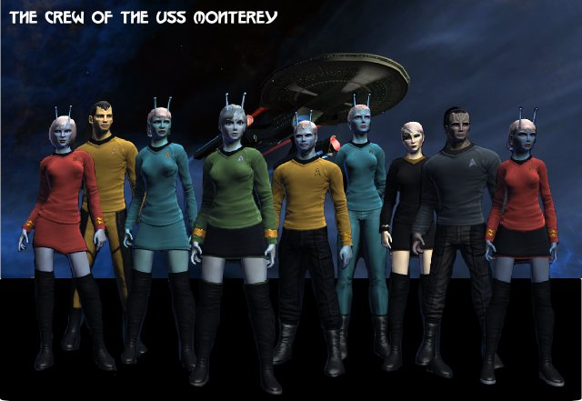
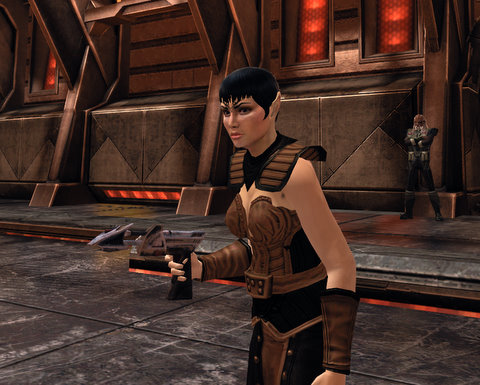

Back to: [West Karana](/posts/westkarana.md) > [2010](/posts/2010/westkarana.md) > [March](./westkarana.md)
# Star Trek Online: Congratulations, Admiral!

*Posted by Tipa on 2010-03-16 07:05:05*

*I had a different picture prepared for this post, but I noticed while making it that several of my crew members looked almost identical. So back to the tailor for some adjustments to hair styles and uniform....*

I made admiral a few days ago. I can't say I have seen all the game, since I haven't been able to find anyone with which to do the raid mission. I really need to look for a fleet to join, but I really have no idea how to go about it. The tools in game are primitive, and even when you join an open group, it's hard to figure out if the people in your group are in fleets. Since after the mission everyone separates and goes their own way, you never really get a chance to talk or get to know anyone.

Compare that to EverQuest, where it was very much to your advantage to find people with whom you liked to group, and stick with them, perhaps all join the same guild. So, looking back, I would have to mark that as a failure for Star Trek Online. It's a great game, but there is absolutely no -- zip, nada, null -- community. There is almost no difference between STO and some single player Star Trek game.

That said, the game has seriously fun space battles. Pretty much everything you'd ever have wanted in an arcade-style space shooter -- constant shifts in strategy, jockeying for position, saving up abilities for a devastating *coup de grâce* -- brilliant. Your bridge officers -- that you skill up and train to have the abilities you want them to have -- become individuals. And then there's the photonic fleet -- projected images of other ships that do real damage and can even the odds in a tough firefight. I'm not sure if that's a science officer ability, associated with my ship, or something everyone gets when they become admiral. It's a lot of fun. Almost all the ships in the picture above are holograms....

[caption id="attachment\_4851" align="aligncenter" width="480" caption="Click to Enlarge"][/caption]

I do enjoy ground missions, but unlike space battles, ground battles tend to be generally rote. Enemies are in clumps. Order your away team to begin softening them up while you do your AE buffs and debuffs, set everyone in good flanking positions and then just let everything run until done. Almost automatic.

In this particular mission, the boss kept disappearing and a wave of adds would rush in. Destroy them, she returns for awhile, etc. That said, I do enjoy ground missions. I get to see my crew in action! In space, they are nothing more than repositories for special abilities. They don't do anything themselves in space. On the ground, they are team mates.

Next stop for any admiral is the Klingon Empire. I rerolled as a Romulan refugee who had decided to throw her lot in with the Klingons, whereupon she was forced to wear this ridiculous outfit. Seriously? Really? 

Nonetheless, I did the Qo'noS quests, got my ship, entered the PvP queues and... wow, the Feds don't even stand a CHANCE now in space PvP. Straight outta drydock, I'm able to hold off a Fed starship two levels higher than me with almost no damage, plenty of time for the other Klingons to finish their encounters and come help finish it off. Went to the Kahless Expanse to finish some of the (few) PvE quests and was taking on groups of Fed NPCs two levels higher with no trouble. Sometimes I'd blunder into a second group -- no problem. Back in beta, the Kahless Expanse was pure death to a level 6 Klingon. I guess they both nerfed the zone and boosted Klingon ships.

I gained nearly two levels just from a couple of PvP matches and the Kahless Expanse quests. Went back to the Federation side and queued for PvP and was not able to get even one Federation space battle going. I guess the Feds understand that it is impossible to win against the Klingons in space.

So, a month or so in, leveling slowly, looking back: STO is a fantastic single player space game. The ground game is more or less on rails, but the team-based fighting is a lot of fun. The plot missions add depth and complexity to the Star Trek millieu, though the inability to actually affect the plot in any way is a little frustrating. There is no community in the game, which doesn't bode well for its long-term health. Without community, there is no pull to keep people playing.

Space PvP is very unbalanced, with almost every encounter being an easy win for the Klingons. Ground based PvP seems a little more even, with victory going with the team that best sticks together.

I haven't been able to try the raid mission. I understand it takes other people working as a team, which would seem to run counter to everything STO has to offer to that point.

Will I keep playing? Yes, at least until I make Rear Admiral 5. If they patch the Romulan storyline in by then, I will definitely be re-rolling to play that story out. Plus, their ships are seriously cool :)

## Comments!

**[Pete S](http://dragonchasers.com)** writes: Congrats on making Admiral!

---

**Longasc** writes: The raidisodes are really going to be a problem. They are not really difficult - but the final task of killing this borg-queen lookalike is much more difficult than the whole game was for many players.

I blame the longish pvp queues for the lame Fed pvp performance. They just don't get experience if they suddenly get beamed into an arena after doing pve mission after pve mission. They just use their pve setup and BOOM - shields down, 4 torpedoes right into the gap and they did not even realize what hit them. This was my first Rear Admiral PvP experience. My Escort just got trounced within seconds and my team had trouble killing a single Klingon.

The Klingon ships are not that much better. I think the Bird of Prey might be the most versatile ship design ingame, but it should be noted that a Federation Assault Cruiser can fend off two T5 BoPs easily. They can take a full team minutes to kill and a wise Klingon just focuses on another ship or goes away, cloaks and just accepts that he cannot outlast a cruiser in his Raptor or Bird of Prey. The Klingon Negh'Var Battlecruiser might pack some more offensive punch, but all in all it cannot compare to an Assault or Star Cruiser, really.

But if you gather 2-3 buddes and fill up with randoms and things start going south for Klingons, they just cloak and drag the match to eternity. :P Some better cloak detection would be nice, science vessel scans don't cut it atm.

The ship combat might be fast and furious in PvE, but to be successful in PvP you need to know the mechanics and ship loadouts. At a certain point you can even recognize which class the player commanding the other ship is playing, because you recognize the skill symbols and so on.
I almost exclusively pvp with my Klingon: I did not have the time to wait for the PvP Queue for the daily honor quest on my Fed! And it is damn more fun than to have this 80% chance to play with a bunch of first timers after a longish wait.

The raidisode is a problem. PUGs dissolve too easily. It takes time to get to the final room, then many have to learn the whole new "jump over glowing goo" and press three buttons at the same time stuff. People die and fail and lose faith or just don't have time anymore. I wonder what they would do if there would be a death penalty.
At least I got several marks of valor from killing the Tactical Cube in the space battle sequence as it was still giving marks... ^^ I hope raidisode II is a bit more manageable with a PUG and has more space combat. :)

I rarely see anyone I know online anymore. The game is probably till going strong and attracts lots of people, but it does not seem to keep players.

I suggest you just click the "sign up for Tribble" button, it will create automatically a test server subfolder and you can switch between Holodeck (Live) and Tribble (Test) while logging in. You can even contact people playing on the other server. Plus it is nice to see that there is really some good new stuff coming to keep people entertained. Some PvE content for Klingons for example. I dunno, but somehow I fear this will make Fed queues even longer...^^

---

**[We Fly Spitfires](http://blog.weflyspitfires.com)** writes: Grats Admiral Tipa!

---

**Egat** writes: I suppose this means I will render a salute the next time we meet.

---

**[Tipa](https://chasingdings.com)** writes: Damn right :)

---

**[/AFK &#8211; PAX Empire Edition &laquo; Bio Break](http://biobreak.wordpress.com/2010/03/21/afk-pax-empire-edition/)** writes: [...] Admiral Tipa reflects on her STO career [...]

---

**[The Best Of The Rest: Bread And Whine Edition - We Fly Spitfires - MMORPG Blog](http://blog.weflyspitfires.com/2010/03/21/the-best-of-the-rest-bread-and-whine-edition/)** writes: [...] Big congratulations to Tipa who earns the esteamed rank of Admiral in Star Trek Online. [...]

---

**[cool](http://yes.com)** writes: glad i read this review, i definitely won't be buying sto.

---

