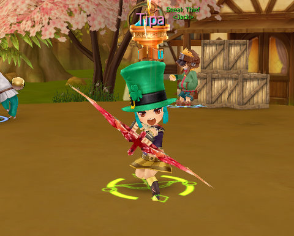
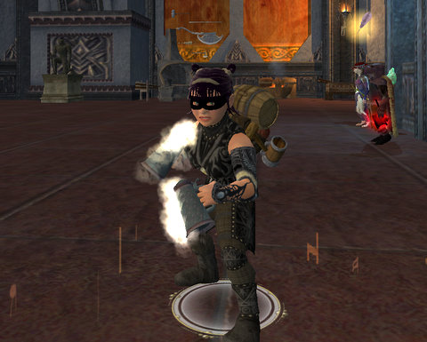

Back to: [West Karana](/posts/westkarana.md) > [2010](/posts/2010/westkarana.md) > [March](./westkarana.md)
# MMOs, Story, Immersion and Definition

*Posted by Tipa on 2010-03-23 07:36:42*

Petter of [Don't Fear the Mutant](http://blog.dontfearthemutant.com/) was wondering on Twitter last night what happened to immersion in MMOs. What happened to those virtual worlds, like Vanguard, World of Warcraft and EverQuest?

Is immersion a quality that games have, or is immersion what the player brings to the game? For immersion to exist, I suspect the player has to WANT to be immersed. There have been times in my life when I've been immersed in such games as Super Mario Kart, Chess, Othello, Backgammon, Colossal Cave Adventures and Zork, and none of those were virtual worlds (and none of those feel immersive to me any more).

[caption id="attachment\_4855" align="aligncenter" width="480" caption="Getting in the spirit of Dragonica\\'s St. Patrick\\'s Day"][/caption]

Looking back, I can see in every case that I'd made a decision to become immersed in that game. As I took my first, willing steps, I let the game draw me further. There are hundreds of MMOs available now, each with their own take on a virtual world and each offering the opportunity for immersion. We should enjoy them now; now that social games have grabbed the imaginations of game developers, those looking for the next money making opportunity will likely move away from expensive MMOs to lighter, browser-based fare.

Massively's Robin Torres yesterday introduced [a new column](http://www.massively.com/2010/03/22/the-fringe-farming-games/) focusing on browser-based Flash games, starting it off with an in-depth look at five farming simulations. Editor Sera Brennan asked her Twitter followers how they felt about Massively's expanding focus?

[caption id="attachment\_4856" align="aligncenter" width="480" caption="Q drags the USS Monterey back through time to save the future"][/caption]

I can't deny the popularity of these sorts of casual games. Looking through my list of Facebook friends last night, seems every one of them was playing several. Not just children -- if you're a Facebook user, chances are you are playing a bunch of social games. They aren't all as loud as Farmville, Mafia Wars and their cousins.

Are they a worthy topic for a MMO new site?

I liken it to a bicycling magazine. One day, among the articles about carbon fiber frames and custom dérailleurs is an article about NASCAR racing. The editors defend the article, noting that people who ride bicycles also often drive cars, and the magazine already covers bicycle races, so an article about car races is a natural extension of what they already do, and besides, polls show that a significant portion of their readership likes NASCAR.

The issue with that, as it turned out to be in the comments and [the blog of at least one social game community manager](http://www.cuppycake.org/?p=1259), is that Massively hasn't built up enough social gaming expertise to be an authority on the topic. Just as our hapless bicycle magazine editors ended up talking about NASCAR in the most general terms (in this race, the racers largely turn left, except for those brief times when they took a rest break in the pit stop area, at which point they often turned slightly to the right.)

That begs the question of what, exactly, is an MMO?

Petter believes MMOs must offer immersion. Robin extends the definition to any game that is online and has millions of players. As my Twitter friend @Slurms1 noted, Farmville is "as much as MMO as Battlefield: Bad Company 2. I play with others, and get levels and new gear."

[caption id="attachment\_4857" align="aligncenter" width="480" caption="Relaxing after an intense evening of Brew Day crafting"][/caption]

Clearly, MMOs are those kinds of games that when you look at them, you say, "ah, this is an MMO."

Can we be more exact?

MMOs must, for me, be based in lore. There is a world, and you have a place in it, and that place has a history that has nothing to do with you before you came onto the scene, and will continue after you, but while you are in that world, you can have an effect.

You will start out weak and new, and gradually gain strength until you have the ability to shape the world in some fashion. So; [the hero's journey](http://en.wikipedia.org/wiki/The_Hero_with_a_Thousand_Faces). MMOs are games that allow you to take part in the sort of story that have thrilled humanity for thousands of years.

Society is the last key to a MMO. The best MMOs give players myriad opportunities to meet and group together to take on challenges they would find impossible alone. It could be a chance meeting in a pick-up group, or guildmates they have come to know over several years, or just voices chatting on a trade channel; their presence helps turn the game into a place to meet new friends and rivals, a place to forge a community.

My definition, then, for an MMO:

 2. Lore. A MMO knows its own story, and a player knows their part.

 4. Hero's Journey. A player starts off as a bit player, and grows into great power.

 6. Community. A player has many opportunities to meet other players with similar likes and goals.

Do social games meet this litmus test? I play two browser-based social games, [Legends of Zork](http://legendsofzork.com/) and Echo Bazaar. 

Legends of Zork is based in name and lore off a series of (largely) text-based adventure games from the 80s. It has a decade of lore on which to rely. Hero's Journey? No, you do exactly the same thing from day 1 as in day 1,000, there is no feeling of a hero's journey. Community? Though it supports guilds and offline arenas, the only place to actually meet other players is through the forums. Legends of Zork is not an MMO.

In [Echo Bazaar](http://echobazaar.failbettergames.com/), you are a recent émigré from the surface world to the 'Neath, a vast underground cavern where Victorian-era London was spirited by hell-sent bats. It being the fifth city so abducted; it sits on the ruins of the previous four.

Lore it has; lore is its main attraction. You play a Victorian gent or lady threading his or her way through the doomed city, gaining power and influence that can bring you to the fabled Shuttered Palace where the Empress raves. Echo Bazaar is built on the Hero's Journey.

Is it an MMO? It fails in community. Where many social games are built on Facebook and MySpace, Echo Bazaar is built on Twitter, and all of its social tools revolve around your list of Twitter friends. As in LoZ, social games can't rely upon out-of-game resources for their community.

I have played Vampire Wars, but not Farmville or its clones. I certainly can't speak for every one of the thousands of social games out there, not even close, but I can say that for the ones I HAVE played, they are fun and a great way of passing time, but they don't look like MMOs to me.

## Comments!

**[ModemMisuser](http://www.sentence-ov-desire.net/)** writes: Interesting.

I always use the literal definition. "Massively Multiplayer" - meaning lots of players; as opposed to smaller online stuff like 8-player Counterstrike and the like. And then... Online. 

As long as something meets that definition - "a lot of people playing the same game together, online" - then it can be rightfully called an MMO by the technical definition.

Though, in order for me to WANT TO PLAY IT, it pretty much has to meet the criteria you listed. ;)

---

**[Tipa](https://chasingdings.com)** writes: Would your definition also include online poker? I think the RPG part of MMORPG sets the bar a little higher than simply being popular and online.

---

**Mycroft** writes: As for immersion, I have a strong preference for RP servers. While my expectations of appropriate RP behavior are modest, I find that any additional naming policy restrictions are welcome. For me, inappropriate names over avatars decreases my potential for immersion during a gaming session, and left unchecked the naming decisions some players make are too sad for words.

I also appreciate Wizard101's approach of restrictive naming, plus I enjoy seeing the names players have chosen for their Wizard101 avatars.

---

**Longasc** writes: I have little love for facebook games where you suddenly get ninja invites by your cousin to attend to his virtual pigs cows whatever by clicking them... awesome games. :>

---

**Longasc** writes: You are mixing MMO, immersion and facebook related topics a bit in this blog entry. The casual social games are completely different caliber than "MMO worlds". They have a lore, though the ideal to create a virtual world has more and more been driven back by game elements where the bare bones of the mechanics shine through, hurting immersion somewhat.

---

**[Tipa](https://chasingdings.com)** writes: I didn't really have enough to say about any one thing to fill a blog post, so I just talked about everything on my mind in this one, interspersed with pictures of the games I'm playing. Kind of a potpourri.

As far as lore for the games that seem most popular, it appears to be, 'welcome to our vampire-themed cash shop', or whatever. A game, Crown of Empire or something, I don't remember, recommended to me by the Editor of Massively.com turned out to be some emo-themed 'vampires and true blood are so sexy and squeeeee!" thing. I mean, huh? I didn't play the game because I couldn't even make it through the HOME PAGE.

---

**[Callan S.](http://philosophergamer.blogspot.com/)** writes: "For immersion to exist, I suspect the player has to WANT to be immersed"

I would say it takes two to tango. Which mostly agrees with your position.

But most players are pretty lazy tango'ers, then they blame the game for lack of immersion...

---

**[Blue Kae](http://www.bluekae.com)** writes: Lore is a huge part of immersion for me, it's why I play Lord of the Rings and not Age of Conan. I do agree that immersion is largely up to the player, after all you can lead a horse to water....

---

**[rowan](http://ihavetouchedthesky.blogspot.com/)** writes: OK late to the game, but here's my take. As Tipa implied in her first comment, "MMO" is generally the shortened form of the funky, long acronym MMORPG. I suppose an MMO could possibly not be an an RPG, just as an RPG doesn't have to and MMO. But a Massively Multiplayer Online Role-playing Game is in a completely different class than a browser-based social game like Mafia Wars or online Poker.

The reason I play MMORPGs like WoW, STO, and AoC, is the lore and the immersion factor. There is no lore in poker, nor in Farmville as far as I know. The Hero's Journey comes from the RP aspect of the class. I can have a hero's journey playing KOTOR or maybe even GTA, but it is not a "brave new world with such people in it" that the MMO aspect brings.

So should Massively discuss Farmville and other flash-based browser games? I suppose, if they develop the expertise to do so. But to say they are the same sort of game as LOTRO or EVE, would be a mistake.

---

