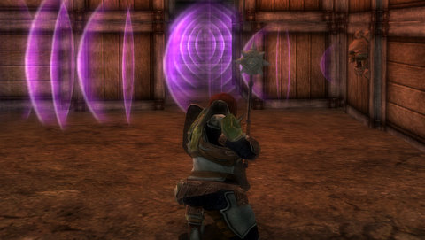
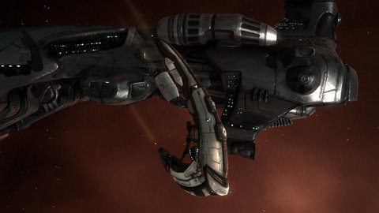
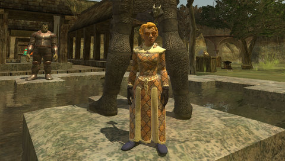
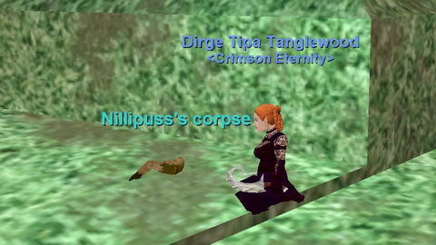

Back to: [West Karana](/posts/westkarana.md) > [2010](/posts/2010/westkarana.md) > [March](./westkarana.md)
# LFG (Looking For Game); decision time.

*Posted by Tipa on 2010-03-24 00:19:46*

I sat in front of my computer the other night, not really feeling a pull toward any MMO. I was watching Zombieland, and I couldn't think of any MMO that would be more fun than watching the best comedy zombie movie since Shaun of the Dead. Blahblahblah. This isn't a post about quitting MMOs.

This is a post about WILLING IMMERSION.

I talked a little about this yesterday. Immersion can seem like a quality of a game, but it's really a quality of the player. Even the best game is nothing like reality; it's as far removed from reality as anything can be. To make it important to us, we have to willingly fill in the lines, paint the walls, paper the ceiling and give it a place in our reality. You might argue that games can help immersion by having fantastic graphics, amazing sound design and killer animations, but I have been immersed in books before. I have immersion to spare; all I really ask of a game is that it doesn't BREAK my immersion.

When I sat in my chair not playing an MMO the other night, it wasn't because there weren't many excellent options available. I was not playing an MMO because I wasn't willing to risk immersing myself in any of them.

So today I'm going to be a little indulgent, go over the choices, and see if I can figure out which one should get the majority of my gaming time.

**Dungeons & Dragons Online**
[caption id="attachment\_4860" align="aligncenter" width="480" caption="Eluding a sonic trap in Dungeons & Dragons Online"][/caption]

Turbine's Dungeons & Dragons Online brings the pencil-and-paper game to life with a (now) free to play MMO. Though not perfect by any means, no other game in this post lets you customize your character's growth in more ways. I have a static group that plays for a couple of hours each Sunday, but the game is paced slowly enough that I'd be unlikely to outstrip them in levels, and there are benefits to grouping with people who have already unlocked the harder modes of a dungeon. The game is free to play, but some content must be bought. It seems unlikely, however, that the cost of purchasing content as needed in DDO would approach the $15/month of a standard MMORPG. DDO can also be played almost entirely with a PC gamepad and has optional hirelings to fill out a group or help out when soloing.

Down sides: My graphics card has serious problems with the game. Sometimes it looks great, and then the game is irreparably plunged into near total darkness. Even when well-lit, the game looks atrocious. I would prefer simpler graphics that look better over complex graphics that look crude. This is the same mistake made by EverQuest 2 in its early years, though with less plastic and more grind.

**World of Warcraft**
[caption id="attachment\_4865" align="aligncenter" width="480" caption="Chilling in World of Warcraft\\'s Ironforge"][/caption]

Blizzard's World of Warcraft is the most popular subscription-based game of any sort in the entire world. More has been written about this one game than all other MMOs, ever. There is more help available for WoW than any other, and the only other MMO that can even sometimes compete in the non-MMO news outlets is EVE Online. Playing WoW would mean I would be playing the game most people think of when they think of MMOs at all. The game runs and looks great on my computer. WoW's quest design set the standard for all other games of its generation. WoW sets the style and the very, very highly placed bar for the entire genre.

To really play this, I'd have to leave my vanity guild, "Snacks for the Horde", and look for another. I think I know enough people that I could land in a guild that was a good match, where people might overlook the fact that I really suck at WoW. My only real objection? What could I possibly blog about? Playing WoW is death for a blogger, since every possible angle is covered by hundreds of bloggers. By playing WoW, you instantly become just a statistic, a very small fish in a very large, world-encompassing ocean. That's not necessarily a bad thing; it was fun going to UBRS and shouting Leroooooy! Or doing Onyxia and yelling MORE DOTS! Or raiding Molten Core with the confident knowledge that all around the world, hundreds of thousands of people were raiding MC at the very same instant.

**Star Trek Online**
[caption id="attachment\_4864" align="aligncenter" width="480" caption="Setting a course for the unknown in Star Trek Online"][/caption]

I added Star Trek Online to this list because it had grabbed me for a month, but since I reached max level, I haven't felt a real need to log back in. Sure, I'd love to see the raidisodes, but the chatter reminds me too much of WoW. Must use vent, must use teamspeak, must have done this before, must have this piece of gear, blah blah blah. Before I can do any of that, I would need to farm marks of exploration for the purple gear required, but.... to me, Star Trek Online is finished until they add more content to the Klingon faction or add the Romulans. I no longer feel the need to raid, but the leveling up was a lot of fun. I'll still play on a casual basis and maybe even try to get a pickup group for the raidisodes, but it could never be my main game.

If it were easier to meet people in the game, it might be a different story, but I went forty five levels in that game and only found a couple of people who'd managed to find a guild, and neither of them sounded like they got anything from it. There were plenty of guilds spamming for members in the game's final zone of Gamma Orionis, but it's hard to choose a guild based solely on guildspam.

**EVE Online**
[caption id="attachment\_4863" align="aligncenter" width="480" caption="A Purifier and a Megathron bring missile-y death to a highsec plex"][/caption]

EVE Online is the deepest, most strategic MMO going. It is the one game where one player's actions truly could change the game world and even end up on the evening news. No other game comes close to EVE Online in depth and complexity. But with all that, even the newest player can fill important roles. You don't need to grind levels for four months to get to the end game; all you have to do is set your autopilot to take you to null security space.

When OtakuDyne was an active corp, I was powerfully drawn in to EVE. When it died, I drifted away, because without people to play with, there's very little reason to play.

With 12 million skill points on my main and 6 million on my alt, I have enough training to apply to a decent corp. Unfortunately, all the ones I know of are in nullsec, and I suck at PvP. Further, some bad investments have left me without enough ISK to really recover once nullsec destroys all my ships. Given that what I like best in the game is building things, it may be that Skyforge (which, according to their recruitment thread, is mostly looking for more cannon fodder to throw at their enemies) and Holowan (which appears to be mostly dead itself) are not good matches. I'm always going to suck at PvP because I don't care enough about it to learn to do it well. Since EVE is built on PvP, it could be that a game I hold in the highest regard is just about done with me, even though I am not done with it.

Still, I would really, REALLY like to be an integral part of a fleet heading to defend some critical piece of space. How do I reconcile not liking PvP with wanting to be part of a fleet action? I do not. I am large. I contain multitudes.

Most of what I don't like about EVE PvP, aside from the inevitability of my death, is having to farm enough money to build and fit a new ship. That can take days. Boring days doing boring stuff. Just to have it get blown up in a moment? There is no up-side to that.

**EverQuest 2**
[caption id="attachment\_4862" align="aligncenter" width="480" caption="My level 10 newbie island Coercer on the soon-to-be-sunk Outpost of the Overlord"][/caption]

For a couple of months, I was in the best EQ2 guild EVER, Clan of Shadows. I loved that guild. Unfortunately, they didn't love me back and my application was eventually overwhelmingly denied. After trying out a couple of other guilds and servers, I eventually pretty much gave up on ever finding a guild that good and moved on to other games.

Returning to EQ2 would mean looking for a guild again, and overcoming the handicap of sucking at EQ2 as badly as I suck at WoW. EQ2 (like WoW) has a very quick pace at odds with the slower, more enjoyable paces of DDO, EVE and STO. Performing at less than 100% efficiency, like a perfect cog in a perfect machine, gets you booted from groups. I just don't know if I can take that pace for very long. On the other hand, casual guilds tend not to have a focus that gives me something to work for. I don't feel any real desire to do boring stuff just because the game wants me to; if I'm not having fun, I'm counting the seconds until I can log off.

To return to EQ2, I'd have to find that perfect guild. For the right guild, I would do anything, be there every night, help out as much as I could. Like I did when I was in Clan of Shadows. /sigh.

**EverQuest**
[caption id="attachment\_4861" align="aligncenter" width="480" caption="Making a batch of brownies in EverQuest, one brownie at a time."][/caption]

Though it wasn't my first MMO -- Nexus, Kingdom of the Wind holds that dubious honor -- EverQuest was the first game that demanded my total gaming attention. For seven years I played EQ, with occasional breaks for Dark Age of Camelot and other temporary flings. I was in some of the best guilds on two servers; United Norrath Coalition, Divine Grace, A Twist of Fate and Crimson Eternity on Erollisi Marr; Lost Sock Patrol and Viking Alliance on Stromm. Finding a nice spot in a dungeon, pulling mobs, hoping for rare drops and chatting and making friends; that was heaven. Helping coordinate massive raids to take down unimaginably dangerous opponents requiring unheard of teamwork; that was also heaven. EQ was the only MMO I ever felt I was good at.

But I just got burned out. For all my love for the game, the incessant guild drama as we tried to stay in the upper echelons of Erollisi Marr raiding guilds (I am talking here of Crimson Eternity, my final guild in EQ), the raids that stopped being exciting kill fests and more about heavily scripted, WoW-style exercises in following the correct steps to win, and ugly, ugly places like the Prophecy of Ro expansion which just sucked all life from the game for me....

Just. Burned. Out.

I logged into EQ tonight to take some pictures for this article, and found three people from the guild online -- Sispis, Achernar and Dalomite/Dalanan -- and they told me they've been playing EQ on a casual basis for a few weeks now, and they have room for a rogue. EQ now lets people level up in "classic" missions where you take on the gear of a level 50 character back when level 50 was the level cap, and are sent to clear out the classic dungeons that no longer exist in that form. And apparently you can take the NPC hirelings along with you to fill out your group.

So, shocker of shockers. There's this chance I might end up right back where I began.

It's between EVE, EQ and EQ2 at this point. My brain says EVE, but my heart says I should give EQ another try first. I'm not sure which to listen to.

## Comments!

**Tarridus** writes: Can I recommend Lord of the Rings Online? 

It may just be your cup of tea at the moment.

---

**Tarridus** writes: **It may Become your cup of tea rather. 

Bah, sorry, I should never comment while eating ;)

---

**Egat** writes: Sounds like a date, I will bring the sticky toffee. See you on Emarr!

---

**[Phil](http://barelyreadablediary.blogspot.com/)** writes: What about EvE with "cheaper" PvP while you're learning the PvP ropes -- small cheap T1 ships like rifters?

---

**Mycroft** writes: I went thru a similar exercise just this month!

 The bottom line, for me, was I ended up changing my WoW subscription from monthly to the 6-month option last week (I determined that I'll be playing it all year, especially with Cataclysm on the horizon), I bought a Wizard101 $20 Prepaid Gift Card from Gamestop last week so I could get the March "Heroes Set" Cloud Demon with it, that gives the Kraken Card, and I'm down to just working on earning the monthly "Seals o' Piracy" in Puzzle Pirates.

 WoW Gnomes > all ... it's rare that I don't smile just running around, or if I'm tired and just chatting with guild mates, there is no better avatar to fish with than a WoW Gnome. And, as a Gnome, I always pay for the taxi ride from Sholozar Basin after picking up my weekly Mysterious Egg so that I can ride in the gyrocopter. :)

 I don't really enjoy PvP, except with friends, and even then I'm not that good. The Wintergrasp Battleground in WoW is nothing but pure fun to me, tho. I really do want to love EVE, but at the end of the day, I'm just not a PvP'er.

 I'm just getting back into Wizard101 after trying it out briefly last year, but I like it as a nice change from the more "traditional" MMORPG's I've spent time in. It's possible that a lack of social connections will cause me to drift away, which is a reason I like the "pay as you go" approach of buying Crowns to purchase an area to access it on my account forever, rather than a subscription.

 Puzzle Pirates is in more of a caretaker mode ... I'm on a non-subscription doubloon ocean (server), so it's easy just to dabble in it when I feel an urge to puzzle a bit.

 I have a lifetime subscription to LotRO, and it is a beautiful game. I love what they've done with the music system! If I had a strong social group in LotRO, I'd probably spend time there, but given the current situation it just gets squeezed out, for me, unfortunately.

---

**[Spinks](http://spinksville.wordpress.com/)** writes: It does sound from reading this as though your heart is with EQ :) I say go try it, write about your experiences. You can always search for a compatible guild in EVE or EQ2 later.

But I also would add that writing about WoW as my main game didn't kill my blog. Actually there are loads of WoW bloggers who love reading blogs about WoW, so if anything it brings in more readers.

---

**[Magson](http://phoenq-magson.blogspot.com)** writes: EVE doesn't have to be expensive for pvp. A fully T2 fit Rifter only costs about 5 million ISK. A fully fit AML Caracal costs about 12 million. An insured battlecruiser will only set you back the fittings, which are about 10-12 million for a T2 fit. Named (meta 2 and 3) fits are often a lot cheaper and just about as good too. Biggest thing is being willing to lose your pod, and if you're pvp'ing in a blank clone like you should be, then there's not really that much financial risk being taken in pvp.

Right now for me, I'm flying a 2 billion isk ship, and have about a billion in implants in my head -- I'm not going anywhere near pvp with that, but I do have a blank clone and several Rifters sitting in a station for whenever my corp wants to go do a lowsec roam. So long as your med clone is updated... pvp can be quite inexpensive.

---

**[mbp](http://mindbendingpuzzles.blogspot.com)** writes: It sounds as if the game you really want to play is EQ2 so it is a great pity that you feel it is not possible to get into a suitable guild. 

I would recommend EVE as a good game for intermittent play. It does get boring after a while but the free-form nature of the game and the fact that it still attracts a steady stream of new players means that you can leave the game for a year and then pick it up again without feeling that you have missed the boat. 

On a more general note Tipa I cannot help noticing that almost all the mmorpg bloggers I follow have become much more casual in their attitude to mmorpgs, not just in play style but also in the length of time that they stay playing any one game. Perhaps this is just selection bias but I do think that now that the industry has matured and now that the player base has matured very few people are prepared to play the same game for years any more. 

Personally I think that this mmorpg hopping is actually a good thing. It creates competition between games and a wider variety of games get to attract some players even if it is only for a month or so. I do think that many game developers have yet to embrace the implications of this though. They all still seem to be under the illusion that they can hold onto their players for years. 

Of course this short termism does create a problem for guilds - If you are only going to be playing for a month that isn't long enough to develop complex social structures. One solution might be to join a multi-game guild. There seems be quite a few of those knocking about now.

---

**Longasc** writes: I found no real love for DDO. It looks about much "Turbine" as LOTRO, but it does not have the gorgeous landscape. I think a good compromise between depth, looks, MMO and F2P is Guild Wars. The community can be atrocious, but you are not forced to group with anyone you dislike. Heroes and Henchmen cannot replace friendly players, but they allow you to play at your own pace.
Otherwise I would rather play Dragon Age offline for a while. That's what I did recently, now waiting for Bioware to properly patch up the expansion before jumping in.

STO really has an endgame problem. "The Cure" supposedly has some nice space combat at the end, but like "Infected" it is throwing a gauntlet at players that never ever encountered any kind of challenge in the game so far. In ground combat, the part of STO that still makes me cringe. Wah. And yeah, the "need class X, TeamSpeak required" stuff turned me off, too. It would basically the only part of STO for which a guild would be "required" just for raiding. I am out of raiding and hope they plan to provide something else for me. Seriously, if Cryptic thinks they can turn the whole population into casual WoW-style raiders, they have not understood the qualities and downsides of their own game.

EVE is fine if you are into it. It also takes some time if you are really into it. So I doubt you have much time for anything else anyways.
EverQuest: There must be something why people love to play this more than WoW, but as I am not a fan of either, I probably cannot understand it. :)
Spinks is probably one of the very few WoW bloggers worth reading for people who don't play WoW. Because her thoughts are usually more general and go beyond the usual WoW horizon that is only interesting for active players.

You probably love EQ the way I loved my first MMO, Ultima Online. But really, they are old and rotten and not even nostalgia can compensate for that.

---

**[Stabs](http://stabbedup.blogspot.com/)** writes: Eve, it seems to me, is one of the best of backburner games.

If it doesn't grab you just keep it ticking along training up skills. Your datacores should build up for next time you play.

---

**Maladorn** writes: Initiate siren song of Fallen Earth...
"We have zombies and a sweet guild."
End siren song.

---

**Endelon** writes: If you're interested in continuing in WoW, now would probably be the best time to do it. The game has become ultra casual: you can do nothing but single group instances through LFD and get a full set of good gear. The new Cataclysm expansion is on the horizon too, which makes it the perfect time to get a character to level 80 an work on stocking up gold and working at a slower pace since the "rush" of the new expansion isn't here yet, and this gives you plenty of time to improve. You can PUG almost all the raids, even the newest Icecrown raid to a certain extent. 

Since you're worried about "sucking", there's plenty of websites that will tell you how to spec and what your rotation is for optimal damage. If you're not opposed to leveling a new character, ranged DPS characters are easier to play (in my opinion) than melee classes in WoW and Mages currently have a rotation that's basically just two abilities. 

As for your concern in finding guilds, I can't speak for the other games you listed (although when I played EQ2 I found it similarly difficult to find a guild) but you should have no trouble finding a guild to do groups and raids with. As I mentioned before, the almost everything is puggable at this point so even if you meet a group of players that aren't really that great in terms of skill, you'll still get to do most of the content together. 

One last thing, the pre-expansion event that's coming up will see Gnomes and Trolls reclaiming their cities and if you're into Gnomes, it's definitely worth getting a character to 80 to participate in that event alone!

---

**DPirate** writes: EQ is still a decent game. It is, however, somewhat more fast paced than it used to be. Dumbed-down, some would say, but really just easier. Still, it's basically the same, and the playerbase has matured. I re-subbed recently, as I generally do for a month or so each year, lol.

On the other hand, I am also DLing AoC to check that out. BTW, nothing is going to stop you from playing DDO whenever you like for a quick crawl at no cost, so what's to stop you subbing somewhere else.

---

**[Toldain](http://toldaintalks.blogspot.com)** writes: Skyforger has its ups and downs. 
Ups: There's some nice folks, who know quite a few things. The CEO, Eperor, actually plays the game, is full of energy and fun, though there's a lot more requirements, too. 

Ratting and running anomalies/plexes in 0.0 is very profitable. And I do mean VERY profitable. There is some sort of ship replacement policy in Skyforger, for pvp ships. Not for ratting/commercial ships. 

Down: There is some drama in the alliance over whether people PvP enough. Since the bulk of my corp lives in Latvia/England, I don't see them all that much. Most of them speak some English, but sometimes corp chat is full of Latvian. 

Eperor just proposed a 2 division structure where you could either be a pvp focused player and get on 70 killmails a month (on the winning side!) or be an industrial and be responsible for mining for the corp, or manage production for the corp, to implement the ship replacement program. That's a lot of structure, compared to Otakudyne. But developing and holding your space in 0.0 isn't easy.

---

**[Amuntoth](http://manifestpixel.wordpress.com/)** writes: You seem to have left a lot of MMO's completely out of the runnings. Was this on purpose or did you just not think of them?

If you don't like PVP I can't recommend Darkfall (I don't like PVP either), but if you want an old school Ultima Online feel with updates I'd recommend Fallen Earth actually. It's changed a lot since launch, updated graphics etc, and I just got into it a few days ago. Been talking about it on my blog, I recommend it. Not for end game stuff, but I play MMOs to level, not to raid.

---

**[Tipa](https://chasingdings.com)** writes: These are games I already play. There are hundreds others! My aim is to commit to a game I play. That said, maybe I should take this chance to try something entirely new....

---

**[mbp](http://mindbendingpuzzles.blogspot.com)** writes: Mind you Tipa ... there is a great blog to be written about "A Carebear's Adventures in Darkfall"

---

**DPirate** writes: A great blog POST, I think, culminating in a great big "SCREW THAT!"

---

**Mycroft** writes: I think Spinks makes a good point about WoW blogging ... it's the WoW content that caused your blog to get mentioned in the public WoW section of our guild BB a couple of months back, "Fun Gnome blog". :)
http://www.hrafnwarband.com/forums/viewtopic.php?t=13974

 FWIW, our WoW chapter has several moms in it (ranging from "son in the Navy" to "getting the little one bathed"), pretty laid back and mature with family friendly chat. I'd be glad to chat with you further about the guild if you think it would be a possible good fit that's worth considering as an option. I didn't mention it earlier since you did say you thought you already knew enough WoW folks to land in a good compatible guild. :)

---

**[Amuntoth](http://manifestpixel.wordpress.com/)** writes: Haha yeah that might not last long. If I were you I'd try some new things. Just spend like a week playing a bunch of trials and see what's for you. If you find out the games you already play are the ones for you then fine, if not thats fine too. Though I do enjoy your EQII posts for some reason more than others, even though I don't play EQII.

Keep up the great work.

---

**[We Fly Spitfires](http://blog.weflyspitfires.com)** writes: Always listen to your heart is my advice! :)

---

**[Blue Kae](http://www.bluekae.com)** writes: Nothing wrong with taking a break or trying something new. For that matter, there's nothing wrong with stopping playing an MMO, like STO for instance, when you hit the end of the content. Subscription business models aside, games are supposed to have endings.

---

**[kaozz](http://www.ectmmo.com/)** writes: Over the past month or two I've felt the same way. I actually went back to Everquest, had a blast. I find myself playing EQ2 more though lately, with my small guild of friends and it has kept me busier than I thought it would. It really sucks trying to get back to that point sometimes. 

I'm pretty happy now :) Hope you find what you're lookin' for.

---

**[Drew](http://bmhunter.wordpress.com)** writes: If it's immersion you seek - and you're contemplating something entirely new, the answer is almost certainly Fallen Earth. 

No fast travel, craft everything you can use, apocalyptic setting done right; but are you okay with no meaningful "end-game" at this time is the question?

---

**[Tipa](https://chasingdings.com)** writes: Several people have mentioned Fallen Earth. Though I am more thinking about how to choose a game I already play as a "main" game, could be I need to give FE a shot.

---

**Chris** writes: I'm sure I could get you into my corp (which is in a null sec alliance) if you wanted to try that out. Sucking at pvp is fine - everyone does at first (I still do). And no-one is going to complain if you turn up in cheap frigs while you learn (I do). We expect everyone to fight when big sov battles are ongoing but rest of the time you could carebear if you liked - every alliance needs miners and industrialists as well as roaming pvpers.

To put it into perspective - we've taken on ppl with only a couple mil sp that have only recently started playing. Leet we ain't.

Although the beauty of eve is that it is so easy to 'park' it for a while and then pick up again, so you could give it a rest if you wanted. WOW etc you are suddenly 10 lvls behind the curve and can't experience the new and popular content, eve... well, eve just keeps going and you'll be in the same place when you return.

---

**[Amuntoth](http://manifestpixel.wordpress.com/)** writes: If you give FE a shot, look for Connor Toth, I'll help you out. You also need to not be afraid of asking for help in the help channel, because you WILL need it.

---

**Astromech** writes: EQ huh? I haven't been back in EQ in quite some time. Do you know if Sony offers any return to EQ for x amount of days promos? I haven't seen any. *Scratches chin*

---

**[Tipa](https://chasingdings.com)** writes: All I see is the "Escape to Norrath" thing (http://escapetonorrath.station.sony.com/) which is only the Serpent's Spine-era newbie caverns.

---

**Bob** writes: Can someone explain this bit?

"EQ now lets people level up in “classic” missions where you take on the gear of a level 50 character back when level 50 was the level cap, and are sent to clear out the classic dungeons that no longer exist in that form. And apparently you can take the NPC hirelings along with you to fill out your group."

I played a little during last summer for a month (I played EQ1 on release till around the end of SoL) and I did find the "merc" bit very helpful (hired a healer!). The other bit I'm confused about. Does it matter what level you are or do they mentor you up to 50 if you're not that level? Is there a site to check out the new changes with the new expansion/latest in EQ1?

---

**Zeb** writes: Hey Tipa. Appreciate all the wonderful comments about Clan of Shadows. I still check your blog once in a while to get a feel for all the MMO's since you play most of them.

I am in stuck in that MMO void myself. I am currently playing LOTRO, but since I hit the level cap I have lost the drive to play all the time. I been thinking about checking out EQ2 again because of the new expansion but I worry it wont be the same as it use to be in the good ol' COS days.

If you figure it out, let me know.

---

**[Tipa](https://chasingdings.com)** writes: Well, I can't speak to how well the latest expansion is doing in EQ2; I barely even played The Shadow Odyssey. But, I know they will be there for me when I decide to return.

I'm currently leveling in EQ1, and that's really fun. I have the same concern, though, about what happens when I hit level cap. In EQ, maxxing level is just the start of the leveling process. Most players consider 1000 alternate advancement levels (AAs) a good start, but could easily spend 2500 AAs and still have more abilities to get. Grinding AAs has always become really boring for me in the past.

But you know, only way to get into an MMO is just to pick one and log in as often as you can.

---

**[Tell me a story? &laquo; M.M.O.S.H](http://mmosh.wordpress.com/2010/03/29/tell-me-a-story/)** writes: [...] that we decide to allow it to add in the missing bits; to turn it into the “Movie In My Head”.  Tipa at West Karana has been talking about wanting to play a game she can immerse herself in, and I can understand [...]

---

**[Cocoonivus](http://www.folkcatart.com/blogs/tale)** writes: It all depends on what your definition of enjoyable game play is. If only raids and high-level dungeons make you happy, then yes, you'll want to join a guild with similar goals.

I am an almost exclusively solo player in EQ2, and I have a great deal of fun. My enjoyment doesn't depend on other people. I may not be able to do every last scrap of game content without help, but I find plenty to keep me both highly amused and very busy, and I level steadily at a rate that I'm happy with. 

I am in a guild, but my husband and I lead it together, and it's a tiny one. We have it mostly for the shared advantages it gives us, and for a few online friends who are with us. Someday, we might want to join a raid or something, but we're in no hurry. Life in Norrath is a journey, not a race. (Unless you're doing a rush order!)

"To end suffering, end desire." If you're not happy with your current situation because you're longing for it to change, find joy where you are with what you can do. You'll be miserable so long as you're always looking at those grapes hanging so high on the vine, and forgetting the feast spread at your feet. And one days, either you'll grow and reach the grapes, or they'll drop down to within your grasp.

---

**[Tipa](https://chasingdings.com)** writes: There's nothing wrong with enjoying the solo lifestyle. I just need to be grouping with people. If I play by myself, I get bored, and it's a rule with me that I am powerless to change that if I am not playing WITH other people in an MMO, then I am quitting that MMO.

I can play single player games anytime I want... but I often don't, because it's even boring (to me) to play single player games. Accomplishments I earn alone, to me, don't count. Accomplishments done with others, as a team, working together, depending on each other, do count to me. It doesn't have to be raiding or grouping -- it can be as simple as just having a really fun conversation, or doing some in-character stuff.

Not everyone wants or needs to play that way, but I do. If there's a reason why I don't play EQ2 or EVE that much at the moment, it's because the people I played with left, moved or quit.

---

**[Valdis Magnusdottir](http://podlogs.com/EMVM)** writes: Tipa, I just stumbled onto your post. I'm part of a high sec corp with around 25 players, who is in turn part of an alliance with corps ranging from players who've been in-game for 7 years (Sphere Industries) to high sec, low sec and null sec corps. We regularly do ops of all kinds, from wormhole space, to mining, building, missioning together, low and nullsec roams. If you're interested, you could send me a message in-game, and join our public channel (Eternal Strife Public) to get a sense for our alliance. I look forward to speaking to you in the near future!

BTW: My in-game name is the same as I posted here.

---

