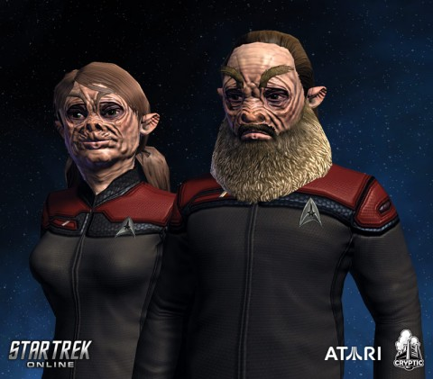
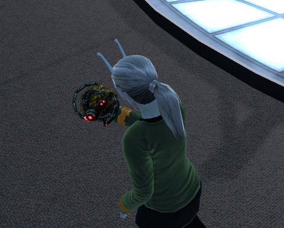

Back to: [West Karana](/posts/westkarana.md) > [2010](/posts/2010/westkarana.md) > [March](./westkarana.md)
# STO wants to sell you a bridge

*Posted by Tipa on 2010-03-26 06:51:24*

Actually, STO wants to sell you bridge PACKS. 120 Cryptic Points will now buy you three new bridges for your newbie ship, and 200 will get you four new bridges for your top-of-the-line Federation or Klingon cruisers. These are still (for the Feds, anyway), the cavernous flight deck hangar-sized bridges.

So now you can invite your friends to your ship, and everyone can pretend that the bridge consoles do something or the viewscreen works >< Well, they DO look nice! I spend a lot of time on the bridge of the USS Monterey because, dammit, that's where you SHOULD be!

Ever notice how Kirk was always signing stuff on the bridge, but I don't remember any of the followup captains ever seeming that concerned with administrative details. 

[caption id="attachment\_4888" align="aligncenter" width="480" caption="Big man, pig man -- ha ha, charade you are...."][/caption]

The expansion also brings a new race, ~~dwarfs~~ Tellaraites, as playable characters. Tellarites are one of the four pillars of the Federation, along with Vulcans, Andorians and the strangely featureless, unformed, smooth-skinned "humans". You have to wonder how the other races see humans. Doughy, neotenous, unfinished... no character at all to their bodies. Humans must look like demons or ghosts to them, right? Faceless creatures out of their nightmares.

Also new with the expansion are cash shop abilities to wipe clean all your training options, and to change your character's name. Given that your character will still be attached to your HANDLE everywhere, going from Aaaaaa@Whoever to Bbbbb@Whoever won't do much to make people forget who you are, but it should be a golden opportunity to change your name from Kirk, Spock or Khan. Because we have enough of those already.

[caption id="attachment\_4889" align="aligncenter" width="480" caption="I love my assimilated tribble!"][/caption]

Logging in the test server last weekend got you a Borg Tribble and the title Crash Test Tribble. The expansion also implemented a couple of new fleet missions that had been promised earlier. I did the Assault on DS9 one last night, where approximately one million RA6(!) Cardassians invade Deep Space 9. Note to people attempting this mission: Destroy the holo generators first, for your own sakes. I died so, so many times. I'd dread this with a death penalty.

There were also some UI tweaks and a new raidisode, "The Cure", which requires players to have done the previous raidisode, "Infected". I haven't done either, but people were saying that "Infected" had gotten easier, so maybe there'll be a chance to pick that one up this weekend.

See you in the Alpha quadrant!

## Comments!

**[Werit](http://www.weritsblog.com)** writes: Borg Tribble, awesome.

---

**[Spinks](http://spinksville.wordpress.com/)** writes: I love your assimilated tribble too.

---

**Longasc** writes: Oh my, so then I really have to win "Infected" at least once to progress to "The Cure"?

The thing is, this ground stuff is killing me. I won't do "DS9" or "The Big Dig" again, ground fleet actions have no appeal to me. But at least they are easy, in "Infected" you can forget about playing with randoms. And unfortunately, next to nobody I know plays STO anymore. Do I really have to join a Fleet just for a "raidisode"???

http://picasaweb.google.com/Longascimages/StarTrekOnlineSeasonOne#5452741330798678418

A word regarding the new bridges. This is a screenshot from one of the Federation bridges. As you can see, the chairs are too low and your officers sit and stand in a rather awkward way. The Klingon bridges are okay.

The next issue: The "packs" are actually 3-4 slightly variations of one bridge. Absolutely unnecessary. Who will ever buy this? The Piggies erm Tellarites won't probably be big sellers either.

I must say I would not have got the Fed and Klingon Bridges if I would not have got some 500 Cryptic Points for... preorder or digital CE, dunno for what I got them ... and some 400 points for filling out the user survey at the end of the first month.

---

**[Jomu](http://www.justonemoreunlock.blogspot.com)** writes: god those tellarites hit every single branch down the ugly tree!
my eyes! they burn!!!

---

**[Tipa](https://chasingdings.com)** writes: 
You know that I'm up for Infected any time. I'm going to give it a shot this weekend

---

**[Tipa](https://chasingdings.com)** writes: Heh :) Maybe that's how Cryptic plans to deal with griefers -- turn 'em into Tellerites..,

---

**[Blue Kae](http://www.bluekae.com)** writes: I just did the Big Dig last night, and didn't enjoy it at all. Breaking the Planet was much more fun. It may have been because BtP had a more cohesive pickup group, but I think the zone was better laid out. The Big Dig has a ton of Romulans all spreadout, which makes it tough to get around or rejoin the group if you respawn.

---

**Thac0** writes: I quit. I played the game for my free month and couldn't take flying in circles hitting space bar, the space fights were too drawn out, the ground combat was boring and i played for an hour every few days and i never got past my noob ship, somehow i doubt the game gets better even with a new ship. 

Tipa you somehow make STO sound really awesome I don't know how you do it.

---

**[Tipa](https://chasingdings.com)** writes: The game DOES get better with a new ship; your bridge officer abilities give you all sorts of ways to approach situations. The combat can get kind of grindy, but no more so than in any MMO -- there's no MMO out there which bothers to make non-boss encounters challenging.

---

**[Tipa](https://chasingdings.com)** writes: Assault on DS9 was the same way with the Cardassians.. 

---

**[We Fly Spitfires](http://blog.weflyspitfires.com)** writes: "Faceless creatures out of their nightmares." 

Brilliant :)

---

**Longasc** writes: Hint: Fleet Actions now scale with your level/rank. I absolutely prefer Starbase 24, Crystalline Entity and the Fleet Actions vs the Gorn and Klingons in the Tostig and Laurentian system to the new "Big Shit" and Cardassian Clone invasion of DS9.

---

**[Tesh](http://tishtoshtesh.wordpress.com)** writes: Borg Tribble? That alone makes me want to play the game.

...yes, I'm hopeless.

---

